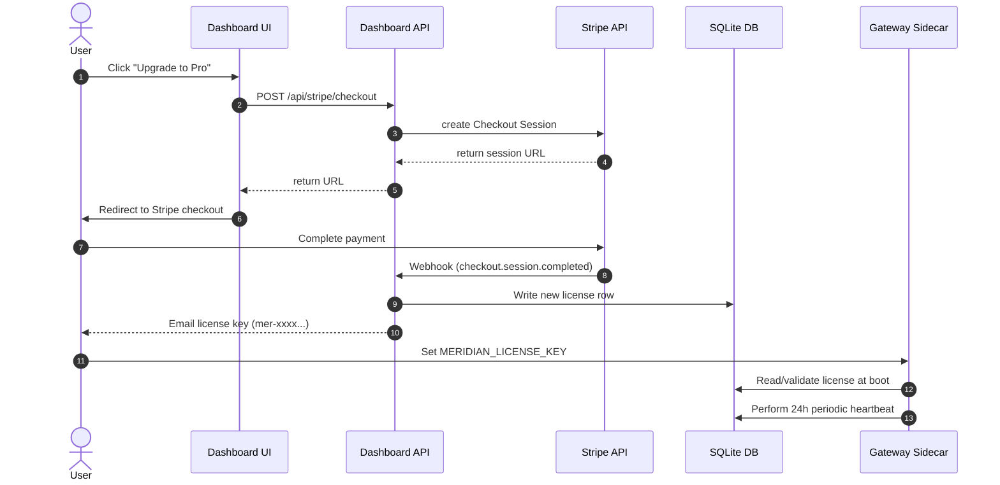

# License Key System & Stripe Billing

## Purpose & business goal
MeridianOS needs a scalable, self-serve monetization engine. Without license validation and Stripe integration, the gateway remains freeware, preventing the project from capturing revenue (which targets Month 1, Week 4). This feature implements the monetization loop: checkout, license key generation, gateway verification, daily phone-home heartbeat checks, offline grace periods, and dashboard-level warnings.

---

## Acceptance criteria
1. **Key Activation:** Setting `MERIDIAN_LICENSE_KEY=mer-XXXX-XXXX-XXXX-XXXX` enables Pro tier features on gateway boot.
2. **Graceful Degradation:** A missing, invalid, or expired key runs the gateway in **Free tier** mode, enforcing a maximum of 1 agent and only routing to the DeepSeek provider.
3. **Dashboard Banner:** An unlicensed gateway displays a prominent, visually elegant dashboard banner alerting the user to upgrade.
4. **Stripe Checkout:** The dashboard generates Stripe Checkout Sessions in test mode, redirecting the user to Stripe's hosted checkout.
5. **Webhook Creation:** The Stripe webhook `checkout.session.completed` generates a new license key and inserts it into the persistent license store.
6. **Webhook Cancellation:** The Stripe webhook `customer.subscription.deleted` marks the subscription as cancelled, triggering degradation to Free on the next heartbeat check.
7. **Daily Heartbeat:** The gateway runs a periodic heartbeat check (every 24 hours) against the validation server.
8. **Offline Grace Period:** If the license server is unreachable, the gateway continues to function under the cached license state for up to 7 days before degrading to the Free tier.

---

## Technical research (HOW)

### 1. License Key Design
To avoid heavy dependencies, license keys will be cryptographically random 128-bit tokens formatted as:
`mer-[4 hex]-[4 hex]-[4 hex]-[4 hex]` (e.g., `mer-8f2a-e9b4-3c81-7d1a`), generated using the built-in `node:crypto` library:
```javascript
import { randomBytes } from 'node:crypto';
function generateLicenseKey() {
  const bytes = randomBytes(8).toString('hex');
  return `mer-${bytes.slice(0, 4)}-${bytes.slice(4, 8)}-${bytes.slice(8, 12)}-${bytes.slice(12, 16)}`;
}
```

### 2. Stripe Checkout and Webhooks
We use Stripe's pre-built Checkout pages (`stripe.checkout.sessions.create`) to minimize frontend work. The Node Stripe SDK is used server-side:
- **Webhook signature validation** is performed using `stripe.webhooks.constructEvent` to prevent spoofing.
- The webhook endpoint `POST /api/stripe/webhook` must read the raw request body buffer to verify signatures properly.

### 3. Verification & Local Cache
To avoid booting failures due to network latency:
- On initial startup, the gateway performs an API-based validation or a local check if local db exists.
- The result of the last successful validation is cached locally in `license_cache` along with a cryptographic HMAC signature:
  `HMAC_SHA256(license_payload, server_shared_secret)`
  This prevents users from manually editing the cached SQLite table or file to fake validation.
- If validation fails with a network error (`ENOTFOUND`, `ETIMEDOUT`), the gateway checks if `Date.now() - last_checked_at <= 7 days`. If so, it continues running on the cached tier; otherwise, it degrades.

---

## Architecture notes

### Data Flow Overview



### Degraded Mode Enforcements
When running in **Free Mode**:
- `gateway/server.mjs` checks every incoming request's routing path. If the provider is not `deepseek`, it immediately rejects with a `403 Forbidden` (`provider_limit_exceeded`).
- Only `1` active agent registration is allowed in `gateway/run-registry.mjs`. If a second agent tries to register, the gateway returns a `403 Forbidden` (`agent_limit_exceeded`).
- Enforcement policies in `budget.mjs` are bypassed (allow-all within the free bounds) to match Free tier spec ("Metering only, no enforcement").

---

## Contract (API & Data Models)

### Data Models (SQLite schema)

#### SQLite: `licenses` (Written by Stripe Webhook)
```sql
CREATE TABLE IF NOT EXISTS licenses (
  key TEXT PRIMARY KEY,
  tier TEXT NOT NULL DEFAULT 'free',
  agent_limit INTEGER NOT NULL DEFAULT 1,
  provider_limit INTEGER NOT NULL DEFAULT 1,
  customer_email TEXT,
  stripe_subscription_id TEXT,
  issued_at TEXT NOT NULL,
  expires_at TEXT,
  cancelled_at TEXT,
  last_validated_at TEXT,
  created_at TEXT NOT NULL DEFAULT (datetime('now'))
);
```

#### SQLite: `license_cache` (Local Gateway cache, signed)
```sql
CREATE TABLE IF NOT EXISTS license_cache (
  key TEXT PRIMARY KEY,
  tier TEXT NOT NULL,
  agent_limit INTEGER NOT NULL,
  provider_limit INTEGER NOT NULL,
  expires_at TEXT,
  last_checked_at TEXT NOT NULL,
  signature TEXT NOT NULL
);
```

### API Contracts

#### 1. POST `/api/stripe/checkout`
- **Request Headers:**
  - `Content-Type: application/json`
  - `x-aios-token: <dashboard-auth-token>`
- **Request Body:**
  ```json
  {
    "tier": "pro"
  }
  ```
- **Response (200 OK):**
  ```json
  {
    "ok": true,
    "url": "https://checkout.stripe.com/c/pay/cs_test_..."
  }
  ```

#### 2. POST `/api/stripe/webhook`
- **Request Headers:**
  - `stripe-signature: t=1612345678,v1=sha256_hash...`
- **Request Body:** Raw binary Stripe event JSON.
- **Response (200 OK):**
  ```json
  {
    "received": true
  }
  ```

---

## Design brief → handoff

### UI Mockup
The dashboard settings panel includes a beautiful glassmorphism-styled Billing & Subscription control panel. 


### Component Hierarchy (Dashboard HTML)
```
[div#billing-section] (Container)
  ├── [div#unlicensed-banner] (Conditionally shown if unlicensed/free)
  │     ├── [span] "Unlicensed — upgrade to Pro to unlock enforcement & dashboard controls"
  │     └── [button.btn-upgrade] "Upgrade Now"
  └── [div.grid-billing] (Main layout)
        ├── [div.billing-card.pro-tier] (Plan Details Card)
        │     ├── [h3] "Pro Subscription"
        │     ├── [p.plan-status] "Active - Expires: 2026-08-19"
        │     └── [button.btn-manage] "Manage Billing on Stripe"
        └── [div.license-input-card] (Key Settings)
              ├── [label] "License Key"
              ├── [input#license-key-field] (Masked, value placeholder)
              ├── [span.badge-status.valid] "Validated" (or .invalid "Expired")
              └── [button#btn-save-license] "Update Key"
```

### Design Tokens (CSS)
- **Primary Gradient:** `linear-gradient(135deg, hsl(262, 80%, 50%), hsl(291, 70%, 45%))` (Indigo to Orchid) for Pro active card.
- **Warning Gradient (Unlicensed):** `linear-gradient(90deg, hsl(32, 90%, 50%), hsl(45, 95%, 45%))` (Deep Orange to Amber).
- **Glassmorphism Backdrop:** `backdrop-filter: blur(12px); background: rgba(255, 255, 255, 0.03); border: 1px solid rgba(255, 255, 255, 0.08)`.
- **Fonts:** `Inter, sans-serif` for modern typography.

---

## Tasks

### Backend Tasks (builder/antigravity)
- [ ] Create `gateway/license-store.mjs` containing the SQLite migrations and helper methods for querying/updating the `licenses` table.
- [ ] Implement `license.mjs` module with cryptographically secure generation, HMAC-based local signature caching, and server-validation logic.
- [ ] Modify `dashboard/server.mjs` to add routes for Stripe Webhooks (`/api/stripe/webhook`) and Checkout Session creation (`/api/stripe/checkout`).
- [ ] Update `gateway/server.mjs` and `gateway/index.mjs` to load the current license and restrict the router if the license is degraded (Free tier: max 1 agent registration, DeepSeek provider routing only).
- [ ] Implement the periodic heartbeat timer (24h) inside `scheduler.mjs` or `watchdog.mjs`, utilizing the 7-day offline grace period logic.

### Frontend Tasks (designer)
- [ ] Design and integrate the dynamic amber orange banner at the top of `dashboard/index.html` for Unlicensed states.
- [ ] Implement the Billing & Licensing layout card inside `dashboard/index.html` styling it with glassmorphism classes.
- [ ] Attach JS events in dashboard JS logic to handle calling `POST /api/stripe/checkout` and rendering validation states on the license input field.

---

## Testing

- **Unit tests (`tests/license.test.mjs`):**
  - Verify `generateLicenseKey` generates valid-format keys.
  - Verify `validateLicense` correctly validates keys and caches local signatures.
  - Verify grace-period logic (simulating offline state for 3 days and 8 days).
- **Integration tests (`tests/gateway-license.test.mjs`):**
  - Launch mock Stripe webhooks (`checkout.session.completed`, `customer.subscription.deleted`) and verify license database updates correctly.
  - Verify that when running under the Free tier, routing requests to `openai` or `anthropic` providers returns a 403 error.
  - Verify that attempting to register more than 1 agent in the run-registry returns a 403 error.

---

## Decisions / open questions
- **HMAC Signatures:** We will use `process.env.AIOS_SECRET` (falling back to a random UUID generated at first-run and stored in `.ai/secrets/signing-secret`) as the local key to sign the local license cache. This prevents local file editing from bypassing validation checks.
- **Enterprise Tier Routing:** Custom models and SSO routing will be designed in a follow-up ticket (F007). Currently, Enterprise acts similarly to Pro but with unlimited agent caps.
