# Gateway Spend Dashboard v0.1 — Design Specification

This document details the high-fidelity design, component hierarchy, design tokens, responsive layout strategy, database schemas, and exact API contracts for the MeridianOS Gateway Spend Dashboard (`F004`).

---

## 1. User Interface & Component Wireframe

The interface is structured as a single-page application (SPA) with a top navigation bar, a persistent filters panel, a metrics summary section, and a main content area toggled via two tabs: **Dashboard** and **Live Stream**.

### Visual Mockup (Mermaid Layout)

```mermaid
graph TD
    subgraph UI ["Gateway Spend Dashboard Layout"]
        Nav["Top Navigation: [MeridianOS Logo] | [Dashboard Tab] | [Live Stream Tab] | [Theme Toggle]"]
        Filters["Filters Bar: [Date Range] | [App/Tenant] | [Provider] | [Model] | [Reset Button]"]
        
        subgraph Summary ["Metrics Overview"]
            M1["Total Cost (USD)<br/><b>$124.50</b><br/>+12% vs last period"]
            M2["Total Tokens<br/><b>8.4M</b><br/>P: 5.1M | C: 3.3M"]
            M3["Avg Latency<br/><b>482 ms</b><br/>95th: 920 ms"]
            M4["Error Rate<br/><b>1.2%</b><br/>124 / 10,240 reqs"]
        end

        subgraph Tabs ["Tabbed Content Area"]
            direction TB
            subgraph DashTab ["Dashboard Tab"]
                Chart1["Spend & Token Volume Over Time (Interactive Bar/Line Chart)"]
                BreakdownGrid["Breakdown Grid (Split 50/50)"]
                Chart2["Cost by Provider (Donut Chart)"]
                Chart3["Cost by Model (Donut Chart)"]
            end
            
            subgraph StreamTab ["Live Stream Tab"]
                StreamHeader["Live Request Logger [Status: Connected (Green Dot) / Paused]"]
                StreamTable["Table Grid:<br/>Time | App | Provider | Model | Tokens | Cost | Latency | Status | Actions (View JSON)"]
            end
        end
        
        Nav --> Filters
        Filters --> Summary
        Summary --> Tabs
        Tabs -.-> DashTab
        Tabs -.-> StreamTab
    end
```



---

## 2. Component Hierarchy & File Structure

The project is structured as a modern React application compiled using Vite.

```
dashboard/
├── docs/
│   └── design-F004.md              # This design specification file
├── src/
│   ├── main.tsx                    # React application entry point
│   ├── index.css                   # Global styles and design tokens
│   ├── types.ts                    # TypeScript types and interfaces
│   ├── api/
│   │   └── mockApi.ts              # Local mock API layer and SSE emulator
│   ├── components/
│   │   ├── Navigation.tsx          # Top navigation and tab selector
│   │   ├── FiltersBar.tsx          # Filter selection bar
│   │   ├── MetricsGrid.tsx         # KPI metrics summary cards
│   │   ├── SpendChart.tsx          # Spend over time bar chart
│   │   ├── BreakdownSection.tsx    # Model/Provider share charts
│   │   └── LiveStreamLog.tsx       # Live request streaming log table
│   └── App.tsx                     # Global state manager and coordinator
├── package.json                    # Package metadata and scripts
├── tsconfig.json                   # TypeScript configuration
└── vite.config.ts                  # Vite build tool config
```

---

## 3. Design System & Design Tokens

To ensure a premium look and feel, we use a curated, HSL-tailored color palette with a modern font stack, subtle shadows, and micro-animations.

### Palette Tokens (CSS variables supporting Light & Dark themes)

```css
:root {
  /* Colors */
  --color-primary-hue: 220;
  
  --bg-app: hsl(var(--color-primary-hue), 20%, 97%);
  --bg-surface: hsl(0, 0%, 100%);
  --bg-surface-nested: hsl(var(--color-primary-hue), 12%, 95%);
  --border: hsl(var(--color-primary-hue), 15%, 88%);
  
  --text-main: hsl(var(--color-primary-hue), 25%, 15%);
  --text-muted: hsl(var(--color-primary-hue), 15%, 45%);
  --text-inv: hsl(0, 0%, 100%);

  --color-accent: hsl(220, 85%, 57%);
  --color-accent-hover: hsl(220, 85%, 47%);
  --color-accent-bg: hsl(220, 100%, 95%);

  --color-success: hsl(142, 70%, 45%);
  --color-success-bg: hsl(142, 80%, 96%);

  --color-warning: hsl(38, 92%, 50%);
  --color-warning-bg: hsl(38, 100%, 96%);

  --color-danger: hsl(350, 80%, 55%);
  --color-danger-bg: hsl(350, 100%, 96%);

  /* Spacing */
  --space-xs: 4px;
  --space-sm: 8px;
  --space-md: 16px;
  --space-lg: 24px;
  --space-xl: 32px;

  /* Typography */
  --font-sans: 'Inter', -apple-system, sans-serif;
  --font-mono: 'JetBrains Mono', 'Fira Code', monospace;
  
  --text-xs: 11px;
  --text-sm: 13px;
  --text-md: 15px;
  --text-lg: 18px;
  --text-xl: 24px;
  --text-2xl: 32px;

  /* Elevation */
  --shadow-sm: 0 1px 2px rgba(0, 0, 0, 0.05);
  --shadow-md: 0 4px 6px -1px rgba(0, 0, 0, 0.08), 0 2px 4px -1px rgba(0, 0, 0, 0.04);
  --shadow-lg: 0 10px 15px -3px rgba(0, 0, 0, 0.1), 0 4px 6px -2px rgba(0, 0, 0, 0.05);
  --radius-sm: 6px;
  --radius-md: 12px;
  --radius-lg: 18px;
}

[data-theme="dark"] {
  --bg-app: hsl(var(--color-primary-hue), 22%, 7%);
  --bg-surface: hsl(var(--color-primary-hue), 20%, 11%);
  --bg-surface-nested: hsl(var(--color-primary-hue), 18%, 15%);
  --border: hsl(var(--color-primary-hue), 15%, 20%);
  
  --text-main: hsl(var(--color-primary-hue), 10%, 93%);
  --text-muted: hsl(var(--color-primary-hue), 10%, 65%);
  
  --color-accent: hsl(217, 91%, 60%);
  --color-accent-bg: hsl(217, 30%, 15%);

  --color-success-bg: hsl(142, 30%, 12%);
  --color-warning-bg: hsl(38, 30%, 12%);
  --color-danger-bg: hsl(350, 30%, 12%);

  --shadow-sm: 0 1px 2px rgba(0, 0, 0, 0.5);
  --shadow-md: 0 4px 6px -1px rgba(0, 0, 0, 0.4);
  --shadow-lg: 0 10px 15px -3px rgba(0, 0, 0, 0.6);
}
```

### Responsive Behavior Plan

1. **Grid Wrapping**:
   - The metrics overview is a 4-column layout on desktops (`min-width: 1024px`), wraps to a 2-column layout on tablets (`768px - 1023px`), and collapses to a single-column scroll on mobile devices (`<768px`).
   - The Breakdown charts section is a 50/50 split on desktop/tablet and becomes stacked vertically on mobile.
2. **Filters Adaptation**:
   - The filters bar wraps from a single horizontal line to a grid layout on smaller viewports, with a collapsible "Advanced Filters" drawer.
3. **Table Responsiveness**:
   - The live stream log table uses horizontal scroll containment with primary columns (`Time`, `Provider`, `Status`, `Cost`) pinned/always-visible and metadata/latency columns overflowable. Clicking a row slides open a responsive details panel.

---

## 4. Backend Database Schema

Data is stored in the gateway sidecar's append-only SQLite database file (`ledger.db`) under the `token_events` table.

```sql
CREATE TABLE IF NOT EXISTS token_events (
  id                   TEXT PRIMARY KEY,  -- UUID or prefix-based request identifier
  ts                   TEXT NOT NULL,     -- ISO-8601 UTC string (Date#toISOString)
  tenant               TEXT NOT NULL,     -- Application or tenant identifier (e.g., 'pv')
  agent                TEXT NOT NULL,     -- Agent identifier (e.g., 'planner', 'coder')
  session              TEXT,              -- Optional execution session id
  task                 TEXT,              -- Optional parent task id (e.g. 'F004')
  run_id               TEXT,              -- Optional run execution id
  request_id           TEXT,              -- Raw upstream request header ID
  provider             TEXT NOT NULL,     -- Upstream provider (e.g., 'openai', 'anthropic')
  model                TEXT NOT NULL,     -- Selected model name (e.g., 'gpt-4o', 'claude-3-5-sonnet')
  wire                 TEXT NOT NULL,     -- Protocol format used ('openai' | 'anthropic')
  upstream_status      INTEGER,           -- HTTP status code returned by the provider (e.g., 200, 429)
  latency_ms           INTEGER,           -- Upstream request latency in milliseconds
  input_tokens         INTEGER,           -- Input (prompt) tokens consumed
  output_tokens        INTEGER,           -- Output (completion) tokens consumed
  cache_read_tokens    INTEGER,           -- Cache read tokens saved (Anthropic/OpenAI)
  cache_write_tokens   INTEGER,           -- Cache creation tokens (Anthropic)
  total_tokens         INTEGER,           -- Sum of input, output, and cache tokens
  cost_usd             REAL,              -- Evaluated cost in USD (computed from pricing.json)
  enforcement_decision TEXT NOT NULL,     -- Gateway verdict decision ('allow' | 'deny')
  cap_window           TEXT,              -- Window type triggered by enforcement ('5h' | 'week' | null)
  raw                  TEXT NOT NULL      -- Raw JSON event payload string
);

CREATE INDEX IF NOT EXISTS idx_token_events_ts ON token_events(ts);
CREATE INDEX IF NOT EXISTS idx_token_events_tenant_agent_ts ON token_events(tenant, agent, ts);
CREATE INDEX IF NOT EXISTS idx_token_events_provider ON token_events(provider);
```

---

## 5. API Contracts

All endpoints accept query filters in the query string:
- `tenant`: (string) Filter by application tenant.
- `agent`: (string) Filter by agent.
- `provider`: (string) Filter by provider.
- `model`: (string) Filter by model.
- `since`: (string, ISO-8601) Filter records after this timestamp.
- `until`: (string, ISO-8601) Filter records before this timestamp.

### 5.1 `GET /api/metrics/summary`
Returns cumulative totals and averages.

**Response (200 OK):**
```json
{
  "totalCostUsd": 124.50,
  "totalTokens": 8450122,
  "inputTokens": 5124900,
  "outputTokens": 3325222,
  "avgLatencyMs": 482.4,
  "errorRate": 0.0121,
  "totalRequests": 10240,
  "failedRequests": 124
}
```

### 5.2 `GET /api/metrics/spend-over-time`
Returns aggregated time-series data grouped by intervals (e.g., hours or days).

**Query parameters:**
- `interval`: `hour` | `day` (defaults to `hour` for ranges < 48 hours, else `day`)

**Response (200 OK):**
```json
[
  {
    "timestamp": "2026-07-19T00:00:00.000Z",
    "costUsd": 14.25,
    "tokens": 920500,
    "requests": 1120
  },
  {
    "timestamp": "2026-07-19T01:00:00.000Z",
    "costUsd": 18.90,
    "tokens": 1245000,
    "requests": 1450
  }
]
```

### 5.3 `GET /api/metrics/breakdown`
Returns distributions of costs and volume grouped by `model` and `provider`.

**Response (200 OK):**
```json
{
  "providers": [
    { "provider": "anthropic", "costUsd": 84.10, "tokens": 4200000, "requests": 5100 },
    { "provider": "openai", "costUsd": 40.40, "tokens": 4250122, "requests": 5140 }
  ],
  "models": [
    { "model": "claude-3-5-sonnet", "provider": "anthropic", "costUsd": 78.50, "tokens": 3800000, "requests": 4200 },
    { "model": "gpt-4o", "provider": "openai", "costUsd": 35.20, "tokens": 3600000, "requests": 4300 },
    { "model": "claude-3-haiku", "provider": "anthropic", "costUsd": 5.60, "tokens": 400000, "requests": 900 },
    { "model": "gpt-4o-mini", "provider": "openai", "costUsd": 5.20, "tokens": 650122, "requests": 840 }
  ]
}
```

### 5.4 `GET /api/requests/stream`
Exposes a Server-Sent Events (SSE) connection that pushes inbound requests in real-time as they flow through the gateway.

**Stream Protocol Headers:**
- `Content-Type: text/event-stream`
- `Cache-Control: no-cache`
- `Connection: keep-alive`

**Event Formats:**
- **`event: ping`**: Emitted every 15s to keep the connection alive.
- **`event: request`**: Emitted on every token event parsed by the gateway.

**Data payload example:**
```
event: request
data: {"id":"req-8f4ba6d2","ts":"2026-07-19T23:34:47.123Z","tenant":"pv","agent":"planner","provider":"anthropic","model":"claude-3-5-sonnet","latencyMs":345,"totalTokens":12400,"costUsd":0.0425,"upstreamStatus":200,"enforcementDecision":"allow"}
```
