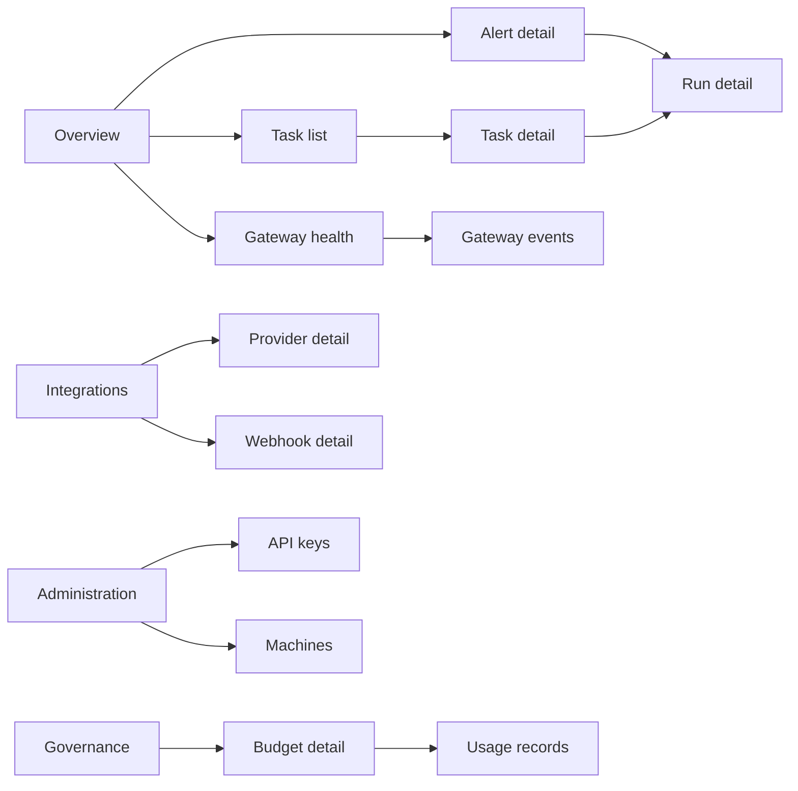
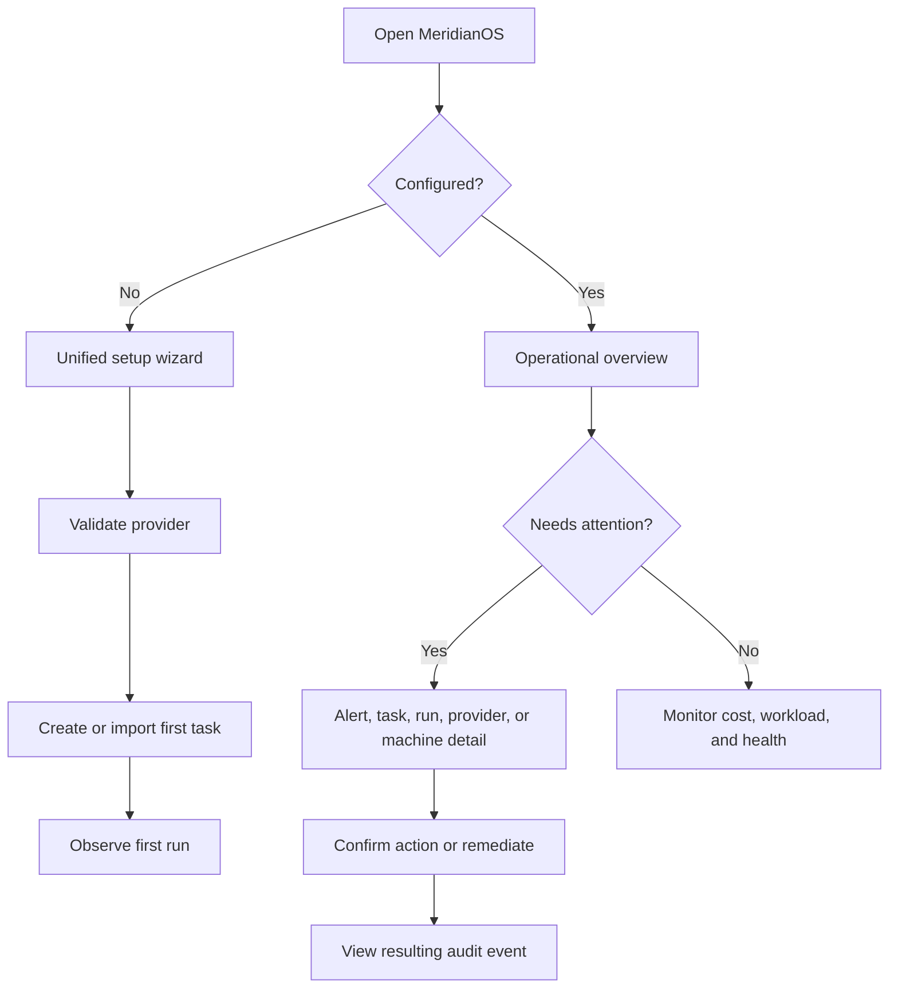

# MeridianOS UI/UX Audit and Revamp Master Plan

## Executive Summary

MeridianOS already has meaningful operational capability: its local dashboard exposes status, budgets, runs, providers, analytics, projects, teams, API keys, billing, compliance, plugins, and public REST v1; Electron embeds that dashboard; and the cloud control plane reports connected machines and provider health. The product experience does not yet make that capability legible or safely actionable at SaaS scale.

**Verified repository facts.** The current local dashboard is a large vanilla HTML SPA served by [dashboard/server.mjs](../dashboard/server.mjs), with many endpoint branches and a 10-second polling loop. Its main page is a centered, single-column control panel with inline styles and handlers in [dashboard/index.html](../dashboard/index.html), while Settings, Team, and Admin are in-page toggles rather than routable destinations. It uses a CSS-variable theme, uPlot, Muuri, and Litegraph vendor files, but no frontend component framework. Electron loads that same dashboard after a four-step wizard, and the cloud dashboard is a separate, minimal static UI. API v1 is isolated in [api/v1/router.mjs](../api/v1/router.mjs) and already provides a useful contract boundary.

**Program recommendation.** Incrementally introduce a React + TypeScript application shell compiled to static assets, preserve existing REST contracts, and migrate one vertical workflow at a time behind a route and feature flag. The target is a calm, high-density operations product: permanent navigation on desktop, a compact top bar for context and global actions, direct links from health and spend signals to actionable records, explicit action feedback, and full WCAG 2.2 AA behavior. This plan uses Grafana and Datadog only as references for workflow quality: persistent orientation, filtering, time control, stable grids, drill-down, and dense scanning. It does not copy their brand, visual design, layouts, or assets.

## Part 1: UI/UX Audit

### Evidence and product context

MeridianOS is an operational SaaS/control plane for autonomous agents, providers, gateways, budgets, tasks, plugins, API keys, webhooks, machine health, and tenant administration. Its audience spans operators and platform engineers who investigate active incidents, engineering leads who manage work and capacity, finance/governance users who control spend and approvals, and non-technical administrators who configure integrations and access.

The product should feel quiet, precise, dense-but-scannable, trustworthy, and fast. It must be a work surface, not a marketing page.

| Evidence source | Verified observation | Audit implication |
|---|---|---|
| [dashboard/index.html](../dashboard/index.html) | A single centered `.wrap` contains the page header, analytics, budget, alerts, policy controls, logs, IDE setup, MCP setup, and subscriptions. | Page hierarchy competes for one vertical reading path; users must remember where controls live. |
| [dashboard/index.html](../dashboard/index.html) and [dashboard-bootstrap.mjs](../dashboard/static/dashboard-bootstrap.mjs) | Settings, Team, and Admin are toggled in place; polling fetches `/api/status` every 10 seconds. | URLs do not represent a user’s current task; updates and state are coupled to the page lifecycle. |
| [dashboard/server.mjs](../dashboard/server.mjs) | One server hosts static files, local dashboard routes, setup, auth, billing, analytics, projects, compliance, and delegates v1 API. | Frontend-facing behavior is broad, but its route catalogue is not represented in the UI information architecture. |
| [dashboard/static/settings-workspace.mjs](../dashboard/static/settings-workspace.mjs) | Muuri persists re-ordered, resizable panels to `localStorage`. | Customization exists but is ungoverned; arbitrary panel dimensions can compromise predictable scanning and mobile behavior. |
| [dashboard/static/task-workflow-panel.mjs](../dashboard/static/task-workflow-panel.mjs) | Task workflow renders HTML strings with inline click handlers and reaches legacy globals. | Modular files remain coupled to DOM IDs and global functions; component testing and safe reuse are limited. |
| [dashboard/static/api-keys-panel.mjs](../dashboard/static/api-keys-panel.mjs) | Modal markup is string-rendered; revoke uses native `confirm`; feedback is an auto-dismiss notification. | Destructive-action, focus-management, recovery, and accessibility behavior are inconsistent. |
| [dashboard/setup.html](../dashboard/setup.html) and [desktop/renderer/wizard.html](../desktop/renderer/wizard.html) | Browser and Electron use different setup flows, designs, fields, and validation models. | First-value experience is inconsistent across installation surfaces. |
| [cloud/dashboard/index.html](../cloud/dashboard/index.html) | Cloud has a login form, machine table, provider health table, and raw policy path/value form. | Multi-machine management lacks the same product language, permissions UX, audit context, and safe configuration patterns. |
| [tests/dashboard-source-quality.test.mjs](../tests/dashboard-source-quality.test.mjs) | Source-quality tests guard syntax and selected anti-patterns, not browser behavior or user journeys. | The current quality gate cannot detect keyboard, layout, focus, navigation, or workflow regressions. |
| Supplied dashboard references | References demonstrate persistent navigation, global search, breadcrumb context, time controls, visualization choice, and dense stable grids. | Use these patterns as interaction standards; do not reproduce their appearance or copyrighted assets. |

### 1. Information architecture and navigation

#### Current-state assessment

The top row has three workspace toggle buttons, refresh, theme, status, and a kill switch. It is not a persistent product navigation system. There is no route-level left navigation, breadcrumbs, global search, command palette, history-aware deep links, current-location indicator, or consistent contextual actions. The `Admin` destination combines projects, templates, API keys, billing, compliance, and marketplace under a transient tab strip; unrelated goals share a hiding place. `Settings & Observability` likewise combines charts, provider/model controls, governance, and task workflow.

This makes users lose orientation when they move from a metric to a record, reopen a shared URL, switch devices, or need to distinguish operations work from administration. It also makes browser history and support links unreliable: a support engineer cannot direct a user to a durable URL for “provider health,” “API key 123,” or a failed run.

#### Target navigation model

**Desktop app shell**

| Region | Contents | Behavior |
|---|---|---|
| Left navigation | Overview; Operations; Observability; Integrations; Governance; Administration; bottom utilities for Help and Profile. | 256 px expanded / 64 px collapsed. Current route is visible. Group labels remain only when expanded; icon-only items have tooltips and accessible names. |
| Top bar | Breadcrumbs, workspace switcher, global search/command trigger, time range when relevant, refresh status, notifications, profile. | Stays visible. Page-specific controls appear to the right of the page title, not in global navigation. |
| Page header | Page title, concise current-state summary, primary action, secondary actions, filters. | One primary action maximum. Actions are route and permission aware. |
| Context panel | Detail drawer or record route for task, run, alert, provider, machine, key, webhook, or integration. | URL changes on open; browser Back closes it. |

**Navigation destinations**

| Group | Destinations |
|---|---|
| Overview | Operational Overview, Saved Views |
| Operations | Agents, Tasks, Runs, Queues, Failures |
| Observability | Gateway Health, Usage, Provider Health, Alerts, Audit History |
| Integrations | Providers, Models, Plugins, Intake Sources, Webhooks, API Keys, IDE and MCP Connections |
| Governance | Budgets, Cost Allocation, Policies, Compliance Reports |
| Administration | Workspace, Tenant, Users and Roles, Billing and Plan, Machines, Security, Preferences |

**Responsive navigation.** At 1024 px and above, retain the collapsible rail. From 768-1023 px, default to compact rail with a temporary expanded overlay. Below 768 px, use a bottom navigation for Overview, Operations, Alerts, Integrations, and More; “More” opens a full-height drawer. The command palette remains available at every size.

#### IA findings

| ID | Severity | Evidence | Affected personas/workflows | User and business impact | Root cause | Specific recommendation | Priority / dependency | Acceptance criteria |
|---|---|---|---|---|---|---|---|---|
| IA-01 | Critical | In-page toggles in [dashboard/index.html](../dashboard/index.html); no route model. | All; investigation, administration, support. | Users cannot orient, bookmark, share, or recover context; support resolution slows. | Single-page DOM as navigation state. | Deliver route-based shell and stable page URLs before migrating content. | P0; architecture ADR. | Every target destination has a URL, title, current-nav state, and browser Back/Forward support. |
| IA-02 | High | Admin mixes six unrelated workflows in [admin-bootstrap.mjs](../dashboard/static/admin-bootstrap.mjs). | Admins, finance, platform engineers. | Privileged configuration is hard to discover and error-prone. | Utility-tab grouping rather than task hierarchy. | Split into Integrations, Governance, and Administration groups. | P0; IA sign-off. | Five task tests find target destination in two interactions or fewer. |
| IA-03 | High | No search or command palette in the local or cloud dashboard. | Operators, leads, support. | Slow access to known tasks, runs, agents, settings, and actions. | No command registry or entity index. | Add global search and permission-aware command palette. | P1; route catalogue and API search endpoint. | `Ctrl/Cmd+K` opens palette; keyboard user can open a known task or run in under 10 seconds. |
| IA-04 | Medium | Header contains visual controls only; no breadcrumbs or page actions. | All. | Context is weak in deep administration work. | Header is an inline control strip. | Add breadcrumbs only where hierarchy exceeds one level; put record-specific actions in page headers. | P1; app shell. | Detail routes expose semantic breadcrumb and one primary action. |
| IA-05 | Medium | Settings workspace supports arbitrary resize and reorder. | Operators. | Personalization can create unstable layouts and inaccessible overflow. | Free-form dashboard panel model applied to operational pages. | Use bounded dashboard grids with opt-in saved views; preserve fixed control and table dimensions. | P2; design tokens. | No default view permits overlapping content or horizontal scroll at target viewports. |

### 2. Primary workflows and user journeys

| Journey | User goal and trigger | Happy path | Friction and missing states | Recovery path and required UX changes | Measurable success criteria |
|---|---|---|---|---|---|
| First-run onboarding | Administrator installs MeridianOS and wants a working first agent. | Select installation context, connect provider, validate connection, set budget and policy defaults, create or import first task, see first successful run. | Browser and Electron wizards differ; providers are auto-detected but not clearly testable; no progress persistence across form/system errors; “ready” has no explicit first-value checklist. | Unified routeable wizard; save draft; validate provider before continuing; show non-secret connection result; completion checklist with “first task” and “view run.” | 80% of moderated first-time users reach a validated provider and first task within 15 minutes; setup abandonment below 15%. |
| Configure a provider | Platform engineer adds a provider/model routing option. | Open Integrations > Providers, add credentials through secure handoff, test, choose available models, set default/routing, confirm health. | Provider controls are nested under Settings; unclear distinction between provider, model, subscription, and API key; test status is not persistently visible. | Provider detail route with connection state, capability, model list, last test, retry, and audit entry; keep secret values masked. | 95% successful test connection without support; connection failures have a visible error and retry action. |
| View agents, tasks, runs, queues, failures | Operator sees an alert or checks throughput. | Overview alert links to filtered Operations list; open task/run; inspect timeline, logs, cost, owner, retry/approve/escalate. | Workflow panel combines many lists in one panel; rows use legacy global modal; no durable record links; queue and failure taxonomy is not explicit. | Separate list and detail routes; stable IDs; status filters; timeline; related-record links; safe retry and escalation. | Median time from alert to implicated run under 60 seconds; 90% task-detail navigation success. |
| Monitor gateway, spend, budgets, usage, provider health | Finance/governance user checks a threshold or forecast. | Choose date range and scope; compare spend; drill from provider/model to task/run; adjust budget or acknowledge alert. | KPIs and charts are split across page/workspace; time range is local; charts do not show shared filters, export/share, or persistent drill-down. | Observability pages share time, tenant, provider, and project filters; chart-to-table transitions preserve context; alert rules disclose scope and threshold. | 95% can identify top cost driver and reach supporting records in under 2 minutes. |
| Investigate alerts and errors | Operator receives an alert or sees a failed action. | Alert has severity, impact, affected entity, timestamps, evidence, owner, acknowledgement, and remediation. | Current alert history and test action are generic; client error reports do not create a unified user-facing incident path. | Alert centre with lifecycle, dedupe, audit timeline, notification preferences, retry/resolve, and reason for suppression. | 90% of alerts lead to an action or justified acknowledgement; duplicate-alert rate below 5%. |
| Manage plugins, intake sources, keys, webhooks, integrations | Admin enables external work intake or automation. | Browse/install/configure; validate credentials; activate; observe delivery/log status; rotate/revoke safely. | Marketplace, API keys, and integrations are hidden under Admin; key creation has limited form guidance and native confirmation for revoke; webhook operations need delivery observability. | Dedicated Integrations group, setup steps, environment validation, scoped permissions, secret disclosure once, delivery attempt timeline, rotation workflow. | 90% successful connector setup; zero secrets visible after creation; key rotation succeeds without an unplanned outage in test scenario. |
| Manage tenant, plan, billing, workspace, permissions, security | Owner changes access or plan. | Open Administration, see current plan/limits, invite user, choose role, review change, audit outcome. | Authentication, team, billing, and project controls have separate in-page sessions and fragments. | Tenant/workspace boundary in top bar; roles matrix; invitation state; billing limits; security settings; audit records; typed confirmation for irreversible scope reductions. | Admin can invite a user and verify their role within 3 minutes; 100% privileged writes produce audit records. |
| Restart or recover services | Operator sees offline/degraded gateway or daemon. | Health detail explains scope; choose retry, restart daemon, reconnect provider, or inspect logs; action provides progress and outcome. | Local restart is platform constrained and yields a terse message; cloud raw policy pushing lacks preview and affected-machine status. | Service recovery runbook drawer, impact preview, confirmation, async progress, reconnect polling, rollback/retry; batch policy preview for cloud. | 95% recovery actions show definitive success/failure state; no restart can be triggered accidentally. |
| Overview to actionable record | Any persona sees a metric, status, or alert. | Click a metric/row, retain filters and time range, land on matching records, take action, return. | Tiles are not consistently actionable and state is not URL encoded. | Define drill-down contract for every visualisation and KPI, with “view records” affordance. | 100% of actionable overview widgets have a labelled drill-down; return preserves filters. |

#### Interaction and feedback findings

| ID | Severity | Evidence | Affected personas/workflows | User and business impact | Root cause | Specific recommendation | Priority / dependency | Acceptance criteria |
|---|---|---|---|---|---|---|---|---|
| IX-01 | Critical | `Pause AI Spend`, restart, policy save, task actions, and verifier controls are distributed through [dashboard/index.html](../dashboard/index.html) and [task-workflow-panel.mjs](../dashboard/static/task-workflow-panel.mjs). | Operators, finance, governance. | High-consequence controls have inconsistent acknowledgement and recovery. | No shared action-state model. | Create `ActionState` conventions: idle, pending, succeeded, failed, retrying, and audited. | P0; component foundation. | Every write action renders pending and final state; retryable failures provide retry; audit ID is linked for privileged writes. |
| IX-02 | High | API-key revoke uses native `confirm` in [api-keys-panel.mjs](../dashboard/static/api-keys-panel.mjs). | Admins. | Native dialogue lacks context, focus design, audit explanation, and typed confirmation for sensitive actions. | Per-panel implementation. | Use shared confirmation dialogs: normal confirmation for reversible actions; typed resource-name confirmation for deleting/revoking/rotating credentials, batch policy push, and service restart with impact. | P0; dialog primitive. | Destructive dialogs name resource, effect, recovery/rollback, and require deliberate confirmation. |
| IX-03 | High | Error handling is panel-specific; toasts auto-dismiss after 3 seconds. | All. | Users can miss failures and lose recovery context. | No error taxonomy or non-transient feedback region. | Toast only for low-risk confirmations; use inline field/page errors for repairable failures and blocking error state for impossible continuation. | P1; error envelope mapping. | Errors persist until dismissed or resolved, are announced accessibly, and include action-specific recovery. |
| IX-04 | Medium | Polling and direct fetch calls are scattered across modules. | Operators. | Stale data, duplicate fetches, and unclear “last updated” reduce trust. | No query/cache boundary. | Centralize query lifecycle, expose refresh timestamp/state, use SSE for status/alerts after pilot, and preserve manual refresh. | P1; API client. | Polling never silently overwrites local edits; offline/degraded state is visible. |

#### Action policy

| Action class | Examples | Required feedback and safety |
|---|---|---|
| Safe, reversible | Filter change, refresh, acknowledge informational alert. | Immediate UI update, non-blocking toast only if meaningful, undo for acknowledgement when retention rules allow. |
| Async operational | Run now, provider test, webhook replay, report generation. | Pending label/spinner, disabled duplicate submit, progress when available, result inline and in audit timeline, retry on failure. |
| Configuration write | Budget/policy/provider routing/form save. | Inline validation before submit; explicit Save by default; success timestamp and actor; unsaved-change guard; audit record. |
| Sensitive/destructive | Pause spend, restart service, revoke/rotate key, delete integration, remove user, bulk policy push. | Impact preview, confirmation; typed confirmation for irreversible or broad impact; blocking error on failure; audit record. |
| Security secret disclosure | Create API key, regenerate webhook secret. | One-time reveal with copy control; no secret in logs/history; require confirmation before replacing existing secret. |

### 3. Visual design and dashboard usability

#### Design direction

Adopt a **technical field notebook** direction: warm off-white light surfaces and charcoal dark surfaces, graphite structural borders, a restrained blue-green operational accent, and semantic green/amber/red states that never serve as the sole carrier of meaning. Use compact, tabular figures for cost and time; a humanist sans for reading and labels; and a mono face only for IDs, command snippets, metrics, and timestamps. The result should feel grounded and durable rather than glossy or marketing-like.

The dashboard needs a bounded 12-column desktop grid, 8-column tablet grid, and 4-column mobile grid. Controls, icon buttons, badges, charts, and tables must retain stable dimensions. Default pages are intentionally composed, not free-form canvas dashboards. Saved views may select allowed widgets and layout variants inside fixed grid constraints.

#### Dashboard findings

| ID | Severity | Evidence | Affected personas/workflows | User and business impact | Root cause | Specific recommendation | Priority / dependency | Acceptance criteria |
|---|---|---|---|---|---|---|---|---|
| VD-01 | High | Nested `.card` and `.tile` surfaces plus 16 px cards/modals in [dashboard/index.html](../dashboard/index.html). | All overview workflows. | Excess framing weakens hierarchy and makes dense data look decorative. | Page built as independent panels rather than a layout system. | Use page bands and one-level cards only; card radius 6-8 px; table/chart surfaces use shared containers. | P1; tokens/components. | No card is nested in another card in target pages without a documented framed-tool exception. |
| VD-02 | High | Inline styles, emojis, manually drawn SVG refresh/theme icons, and text buttons for familiar tools. | All. | Visual inconsistency and inaccessible/unclear icon semantics. | No icon or component standard. | Use Lucide icons, accessible icon buttons, tooltip on unfamiliar icon-only actions, and no manual SVG where Lucide exists. | P1; icon package decision. | Component audit finds zero new emoji-as-control or hand-drawn equivalent icon. |
| VD-03 | High | One mobile breakpoint at 768 px forces `.grid` to one column. | Tablet/mobile administrators. | Dense tables, long controls, and dashboards lose context and can overflow. | Layout is content-local, not breakpoint/system based. | Define 1440/1280/1024/768/480 behavior per component; use priority columns, drawers, and condensed control bars. | P1; responsive foundation. | No horizontal viewport scroll at 320 px; tables remain operable with priority columns/detail drawer. |
| VD-04 | Medium | Local KPIs, provider spend, Settings charts, and task workflow are separated. | Operators and finance. | Important comparisons require memory and page scanning. | Incremental panel additions without overview hierarchy. | Place urgent attention and current health first, then workload, cost, and trends; use shared filters and drill-down. | P1; overview spec. | Usability test participants identify “what needs attention” in five seconds. |
| VD-05 | Medium | Current uPlot charts use fixed container dimensions and per-panel fetches in [observability-panels.mjs](../dashboard/static/observability-panels.mjs). | Operators, finance. | Charts can misrepresent current filter scope or resize poorly. | No shared visualization contract. | Introduce chart adapter, typed data contracts, resize observer, accessible summary/table fallback, common time/filter bar. | P2; API client/chart abstraction. | Every chart states scope, time range, unit, legend/direct labels, empty/error state, and linked table. |
| VD-06 | Medium | Sample status can fill missing live values in mock mode. | Demos, operators. | Static/example values can be mistaken for live operational state. | Demo state coexists with production rendering path. | Clearly label demo mode with persistent banner, synthetic timestamp, and disabled destructive actions. | P2; environment model. | No simulated value renders without visible “Demo data” disclosure. |

#### Dashboard and visualization inventory

| Surface | Primary question | Required visualisation and interactions | Drill-down |
|---|---|---|---|
| Operational Overview | What needs attention now? | Attention queue, service health strip, active agents, failures, short cost/budget trend. Filters: workspace, time, provider/project. | Alert, task, run, provider, machine. |
| Agent Operations | Are agents working effectively? | Agent table, state/lease duration, task queue, WIP and run outcome distribution. | Agent detail, task, run. |
| Run Detail | Why did this run succeed or fail? | Timeline, status transitions, logs, model/provider/cost, related task, retry history. | Task, provider, gateway event, audit entry. |
| Gateway Health | Is the metering path healthy? | Availability, latency/error trend, denied requests, throughput, connection state. | Event table and request/run detail. |
| Cost and Budget | What is spend and what will happen next? | Actual vs budget/forecast, provider/model/project breakdown, anomaly table. | Filtered usage table, task/run. |
| Alerts | What changed and what needs intervention? | Severity list, trend by type, acknowledgement state, MTTA/MTTR. | Alert detail and related entity. |
| Integrations | Is data entering and leaving safely? | Provider/test status, plugin state, intake volume, webhook delivery attempts. | Integration detail, delivery, audit event. |
| Cloud Machines | Which machines need attention? | Health table, last seen, version drift, provider health aggregation. | Machine detail, policy deployment result. |

### 4. Content design and iconography

#### Terminology conventions

| Term | Definition and rule |
|---|---|
| Agent | An autonomous worker identity that can claim and execute tasks. Do not call it a “bot” in product UI. |
| Task | A unit of planned work with a state, owner, priority, and governance requirements. |
| Run | One execution attempt for a task or command. Never use “run” as a synonym for agent. |
| Provider | An external AI service connection. |
| Model | A selectable model offered through a provider. Always show provider alongside ambiguous model names. |
| Gateway | MeridianOS’s metering and policy enforcement path for AI traffic. |
| Budget | A configured spending/token limit, scope, and threshold. Distinguish actual, forecast, and cap. |
| Plugin | An installed extension providing a capability or connector. |
| Integration / intake source | An external system and its configured inbound work connection. Use “integration” for the whole connection and “intake source” for incoming work specifically. |
| Machine | A host running MeridianOS and reporting health to cloud control plane. |
| Tenant / workspace | Tenant is the billing/security boundary; workspace is the operating context selected inside a tenant. Never use them interchangeably. |

#### Content findings

| ID | Severity | Evidence | Affected personas/workflows | User and business impact | Root cause | Specific recommendation | Priority / dependency | Acceptance criteria |
|---|---|---|---|---|---|---|---|---|
| CD-01 | Medium | “AIOS control,” “founder usage,” and raw control labels in [dashboard/index.html](../dashboard/index.html). | Non-technical admins, finance. | Product vocabulary assumes implementation context and creates uncertainty. | Founder-local tool language persists in SaaS surface. | Use “MeridianOS,” “Personal usage,” and task-oriented labels; preserve technical detail in secondary text. | P1; content glossary. | Content review finds no unexplained founder/internal-only term in primary UI. |
| CD-02 | High | Messages such as “Analytics unavailable. Is the gateway ledger accessible?” lack recovery. | Operators. | Errors do not explain scope, consequence, or next action. | Generic fixed strings. | Use pattern: what happened, effect, likely next step, technical detail toggle, retry. | P1; error system. | Error-state tests assert accessible message and contextual recovery control. |
| CD-03 | Medium | Empty states vary in tone and completeness across modules. | First-time users. | Users do not know whether to wait, configure, or act. | No empty-state component/copy patterns. | Define four-part empty state: status, short reason, action, optional help link. | P2; component foundation. | Each list/chart/form uses specified empty, loading, and error state. |

**Copy patterns.** Use “No runs match these filters” rather than “no runs yet”; “Gateway data could not load. Retry, or check gateway health.” rather than “unavailable”; “Pause new AI spend” with a clearly scoped description rather than “Emergency”; “Test connection” rather than “test.” Use sentence case, action-led buttons, date/time with timezone where material, and compact relative time with absolute time on hover/focus.

### 5. Accessibility, responsiveness, and quality

#### Accessibility and form requirements

The implementation target is WCAG 2.2 AA. Use semantic `header`, `nav`, `main`, `aside`, `section`, `table`, `form`, `dialog`, and ordered heading levels. Every route has one `h1`; visual section titles do not skip levels. Use native controls first; add ARIA only to fill a semantic gap.

Keyboard operation must cover navigation rail, top-bar controls, command palette, tabs, filters, tables, drawers, dialogs, chart data alternatives, drag/reorder alternatives, and all actions. Focus must be visible with a 3:1 focus indicator, never hidden under sticky chrome. Dialogs trap focus, restore focus, close with Escape where safe, and never use `alert`/native `confirm` as the product interaction. Respect `prefers-reduced-motion`; no essential status depends on animation. Minimum pointer targets are 24 by 24 CSS px for dense desktop icon controls and 44 by 44 px for touch-first/mobile controls.

Forms use visible labels, local help text, validation on blur and submit, error summary after failed submit, programmatic association via `aria-describedby`, and preserved user input. Autosave is allowed only for low-risk preferences with a visible saved state and recovery; policy, budget, integration, permissions, billing, and security changes require explicit save/review. Charts provide title, scope, unit, legend/direct labels, keyboard-accessible data table, and textual trend summary.

| ID | Severity | Evidence | Affected personas/workflows | User and business impact | Root cause | Specific recommendation | Priority / dependency | Acceptance criteria |
|---|---|---|---|---|---|---|---|---|
| AX-01 | Critical | Inline `onclick`, string-built markup, no landmarks, and custom modal in [dashboard/index.html](../dashboard/index.html). | Keyboard and screen-reader users; all modal workflows. | Focus order, labels, and announcements are unreliable. | No reusable semantic component primitives. | Build app shell, dialog, drawer, toast, and form primitives with keyboard tests first. | P0; component system. | Automated axe plus manual keyboard tests have no critical/serious violations in migrated routes. |
| AX-02 | High | Current controls rely heavily on title/visual symbols and manually drawn SVG. | Screen-reader and keyboard users. | Icon purpose and state may be ambiguous. | No accessible icon policy. | Lucide icon button requires `aria-label`; tooltip supplements, never replaces label. | P1; icon wrapper. | Lint/test rejects unnamed icon button. |
| AX-03 | High | Light/dark variables and status colors are present but semantic contrast is not enforced across components. | Low-vision and color-vision users. | Status can become illegible or color-only. | Token values are not verified by semantic use. | Use status foreground/background/border/icon tokens with contrast tests in both themes and text/icon redundancy. | P1; token system. | AA contrast passes for normal text and non-text status indicators in both themes. |
| AX-04 | High | One generic mobile breakpoint and arbitrary panel resize. | Tablet/mobile and zoom users. | Content can overflow, reorder unpredictably, or lose table meaning. | No responsive component rules. | Define route/component behavior at 1440, 1280, 1024, 768, 480, and 320 px; test at 200% zoom. | P1; responsive spec. | No overlap, clipped controls, or horizontal page scroll in matrix. |
| AX-05 | Medium | Drag/reorder is core to settings workspace. | Keyboard users. | A mouse-only feature blocks customization. | Muuri drag has no equivalent interaction model. | Make layout personalization secondary; offer keyboard move/reset order actions and fixed default layout. | P2; saved-view feature. | All panel-order operations have keyboard equivalents or are not required for core workflow. |

#### Prioritized audit matrix

| Priority | Finding IDs | Owner | Dependency | Exit evidence |
|---|---|---|---|---|
| P0 | IA-01, IA-02, IX-01, IX-02, AX-01 | Product Design, Frontend, Accessibility, Architecture | ADR, route catalogue, component foundations | Shell pilot passes route, keyboard, and API-contract checks. |
| P1 | IA-03, IA-04, VD-01, VD-02, VD-03, VD-04, IX-03, IX-04, CD-01, CD-02, AX-02, AX-03, AX-04 | Product Design, Frontend, Content, QA | Tokens, API client, observability event schema | Overview, provider, task/run, and API key workflows pass usability and accessibility criteria. |
| P2 | IA-05, VD-05, VD-06, CD-03, AX-05 | Frontend, Data Visualization, QA | Saved view and chart adapter decisions | Personalization and advanced visualization meet bounded-layout and data-alternative standards. |

#### Target sitemap and user-flow map





#### Recommended page inventory

| Page | Purpose | Primary owner | Primary API/data boundary |
|---|---|---|---|
| Overview | Attention, health, workload, spend summary. | Operator | `/api/status`, analytics, alerts. |
| Agents / Tasks / Runs | List, filter, investigate, and act. | Operator/engineering lead | Existing tasks/runs/status routes; v1 evolution only if list filters are absent. |
| Gateway Health / Usage | Monitor metering path and traffic. | Platform engineer | Gateway, ledger, analytics endpoints. |
| Budgets / Cost | Govern spend and forecasting. | Finance/governance | Analytics, budget, pricing. |
| Alerts / Audit | Triage and prove change history. | Operator/compliance | Alerts, activity, compliance/audit data. |
| Integrations | Configure providers, models, plugins, intake, IDE/MCP, webhooks. | Platform/admin | Existing provider/plugin/webhook/API routes. |
| Workspace / Tenant / Access / Billing | Control ownership and security. | Admin/owner | Auth, users, invitations, projects, billing. |
| Machines | Operate cloud-connected instances. | Platform engineer | Cloud routes. |
| Setup | Achieve validated first value. | Administrator | Setup endpoints and provider test. |
| Search / Command palette | Jump to entities and safe commands. | All | Entity search index and command registry. |

#### Design-system gap analysis

| Area | Current state | Gap | Target |
|---|---|---|---|
| Tokens | CSS variables exist locally; chart colors have a separate file. | No layered semantic token contract or component ownership. | Tokens for primitive, semantic, and component use in light/dark. |
| Components | Repeated HTML strings, CSS classes, inline styles. | No reusable accessible primitives or API conventions. | Typed, documented primitives and product patterns. |
| Layout | Single-column wrap and free-form workspace. | No app shell/grid/route layout rules. | Bounded application shell and responsive grids. |
| Feedback | Toasters, native confirm, panel-specific errors. | No action state/recovery model. | Dialog/drawer/toast/inline-status system. |
| Typography/iconography | Inter/system fonts, emojis, manual SVG. | Inconsistent hierarchy and icon accessibility. | Explicit type scale and Lucide wrapper. |
| Tests | Node source-quality and HTTP tests. | No visual, keyboard, browser, or responsive coverage. | Unit, contract, browser E2E, axe, visual regression. |

#### Measurable UX scorecard

Baseline values are assumptions pending Phase 0 instrumentation and five-person-per-persona research; targets are release gates.

| Metric | Baseline assumption | Target | Measurement owner |
|---|---:|---:|---|
| Time to first validated provider | Unknown; likely 15-30 min | <= 10 min median | Product analytics / UX Research |
| Time from alert to implicated run | Unknown; current navigation is in-page | <= 60 sec median | UX Research |
| Task/run investigation completion | No task-level deep links | >= 90% success | QA / UX Research |
| Provider configuration success | Unknown | >= 95% with no support | Product / Support |
| Error recovery success | Unknown | >= 85% | UX Research |
| Critical/serious WCAG violations | Unknown | 0 on migrated routes | Accessibility |
| Initial dashboard route load | Unknown | p75 LCP <= 2.5 s local; <= 3.5 s cloud | Frontend |
| Refresh-to-render | Unknown | p95 <= 1 s for summary; <= 2 s for tables | Frontend / Platform |
| Support tickets about finding/configuring feature | Unknown | 30% reduction after two releases | Support |

## Part 2: Master Execution and Implementation Plan

### 1. Target frontend architecture decision

#### Weighted decision matrix

Scores are 1 (weak) to 5 (strong). The weighted result is out of 500 and evaluates the product’s actual migration needs, not generic framework popularity.

| Criterion | Weight | React + TypeScript | Vue + TypeScript | Disciplined Web Components |
|---|---:|---:|---:|---:|
| Complex operational UI maintainability | 15 | 5 | 4 | 3 |
| Electron compatibility | 8 | 5 | 5 | 5 |
| Testability and accessibility ecosystem | 14 | 5 | 4 | 3 |
| Delivery speed / staffing familiarity | 12 | 5 | 4 | 3 |
| Typed API and state model | 12 | 5 | 4 | 3 |
| Bundle/runtime cost | 8 | 3 | 4 | 5 |
| Zero-dependency alignment | 10 | 2 | 2 | 5 |
| Existing dashboard migration fit | 10 | 5 | 4 | 3 |
| Component model / design-system maturity | 11 | 5 | 4 | 3 |
| **Weighted total** | **100** | **456** | **396** | **348** |

**Decision: React + TypeScript, compiled to static assets, with a narrow dependency exception ADR.** React wins because the required work is an application shell, routable records, dense tables, lifecycle-aware data, accessible dialogs/drawers, and an incremental coexistence migration. It provides the strongest test, accessibility, Electron, and design-system support. It does not require a Node runtime in production: the browser receives static, versioned assets from the existing dashboard server. Preserve uPlot as the first chart implementation and avoid a broad UI kit.

**Dependency decision.** Add build-time/runtime-bundled `react`, `react-dom`, `typescript`, `vite`, `lucide-react`, and an approved browser test runner only after an ADR demonstrates the baseline asset size and build flow. The runtime impact is static JS/CSS assets served by `dashboard/server.mjs`; no extra daemon service, database, or API dependency is introduced. `uPlot` remains vendored initially. Reject Vue because it offers no compensating advantage for the migration and adds equivalent dependency cost. Reject custom Web Components because it moves routing, typed state, composition, controlled forms, accessible overlays, and test conventions into bespoke infrastructure, slowing delivery and increasing long-term risk. Dependencies must be isolated to dashboard build/development scopes and reviewed against the repository’s zero-dependency principle.

#### Target directory structure and boundaries

```text
dashboard/
  app/                         # New React + TypeScript source
    entry-client.tsx
    app-shell/
    routes/
      overview/
      operations/
      observability/
      integrations/
      governance/
      administration/
      setup/
    components/
      primitives/
      patterns/
      charts/
    api/
      client.ts
      contracts.ts
      queries.ts
      mutations.ts
    state/
    styles/
    test/
  static/                      # Legacy modules and generated app assets during migration
  index.html                    # Temporary legacy host; later minimal app document
  server.mjs                    # Preserve API routing/static serving; add manifest-aware asset serving
  build/                        # Generated, gitignored hashed assets
```

| Architectural concern | Target decision | Validation |
|---|---|---|
| Routing | Client router with history API; server falls back to app entry only for approved dashboard routes, never `/api/*`. | Direct navigation and refresh work for every route; API routes unchanged. |
| State | URL owns navigational/filter state; server data is cached in query layer; local component state only for transient UI; durable user preferences via server where cross-device, `localStorage` only for noncritical local preference. | Back/Forward and share URL restore filters; no fetch happens in a render path. |
| API client | Typed wrapper around existing REST/v1 error envelopes; all mutations return structured result and invalidate targeted queries. | Contract tests cover existing endpoint shapes before migration. |
| Real time | Start with consolidated polling scheduler and visibility pause; introduce SSE for status, alerts, and run updates after server pilot; retain manual refresh and reconnect behavior. | No duplicate polling; disconnected status shown; no local edit overwritten. |
| Component model | Primitives expose semantic props, not raw styling; patterns compose primitives; pages own data and navigation. | Story/test fixtures cover all states and interaction modes. |
| Theming | CSS custom properties generated from tokens; `data-theme` and system preference; semantic colors only in components. | Light/dark screenshot and contrast tests. |
| Charts | Adapter around uPlot with typed data/formatters, resize handling, data table fallback, and no color-only meaning. | Keyboard/table alternative and responsive chart tests. |
| Testing | Node unit/contract tests, TypeScript check/build, Playwright E2E/visual/a11y, manual screen-reader smoke test. | CI gates described below. |

### 2. Design system and component foundation

#### Tokens

| Token family | Required tokens and rules |
|---|---|
| Color | Primitive neutral/teal/blue/amber/red scales; semantic `surface`, `text`, `border`, `focus`, `action`, `success`, `warning`, `danger`, `info`, `chart`; never use component hard-coded hex values. |
| Typography | `font-sans`, `font-mono`; 12/13/14/16/20/24/32 px scale; tabular numerals for metrics; letter-spacing `0`; no viewport-scaled fonts. |
| Spacing | 4 px base with 4/8/12/16/20/24/32/40/48 scale. |
| Borders/elevation | 1 px semantic borders; radius 4/6/8 only, default 6; elevation 0/1/2 for hierarchy, no decorative shadows. |
| Sizing | 24/28/32/36/40/44 control sizes; fixed icon-button dimensions; chart min-height 240 desktop/200 mobile; table row 40/48 dense/comfortable. |
| Breakpoints | 1440, 1280, 1024, 768, 480, 320. Use container constraints for component behavior. |
| Z-index | Named layers: base, sticky, nav overlay, dropdown, drawer, modal, toast, blocking. |
| Motion | 120/180/240 ms only for state/context transitions; reduced motion disables nonessential movement. |
| Status | Semantic foreground/background/border/icon sets for neutral, info, success, warning, danger, running, paused, offline, unknown. Text/icon pair is mandatory for status. |

#### Component inventory and conventions

| Component | API convention / responsive rule | Accessibility and acceptance criteria |
|---|---|---|
| App shell, left nav, top bar, breadcrumb | `currentRoute`, `navItems`, `workspace`, `actions`; collapse rather than shrink labels. | Landmarks, current-page state, focus order, mobile drawer; all destinations keyboard accessible. |
| Command palette/global search | `commands`, `results`, `onSelect`; modal overlay. | `Ctrl/Cmd+K`, roving focus, typeahead, Escape, announced result count. |
| Page header, tabs, segmented control, filters/time range | Controlled value + URL sync; fixed-height controls. | Native/selectable semantics; selected state announced; no wrapping overlap. |
| Tables | Typed columns, density, sort/filter/pagination, priority columns. | Native table where data is tabular; caption/headers; row action menu keyboard operable; mobile detail drawer. |
| Charts/stat panels/status badges | Typed data/scope/time/unit; stable min dimensions. | Summary, legend/direct labels, table alternative, no color-only status. |
| Forms/validation | Field label/help/error/dirty state; explicit submit. | Label association, error summary, focus first invalid field, preserve values. |
| Dialog/drawer | `open`, `onOpenChange`, `title`, `description`, `actions`. | Focus trap/restore, Escape rules, labelled description, scroll lock, mobile full-screen drawer. |
| Toast/inline status | Severity, message, action; toasts reserved for low-risk events. | Polite/assertive live regions; error not auto-dismissed. |
| Empty/loading/error | `title`, `body`, `action`, `technicalDetail`. | Structural consistency, announced state, recovery when possible. |
| Audit timeline/onboarding checklist | Event type, actor, timestamp, entity link; checklist state and next action. | Relative plus absolute time, semantic list, deep links, no inaccessible progress-only cue. |

Implement familiar actions as Lucide icon buttons (refresh, copy, filter, export, settings, close, more) with visible tooltip and accessible label. Use text or icon-plus-text for clear commands such as “Add provider,” “Create task,” and “Save changes.” Do not create manual SVG equivalents, decorative gradient orbs, landing-page layouts, nested cards, or oversized rounded surfaces.

### 3. Product-surface master plan

| Surface | Purpose/persona/navigation | Core data and primary actions | States and responsive behavior | Accessibility/API/success criteria |
|---|---|---|---|---|
| Operational Overview | Operator; Overview. | Attention queue, service health, agents, task/runs, budget snapshot; filter, refresh, create task. | Skeleton by region; empty state routes to setup; 12/8/4 bounded grid. | Live region only for significant status change; `/api/status`, analytics, alert endpoints; five-second attention comprehension. |
| Agent and Task Operations | Operator/lead; Operations. | Agent roster, queue, task list/details, assignments, transition/retry/escalate. | Table priority columns collapse to detail drawer on mobile; actionable error states. | Semantic table/list, confirm sensitive transitions; existing task/action APIs plus query/filter evolution; 90% completion. |
| Run Detail and Failure Investigation | Operator/platform; Operations > Runs. | Run timeline, logs, checks, cost, task/provider, retry history; retry/open task/copy resume. | Log viewer is contained with copy/download; mobile sections stack. | Keyboard log search and labelled copy controls; `/api/run`, status, ledger/events; alert-to-run <=60 sec. |
| Gateway Health and Usage | Platform engineer; Observability. | Availability, latency, denial events, throughput, provider health, request/usage records. | Shared time/filter bar; chart table fallback; degraded/offline clear. | Chart alternatives and scope label; ledger/analytics/provider endpoints; health diagnosis success >=90%. |
| Budget, Cost, Provider, Model | Finance/platform; Governance and Integrations. | Budget vs forecast, allocation, provider/model policies, pricing refresh; edit with review. | Compare cards only at one level; table fallback on mobile. | Confirm policy writes; audit event; analytics/budget/providers/models/pricing APIs; accurate top-cost drill-down. |
| Alerts and Audit History | Operator/compliance; Observability. | Alert lifecycle, severity, linked entity, acknowledgement, rule settings, audit timeline. | Persistent recoverable error; filters state in URL. | Status text and icon; alert/activity/compliance APIs; acknowledgement is auditable. |
| Plugins, Intake, Integrations | Admin/platform; Integrations. | Browse, install, configure, test, activate, view deliveries and logs. | Stepper/drawer forms; status summary per connection; mobile full-screen setup drawer. | Secret masking and explicit save; plugins, provider, IDE, MCP, webhook APIs; 90% setup success. |
| API Keys and Webhooks | Admin/developer; Integrations. | Create/rotate/revoke scoped keys, delivery attempts, replay, secret reveal once. | Key value only in secure one-time dialog; tables with filters. | Typed confirmation, focus-managed dialog; v1 key/webhook contracts and auth routes; no secret persistence. |
| Workspace, Tenant, Users, Permissions, Billing | Owner/admin; Administration. | Workspace switch, members/roles, invitations, plan/usage, invoices, security. | Role matrix is horizontally contained, with mobile summaries/details. | Permission-aware actions; auth/invite/project/billing routes; 100% privileged writes audited. |
| Setup Wizard and Onboarding | Non-technical admin; `/setup`. | Configure workspace, providers, budget, agents, first task/run; validate and resume. | Draft persistence and explicit final review; Electron reuses same app route/web components. | Step semantics, error summary, secure secret entry; setup APIs; first value <=10 minutes. |
| Search and Command Palette | All; top bar. | Entity search and safe commands. | Full-screen mobile overlay; recent items; permissions-aware commands. | Keyboard-first and announced results; search index API; target task lookup <=10 seconds. |
| Settings and Profile | All/admin; Administration > Preferences/Security. | Theme, notification preferences, profile, session/security, local layout reset. | Grouped forms, explicit save; responsive form width. | Labels/error summary; auth/preferences APIs; no silent policy changes. |

### 4. Phased roadmap

| Phase | Objective and user-facing outcome | Likely modules/areas and new directories | API/data/compatibility | Risks, mitigations, test plan, definition of done, rollback |
|---|---|---|---|---|
| 0: Baseline and ADR | Establish factual baseline, validate personas, approve architecture and IA. | `docs/`, ADR, analytics schema, dashboard test harness. | No contract changes; instrument current dashboard carefully. | Risk: designing against assumptions. Mitigate with 5 users/persona and current-flow analytics. DoD: signed ADR, baseline scorecard, reviewed sitemap. Rollback: remove instrumentation flag. |
| 1: Shell, navigation, routing, tokens | Users can navigate stable URLs in a themed, accessible shell. | `dashboard/app/app-shell`, `routes`, `components/primitives`, `styles`, server static fallback. | Preserve APIs; feature flag `/app/*` or shell flag; legacy reachable. | Risk: direct-load/routing conflicts. Mitigate API-route exclusion and route contract tests. DoD: shell routes pass keyboard/responsive/a11y tests. Rollback: disable shell flag. |
| 2: Onboarding and first value | New users configure, validate, and observe first run through one flow. | `routes/setup`, shared form/stepper; replace browser/Electron duplicated wizard UI. | Setup API validation and possibly provider test response normalization. | Risk: credential handling. Mitigate keychain/secret boundary review. DoD: verified first-value flow and draft recovery. Rollback: retain old setup route for one release. |
| 3: Operations and observability | Operators triage attention and drill into tasks/runs/gateway/cost. | Overview, operations, observability routes; chart adapter; query layer. | Add only documented filters/search/SSE endpoints; existing data contracts remain. | Risk: data parity and polling load. Mitigate side-by-side route comparison and query telemetry. DoD: all high-priority dashboard journeys pass. Rollback: per-route legacy fallback. |
| 4: Management workflows | Admins safely manage providers, integrations, keys, webhooks, billing, permissions. | Integrations/governance/administration routes, dialogs/forms/audit timeline. | Scope/role enforcement and audit attributes may need API evolution. | Risk: security regression. Mitigate threat model and contract/security tests. DoD: sensitive action policy fully enforced. Rollback: hide migrated action, preserve legacy read-only view. |
| 5: Hardening | Product is fast, accessible, resilient across devices and themes. | Performance budgets, SSE reconnect, visual/a11y suite, cloud shell integration. | Cloud API error/permission normalization where required. | Risk: late browser variability. Mitigate viewport/browser matrix and canary. DoD: all gates pass two releases. Rollback: turn off SSE/advanced visualisation flag. |
| 6: Completion and legacy removal | Migrate remaining users, document support, remove equivalent legacy code. | Remove old inline SPA/modules only after parity inventory closure; docs/runbooks. | Contract deprecation notices only after usage reaches zero. | Risk: deleting relied-on behavior. Mitigate telemetry, dual-run period, and rollback bundle. DoD: legacy usage <1%, migration sign-off, support docs shipped. Rollback: restore tagged legacy asset release. |

### 5. Dependency-ordered implementation backlog

Estimates: XS (<=1 day), S (2-3 days), M (4-6 days), L (1-2 weeks). “Parallel” identifies work that may proceed once its dependencies are met.

| ID | Task title | Owner discipline | Estimate | Dependencies / parallel | Implementation notes and affected files | Acceptance criteria and test coverage |
|---|---|---|---|---|---|---|
| UX-001 | Establish research baseline | UX Research | M | None; parallel UX-002 | Instrument current paths; recruit operators, leads, finance, admins. `docs/`, telemetry. | Baseline scorecard and findings signed off; consent/privacy reviewed. |
| UX-002 | Approve IA and route catalogue | Product Design / IA | M | UX-001 | Define sitemap, labels, role visibility, deep-link grammar. `docs/`. | Card-sort/tree-test result supports <=2-interaction discovery. |
| ARC-001 | Write frontend architecture ADR | Staff Frontend / Architecture | S | UX-002 | Record React exception, static build, route fallback, dependency budget. `docs/adr/`. | Review approves alternatives/rejection and rollback plan. |
| FE-001 | Scaffold typed dashboard app | Frontend | M | ARC-001 | Add `dashboard/app/`, build config, manifest output; do not replace legacy page. | Typecheck/build pass; static output served in local/Electron smoke test. |
| QA-001 | Create browser test harness | QA Automation | M | FE-001; parallel DS-001 | Add E2E, visual, axe, viewport fixtures. | One legacy and one new-route smoke test run in CI. |
| DS-001 | Define token contract | Product Design / Frontend | M | ARC-001; parallel QA-001 | Create token CSS/TS source and theme fixtures. | Contrast tests pass light/dark; no hard-coded component colors. |
| DS-002 | Build accessible primitives | Frontend / Accessibility | L | DS-001, FE-001 | Buttons, icon buttons, form fields, dialog, drawer, toast, tabs, table base. | Keyboard, focus, axe tests for every primitive. |
| FE-002 | Implement app shell and nav | Frontend | L | FE-001, DS-002, UX-002 | `app-shell`, route layout, rail, top bar, breadcrumbs. | Direct links, Back/Forward, compact/mobile nav tests pass. |
| FE-003 | Add query/API client boundary | Frontend | M | FE-001 | Type current contracts; centralized error/mutation/cache policy. | Contract fixtures and error-state tests pass. |
| BE-001 | Publish dashboard contract inventory | Backend / API | S | ARC-001 | Document route response/error/auth behavior; preserve routes. | Consumer contract tests cover status, tasks, analytics, auth, v1. |
| FE-004 | Implement global search/commands | Frontend | M | FE-002, FE-003 | Command registry, palette, URL navigation. | Keyboard-only task/open route test passes. |
| BE-002 | Add entity search endpoint if needed | Backend | M | BE-001 | Scope-aware task/run/provider/machine search; rate limit. | Auth, scope, ranking, and empty/error contract tests. |
| UX-003 | Specify unified onboarding | Product Design / Content | S | UX-001 | Map validation, secret, completion, recovery behavior. | Scenario review with admins signed off. |
| FE-005 | Build onboarding route | Frontend | L | DS-002, FE-003, UX-003 | Replace duplicate UI progressively; Electron routes to shared app. | Form/a11y/draft recovery/E2E first-value tests pass. |
| BE-003 | Normalize setup/provider validation | Backend / Security | M | BE-001 | Return field-safe validation and progress; do not expose secrets. | Security and error-envelope tests pass. |
| FE-006 | Build operational overview | Frontend / Product Design | L | FE-002, FE-003 | Attention, health, active work, cost/budget; feature flag. | Drill-down contract test for every actionable widget. |
| FE-007 | Build task and run routes | Frontend | L | FE-006, BE-001 | Lists, filters, detail/timeline/log viewer/action state. | Alert-to-run E2E and keyboard table tests pass. |
| BE-004 | Add filtered list/detail APIs only where absent | Backend | M | BE-001 | Version/document any added filters/search/SSE. | Backward compatibility and load tests pass. |
| FE-008 | Build gateway/usage/budget routes | Frontend / Data Visualization | L | FE-003, DS-002 | Shared filters, chart adapter, data tables, exports. | Visual/responsive/chart alternative tests pass. |
| BE-005 | Pilot status/alert SSE | Backend / Platform | M | BE-004 | Stream scoped summaries with reconnect cursor; retain polling. | Disconnect/reconnect/load tests pass. |
| FE-009 | Build alert centre and audit timeline | Frontend | M | FE-007, FE-008 | Severity lifecycle, linked entities, acknowledgement. | Audit linkage and action feedback E2E pass. |
| FE-010 | Build integrations management | Frontend | L | DS-002, FE-003 | Providers/models/plugins/intake/IDE/MCP details. | Provider test and failure recovery scenarios pass. |
| FE-011 | Build API key and webhook workflows | Frontend / Security | L | FE-010 | One-time secret reveal, rotate/revoke confirmation, delivery views. | Secret leak, focus, destructive confirmation tests pass. |
| BE-006 | Enrich webhook/audit contracts | Backend / Security | M | BE-001 | Delivery attempts, actor, result, pagination; scope checks. | Contract/security tests pass. |
| FE-012 | Build workspace/admin/billing routes | Frontend | L | FE-003, DS-002 | Users, roles, invitations, tenant, plan, settings. | Permission matrix and audit E2E tests pass. |
| BE-007 | Review authorization boundaries | Security / Backend | M | BE-006 | Align local JWT, v1 keys, cloud auth, role decisions. | Threat model and negative authorization tests pass. |
| FE-013 | Migrate cloud dashboard shell | Frontend | M | FE-002, BE-007 | Reuse primitives; retain cloud-specific machine context. | Cloud login/machine/policy preview responsive/a11y tests pass. |
| A11Y-001 | Complete accessibility audit | Accessibility | M | FE-005 through FE-013 | Manual NVDA/VoiceOver, keyboard, zoom, reduced-motion review. | Zero critical/serious issues; exceptions documented and approved. |
| QA-002 | Enforce visual/performance regression suite | QA / Frontend | M | QA-001, FE-008 | Baselines, budgets, 320-1440 viewports. | CI blocks budget/a11y/visual regressions. |
| DOC-001 | Publish user/admin/support documentation | Documentation | M | Feature route completion | Update help, runbooks, glossary, migration notes. | Support walkthrough succeeds with docs only. |
| REL-001 | Canary, telemetry review, staged rollout | Release / Product | M | QA-002, DOC-001 | Enable flags by workspace; compare legacy/new outcome. | KPI thresholds reached; rollback drill completed. |
| FE-014 | Remove legacy surfaces after equivalence | Frontend | L | REL-001 | Remove only audited-equivalent panels and inline scripts. | Legacy usage <1%; parity checklist and rollback bundle retained. |

### 6. Validation and operational quality

| Validation type | Required coverage |
|---|---|
| Unit | Tokens, formatters, route state, query/error mapping, action state, form validation, permission predicates, chart transforms. |
| Integration/API contract | Existing `/api/*` and `/api/v1/*` responses, auth, errors, rate limits, pagination/filter evolution, SSE reconnect. |
| E2E | Setup-to-first-run; alert-to-run investigation; provider test; pause/restart; API key create/rotate/revoke; webhook replay; invite/role changes. |
| Visual regression | Light/dark, overview, tables, forms, dialogs/drawers, empty/loading/error, charts at target viewports. |
| Accessibility | Axe for each route/state, keyboard journeys, focus-visible, screen-reader smoke, reduced-motion, 200% zoom. |
| Responsive | 1440x900, 1280x800, 1024x768, 768x1024, 480x800, 390x844, 320x568; latest Chrome, Edge, Firefox, Safari/Electron where applicable. |

**Performance budgets.** Initial JS <= 220 KB gzip for shell + route-critical code, route LCP p75 <= 2.5 s local and <= 3.5 s cloud on reference hardware, interaction response p95 <= 100 ms locally after data arrival, table filter/sort <= 100 ms for 1,000 rows client-side, chart render <= 500 ms for 2,000 points, summary refresh-to-render p95 <= 1 s, and no long task >200 ms on initial route interaction.

**Required telemetry events.** `onboarding_started`, `onboarding_step_completed`, `onboarding_completed`, `provider_test_failed`, `workflow_abandoned`, `global_search_used`, `command_executed`, `dashboard_drilldown`, `action_started`, `action_failed`, `error_recovery_started`, `error_recovery_succeeded`, `alert_acknowledged`, and `legacy_route_used`. Each event includes route, persona role, workspace/tenant pseudonymous ID, feature flag, duration, and outcome; never include prompts, API keys, webhook secrets, or raw request content.

**Usability research.** Run moderated scenarios with at least five participants per primary persona: (1) complete setup and validate a provider, (2) find a failed run from an alert, (3) identify forecast risk and responsible provider, (4) rotate an API key without breaking an integration, and (5) invite a user with correct role. Capture completion, time, errors, confidence, and System Usability Scale; feed prioritized evidence back into Phase 0/each feature specification.

**Release gates.** All blocking E2E, contract, visual, a11y, performance, and security checks pass; zero unresolved critical/high usability findings; scorecard thresholds meet target or have approved exception; rollback has been rehearsed; instrumentation confirms no regression in completion, error recovery, dashboard performance, or support-ticket rate.

### 7. Spec-Driven Development Handoff

Program-level source of truth is this document. Each feature below is independently releasable and vertically sliced; none is a license for a big-bang dashboard rewrite. For foundation and any feature expected to change more than 20 files, open a spec-only PR first and require `REVIEWERS.md` to list approval decisions before implementation.

| Feature ID and title | Problem / user value | In scope / out of scope | Dependencies / order / change scope | Candidate acceptance scenarios | Risk and rollback boundary |
|---|---|---|---|---|---|
| UXF-001 Application shell, navigation, routing, and tokens | Fragmented in-page navigation blocks orientation; users gain stable routes and context. | Shell, rail, top bar, routes, tokens; excludes business workflow replacement. | First; ADR and IA; L, >20 files. | Navigate directly to Overview/Operations/Integrations; Back restores context. | Routing/static-serve risk; feature flag returns users to legacy root. |
| UXF-002 Component system, accessible forms, feedback, theming | Repeated markup creates inconsistent interactions; users get reliable controls and feedback. | Primitives/patterns/themes; excludes page migration. | After UXF-001; L, >20 files. | Keyboard submit/recovery, dialog focus, light/dark status contrast. | Foundation regression; package is unused until route opt-in. |
| UXF-003 First-run onboarding and setup workflows | First value differs by surface and recovery is weak; admins reach first task/run confidently. | Shared setup route and Electron reuse; excludes broad administration. | After UXF-002; L. | Validate provider, resume draft, see first run. | Secret/desktop integration risk; retain old wizard one release. |
| UXF-004 Operational overview, observability, drill-down, and alerts | Metrics do not reliably lead to action; operators diagnose and remediate faster. | Overview, task/run, gateway, cost, alerts; excludes integration admin. | After UXF-002; L, >20 files. | Alert opens run; cost chart opens filtered table; retry auditable. | Data parity/live updates; per-route legacy fallback. |
| UXF-005 Management workflows | Admin functions are hidden and inconsistent; secure self-service configuration. | Providers, integrations, keys, webhooks, billing, tenant, permissions. | After UXF-002/UXF-004 API findings; L, >20 files. | Rotate key, test provider, invite role, review audit. | Authorization/secrets; hide mutations behind feature flag. |
| UXF-006 Responsive, performance, accessibility, test, and legacy migration completion | Quality is not enforceable; all users get a fast inclusive product. | Cross-cutting hardening, cloud alignment, parity/removal; excludes new product capability. | Runs alongside UXF-003-005; final removal after parity; L. | Target viewport and AT suites pass; legacy usage declines to zero. | Late regressions; rollback to versioned legacy assets. |

### Spec Kit Handoff: UXF-001 — Application Shell, Navigation, Routing, and Design Tokens

**Specification input**
- User stories: operator navigates a shareable task URL; administrator finds Integrations; keyboard user moves between routes; user chooses light/dark/system theme.
- Functional requirements: `FR-101` route catalogue and history behavior; `FR-102` responsive left/bottom navigation; `FR-103` breadcrumbs/page headers; `FR-104` theme persistence; `FR-105` feature-flagged legacy fallback.
- Non-functional requirements: `NFR-101` WCAG 2.2 AA shell; `NFR-102` no API route interception; `NFR-103` no horizontal overflow at 320 px.
- Acceptance scenarios in Given/When/Then form: Given a direct `/app/operations/tasks/{id}` URL, when loaded, then it renders shell/current nav and retrieves the record. Given 390 px width, when navigation changes route, then it is reachable from bottom nav without overlap.
- Explicit assumptions and open questions: choose final route prefix versus root takeover; confirm workspace/tenant selector contract; validate target browser support.
- Scope exclusions: no workflow content migration beyond shell pilot.

**Planning input**
- Relevant current modules and expected file changes: [dashboard/index.html](../dashboard/index.html), [dashboard/server.mjs](../dashboard/server.mjs), `dashboard/app/**`, static asset manifest/build config.
- Architecture decisions and alternatives considered: React static build approved through ADR; Vue/Web Components rejected per matrix; preserve legacy route through flag.
- API, data-model, migration, security, and compatibility requirements: do not alter `/api/*` or `/api/v1/*`; exclude API/static paths from fallback; preserve CSRF token strategy while routes coexist.
- Test strategy and performance/accessibility budgets: direct-load routing, keyboard rail, 320-1440 screenshots, axe, initial shell <=220 KB gzip.

**Task-generation input**
- Dependency constraints: ADR and IA sign-off first; API contract inventory before fallback change.
- Test-first requirements: route fallback/Back-forward and nav keyboard tests precede migration.
- Parallelizable work: token design, browser harness, navigation copy.
- Definition of done: UXF-001 acceptance scenarios and gates pass behind flag.
- Required documentation and rollout work: ADR, route catalogue, `REVIEWERS.md`, feature-flag playbook.

**cc-spex review focus**
- Design decisions requiring human approval: final nav groups, naming, route grammar, token visual direction.
- Highest-risk implementation areas: server fallback and legacy cohabitation.
- Product, accessibility, security, and operational questions for reviewers: tenant switch semantics; CSRF token propagation; focus strategy.
- Suggested PR boundary: spec-only.

Recommended command sequence for UXF-001:
1. `/speckit-specify` using the UXF-001 Specification input.
2. `/speckit-clarify` to resolve ambiguous requirements.
3. `/speckit-plan` using the UXF-001 Planning input.
4. `/speckit-tasks` using the UXF-001 Task-generation input.
5. `/speckit-analyze` to validate artifact consistency.
6. `/speckit-implement` only after the specification and plan are approved.

### Spec Kit Handoff: UXF-002 — Component System, Accessible Forms, Feedback, and Theming

**Specification input**
- User stories: user completes a form and repairs validation; admin safely confirms a destructive action; keyboard user opens/closes a dialog; user changes theme.
- Functional requirements: `FR-201` token-driven light/dark themes; `FR-202` accessible primitives; `FR-203` action-state model; `FR-204` confirmation tiers; `FR-205` Lucide icon policy.
- Non-functional requirements: `NFR-201` zero critical axe violations; `NFR-202` focus visible at 3:1; `NFR-203` reduced-motion support.
- Acceptance scenarios in Given/When/Then form: Given an invalid required field, when Save is selected, then focus moves to an error summary and field error. Given key revocation, when confirm is selected, then typed resource confirmation and audit outcome are required.
- Explicit assumptions and open questions: select final font licences; define audit-event response field; choose test runner package exception.
- Scope exclusions: no product-specific page migration except component demonstration fixtures.

**Planning input**
- Relevant current modules and expected file changes: `dashboard/app/components/**`, `dashboard/app/styles/**`, [dashboard/static/api-keys-panel.mjs](../dashboard/static/api-keys-panel.mjs) as migration reference.
- Architecture decisions and alternatives considered: native controls first; no broad third-party component library; Lucide React only.
- API, data-model, migration, security, and compatibility requirements: map existing error envelopes; do not persist secret values or form drafts containing secrets.
- Test strategy and performance/accessibility budgets: primitive unit/axe/keyboard tests; light/dark visual fixtures; no component overflow at viewport matrix.

**Task-generation input**
- Dependency constraints: UXF-001 shell/token import conventions.
- Test-first requirements: dialog, forms, toast, icon button, table tests before page use.
- Parallelizable work: content patterns, token palette validation, component documentation.
- Definition of done: all primitives meet documented API and accessibility contract.
- Required documentation and rollout work: component catalogue and migration guide.

**cc-spex review focus**
- Design decisions requiring human approval: typography, status semantics, confirmation tiers.
- Highest-risk implementation areas: focus trapping, secret disclosure, destructive action defaults.
- Product, accessibility, security, and operational questions for reviewers: how audit ID returns from mutations; whether pause-spend permits undo.
- Suggested PR boundary: spec-only.

Recommended command sequence for UXF-002:
1. `/speckit-specify` using the UXF-002 Specification input.
2. `/speckit-clarify` to resolve ambiguous requirements.
3. `/speckit-plan` using the UXF-002 Planning input.
4. `/speckit-tasks` using the UXF-002 Task-generation input.
5. `/speckit-analyze` to validate artifact consistency.
6. `/speckit-implement` only after the specification and plan are approved.

### Spec Kit Handoff: UXF-003 — First-Run Onboarding and Setup Workflows

**Specification input**
- User stories: first-time admin resumes setup, validates a provider, sets a budget, and observes a first run; Electron user follows the same conceptual flow.
- Functional requirements: `FR-301` resumable stepper; `FR-302` provider validation; `FR-303` secure secret handoff; `FR-304` final review; `FR-305` first-value checklist.
- Non-functional requirements: `NFR-301` secrets never persist in browser storage; `NFR-302` flow meets WCAG AA; `NFR-303` setup completion p75 <=10 min.
- Acceptance scenarios in Given/When/Then form: Given a failed provider test, when Retry is selected, then entered non-secret configuration remains and error explains recovery. Given completion, when dashboard opens, then checklist links to first task and run.
- Explicit assumptions and open questions: provider secret ownership between Electron keychain, `.env`, and browser setup; agent roster defaults.
- Scope exclusions: plugin marketplace and advanced tenant provisioning.

**Planning input**
- Relevant current modules and expected file changes: [dashboard/setup.html](../dashboard/setup.html), [desktop/renderer/wizard.html](../desktop/renderer/wizard.html), [desktop/main.js](../desktop/main.js), setup routes in [dashboard/server.mjs](../dashboard/server.mjs), `dashboard/app/routes/setup/**`.
- Architecture decisions and alternatives considered: shared web app route in Electron versus separate wizard; choose shared UI with secure Electron bridge.
- API, data-model, migration, security, and compatibility requirements: normalize plan/commit/validation response; retain old setup during compatibility release; redact secrets.
- Test strategy and performance/accessibility budgets: E2E recovery/draft/secret tests; screen-reader stepper test; completion timing telemetry.

**Task-generation input**
- Dependency constraints: UXF-001 and UXF-002.
- Test-first requirements: validation and secret persistence negative tests.
- Parallelizable work: content testing, Electron bridge review, provider response normalization.
- Definition of done: browser and Electron first-value scenarios reach same outcome.
- Required documentation and rollout work: installation guide and support recovery guide.

**cc-spex review focus**
- Design decisions requiring human approval: mandatory versus optional provider, budget defaults, first-value definition.
- Highest-risk implementation areas: credential security and Electron context isolation.
- Product, accessibility, security, and operational questions for reviewers: offline setup behavior and upgrade path from existing configuration.
- Suggested PR boundary: spec plus implementation if <=20 files; otherwise spec-only.

Recommended command sequence for UXF-003:
1. `/speckit-specify` using the UXF-003 Specification input.
2. `/speckit-clarify` to resolve ambiguous requirements.
3. `/speckit-plan` using the UXF-003 Planning input.
4. `/speckit-tasks` using the UXF-003 Task-generation input.
5. `/speckit-analyze` to validate artifact consistency.
6. `/speckit-implement` only after the specification and plan are approved.

### Spec Kit Handoff: UXF-004 — Operational Overview, Observability, Drill-Down, and Alerts

**Specification input**
- User stories: operator identifies attention in five seconds; opens an alert to the failing run; finance user finds cost driver; user acknowledges/remediates with audit evidence.
- Functional requirements: `FR-401` shared filters/time; `FR-402` drill-down contract; `FR-403` task/run detail; `FR-404` gateway/cost charts with table fallback; `FR-405` alert lifecycle.
- Non-functional requirements: `NFR-401` chart render <=500 ms at 2,000 points; `NFR-402` alert-to-run <=60 sec median; `NFR-403` SSE optional with polling fallback.
- Acceptance scenarios in Given/When/Then form: Given a provider-spend chart, when a provider is selected, then usage records preserve time/scope filter. Given a failed alert, when selected, then related task/run and recovery action are available.
- Explicit assumptions and open questions: canonical alert model; run-log query pagination; data retention and tenant/project scope.
- Scope exclusions: provider credential editing and user administration.

**Planning input**
- Relevant current modules and expected file changes: [dashboard-bootstrap.mjs](../dashboard/static/dashboard-bootstrap.mjs), [task-workflow-panel.mjs](../dashboard/static/task-workflow-panel.mjs), [observability-panels.mjs](../dashboard/static/observability-panels.mjs), analytics/ledger routes in [dashboard/server.mjs](../dashboard/server.mjs), `dashboard/app/routes/{overview,operations,observability}`.
- Architecture decisions and alternatives considered: adapter over existing uPlot versus new chart dependency; start with uPlot.
- API, data-model, migration, security, and compatibility requirements: document filters/version additions; preserve existing action authorization; make realtime opt-in.
- Test strategy and performance/accessibility budgets: chart data alternatives, E2E drill-down, SSE reconnect, performance matrix.

**Task-generation input**
- Dependency constraints: UXF-001/002; backend filter API can parallelize route components.
- Test-first requirements: drill-down URL and mutation audit tests.
- Parallelizable work: overview layout, task/run detail, chart adapter, alert model.
- Definition of done: P1 operational journey success criteria and parity inventory pass.
- Required documentation and rollout work: observability glossary and incident response guidance.

**cc-spex review focus**
- Design decisions requiring human approval: default overview widgets, alert severity/acknowledgement policy, metric definitions.
- Highest-risk implementation areas: data correctness, live update scaling, action authorization.
- Product, accessibility, security, and operational questions for reviewers: whether acknowledgement suppresses notification and who may retry/restart.
- Suggested PR boundary: spec-only.

Recommended command sequence for UXF-004:
1. `/speckit-specify` using the UXF-004 Specification input.
2. `/speckit-clarify` to resolve ambiguous requirements.
3. `/speckit-plan` using the UXF-004 Planning input.
4. `/speckit-tasks` using the UXF-004 Task-generation input.
5. `/speckit-analyze` to validate artifact consistency.
6. `/speckit-implement` only after the specification and plan are approved.

### Spec Kit Handoff: UXF-005 — Management Workflows: Providers, Integrations, API Keys, Webhooks, Billing, Tenant Settings, and Permissions

**Specification input**
- User stories: admin adds/tests provider, rotates key, replays webhook, invites user with correct role, reviews billing limit and audit outcome.
- Functional requirements: `FR-501` integration list/detail; `FR-502` secret disclosure/rotation; `FR-503` webhook delivery/replay; `FR-504` roles/invitations; `FR-505` billing/security/audit pages.
- Non-functional requirements: `NFR-501` authorization enforced server-side; `NFR-502` no secret in DOM after close/log/telemetry; `NFR-503` 100% privileged changes audit logged.
- Acceptance scenarios in Given/When/Then form: Given a selected API key, when revoke is confirmed with its name, then it becomes inactive, audit event is visible, and no raw token is shown. Given provider test fails, when user opens details, then retry and technical reason are available.
- Explicit assumptions and open questions: role model source of truth, webhook replay idempotency, Stripe/billing environment contracts.
- Scope exclusions: new marketplace business model and external identity-provider procurement.

**Planning input**
- Relevant current modules and expected file changes: [admin-bootstrap.mjs](../dashboard/static/admin-bootstrap.mjs), [api-keys-panel.mjs](../dashboard/static/api-keys-panel.mjs), provider/plugin/billing/team modules, [api/v1/router.mjs](../api/v1/router.mjs), auth/billing/webhook routes, `dashboard/app/routes/{integrations,governance,administration}`.
- Architecture decisions and alternatives considered: retain REST contracts; favor detailed route/drawer over nested admin tabs.
- API, data-model, migration, security, and compatibility requirements: add audit actor/outcome and webhook attempts only through documented evolution; threat model every secret/mutation.
- Test strategy and performance/accessibility budgets: role-negative tests, secret leak test, typed confirmation/focus tests, management E2E.

**Task-generation input**
- Dependency constraints: UXF-002 and authorization review; API enrichment may block detailed delivery/audit views.
- Test-first requirements: permission and secret redaction tests before UI actions.
- Parallelizable work: provider/integration pages, access/billing pages, API contracts.
- Definition of done: all sensitive action policy and management success criteria pass.
- Required documentation and rollout work: key rotation, webhook recovery, invitation, billing support runbooks.

**cc-spex review focus**
- Design decisions requiring human approval: role matrix, destructive confirmation phrases, billing entitlement presentation.
- Highest-risk implementation areas: API key/webhook secret handling, authorization inconsistency across local/cloud APIs.
- Product, accessibility, security, and operational questions for reviewers: action retention/audit requirements, lost-key recovery, policy-push blast radius.
- Suggested PR boundary: spec-only.

Recommended command sequence for UXF-005:
1. `/speckit-specify` using the UXF-005 Specification input.
2. `/speckit-clarify` to resolve ambiguous requirements.
3. `/speckit-plan` using the UXF-005 Planning input.
4. `/speckit-tasks` using the UXF-005 Task-generation input.
5. `/speckit-analyze` to validate artifact consistency.
6. `/speckit-implement` only after the specification and plan are approved.

### Spec Kit Handoff: UXF-006 — Responsive, Performance, Accessibility, Test, and Legacy Migration Completion

**Specification input**
- User stories: operator works on tablet, keyboard user completes every workflow, support trusts performance and migration parity, cloud user sees a consistent product.
- Functional requirements: `FR-601` target viewport behavior; `FR-602` visual/a11y/performance gates; `FR-603` cloud shell alignment; `FR-604` legacy parity and removal process.
- Non-functional requirements: `NFR-601` WCAG 2.2 AA; `NFR-602` performance budgets; `NFR-603` no data/API regression during migration.
- Acceptance scenarios in Given/When/Then form: Given 200% zoom at 320 px, when a task detail opens, then controls remain visible and operable. Given a legacy panel reaches parity, when flag telemetry shows <1% legacy use, then removal is approved only after rollback asset test.
- Explicit assumptions and open questions: visual baseline storage, supported assistive technologies, legacy usage telemetry privacy.
- Scope exclusions: unrelated dashboard capability expansion.

**Planning input**
- Relevant current modules and expected file changes: all migrated dashboard routes, [cloud/dashboard/index.html](../cloud/dashboard/index.html), [cloud/dashboard/app.js](../cloud/dashboard/app.js), tests/CI/docs, legacy static modules.
- Architecture decisions and alternatives considered: Playwright-based browser tests versus manual-only; require automated plus manual checks.
- API, data-model, migration, security, and compatibility requirements: no contract removal until consumer/legacy telemetry confirms zero dependency; retain versioned asset rollback.
- Test strategy and performance/accessibility budgets: complete viewport/browser/AT matrix and all budgets from section 6.

**Task-generation input**
- Dependency constraints: UXF-003 through UXF-005 feature parity evidence.
- Test-first requirements: add regression test before removing each legacy behavior.
- Parallelizable work: performance profiling, a11y audit, cloud alignment, documentation.
- Definition of done: release gates pass for two consecutive release candidates; parity ledger signed off.
- Required documentation and rollout work: migration guide, support runbook, changelog, feature-flag retirement plan.

**cc-spex review focus**
- Design decisions requiring human approval: legacy removal threshold, accessibility exception process, performance budget exception authority.
- Highest-risk implementation areas: incomplete parity, cloud/local divergence, regressions hidden by flags.
- Product, accessibility, security, and operational questions for reviewers: support response for rollback, retention of audit trails, performance on low-spec machines.
- Suggested PR boundary: spec-only.

Recommended command sequence for UXF-006:
1. `/speckit-specify` using the UXF-006 Specification input.
2. `/speckit-clarify` to resolve ambiguous requirements.
3. `/speckit-plan` using the UXF-006 Planning input.
4. `/speckit-tasks` using the UXF-006 Task-generation input.
5. `/speckit-analyze` to validate artifact consistency.
6. `/speckit-implement` only after the specification and plan are approved.

## Implementation Readiness Checklist

- [ ] Product, UX, Accessibility, Security, Backend, Frontend, QA, Documentation, and Release owners named for Phase 0.
- [ ] Route catalogue, information architecture, terminology glossary, and scorecard baseline reviewed with representative users.
- [ ] Frontend architecture and dependency-exception ADR approved under the zero-dependency policy.
- [ ] `REVIEWERS.md` exists for UXF-001 and any feature forecast to touch more than 20 files.
- [ ] Existing REST/v1 contract inventory and compatibility tests are committed before new routes consume them.
- [ ] Feature flags, telemetry privacy review, canary cohort, and versioned rollback assets are defined.
- [ ] Browser, viewport, accessibility, visual-regression, performance, security, and E2E release gates are operational in CI.
- [ ] Legacy parity ledger identifies each current panel/module, its target destination, owning feature, acceptance evidence, and removal gate.

## UXF-006 Completion Addendum — 2026-08-12

This addendum records the evidence-backed autonomous completion pass against the plan above. The existing plan’s early React/TypeScript proposal is superseded for this feature by the repository constraint and implementation decision to use the existing native browser ES-module shell with no new runtime dependency. No public `/api/*` or `/api/v1/*` contract, auth boundary, tenant/project scope, gateway-only metering path, secret handling, or legacy route was removed.

### Verified baseline and completed autonomous work

- Origin PRs #88, #90, #92, and #94 are merged and their merge commits are ancestors of `origin/main`; UXF-001 through UXF-005 behavior is retained and covered by the existing route, onboarding, operational, management, realtime, and API tests.
- UXF-006 now has a standard Spec Kit feature package at `specs/015-uxf-006-completion/` containing the specification, plan, research, data model, contract, tasks, checklist, quickstart, analysis, and convergence evidence.
- The local native shell has a bounded role- and scope-aware global search API and `Ctrl/Cmd+K` palette for routes, tasks, retained runs, and provider labels. Invalid input is a 400, safe projections exclude notes/raw content, and results cannot cross the selected project.
- The existing SSE pilot remains opt-in with cursor deduplication, reconnect, visibility handling, and polling/manual-refresh fallback. It is documented and tested; it is not a replacement for the trusted polling fallback.
- Local and cloud shells include responsive, focus, skip-link, reduced-motion, forced-colors, 44px target, status-announcement, safe-rendering, and no-page-overflow hardening. Browser evidence covers the seven target viewports in the UXF-006 Playwright spec; Safari evidence includes a palette smoke and Electron remains a host smoke gate.
- Privacy-safe UXF telemetry is allowlisted, opt-in/local-only, pseudonymizes scope, strips URL query/fragment data, and never accepts prompts, API keys, webhook secrets, raw request content, or search text.
- CI runs the deterministic UXF source/release gate alongside the existing unit and browser jobs. Full measurement gates fail closed when an evidence artifact is supplied and enforce the documented gzip, LCP, interaction, table, chart, refresh, long-task, visual, accessibility, browser, and privacy thresholds.
- The parity ledger, migration guide, rollout/canary/rollback plan, support runbook, user guide, cloud guide, and changelog are committed. No legacy module or route is removed.

### Evidence and remaining human gates

Exact command counts, durations, artifact paths, browser/host status, and manual AT results are maintained in `specs/015-uxf-006-completion/quickstart.md`. The following remain intentionally unchecked and are not release claims: named Phase 0 owners; final IA/terminology/scorecard review with representative users; architecture/dependency ADR approval; `REVIEWERS.md`; canary cohort and approved usage threshold; accessibility/performance exception authority; manual NVDA/VoiceOver runs where unavailable; two consecutive release-candidate approvals; and legacy removal authorization. These gates require human ownership and cannot be satisfied by repository inspection.

The authoritative operational detail is in [the remaining-work inventory](UI-UX-Audit-Revamp-Remaining-Work.md), [the parity ledger](legacy-parity-ledger.md), and [the rollout plan](uxf-006-rollout.md). The original dirty checkout’s samples, screenshots, dashboard metrics change, and runtime log remain preserved outside this isolated implementation branch.
