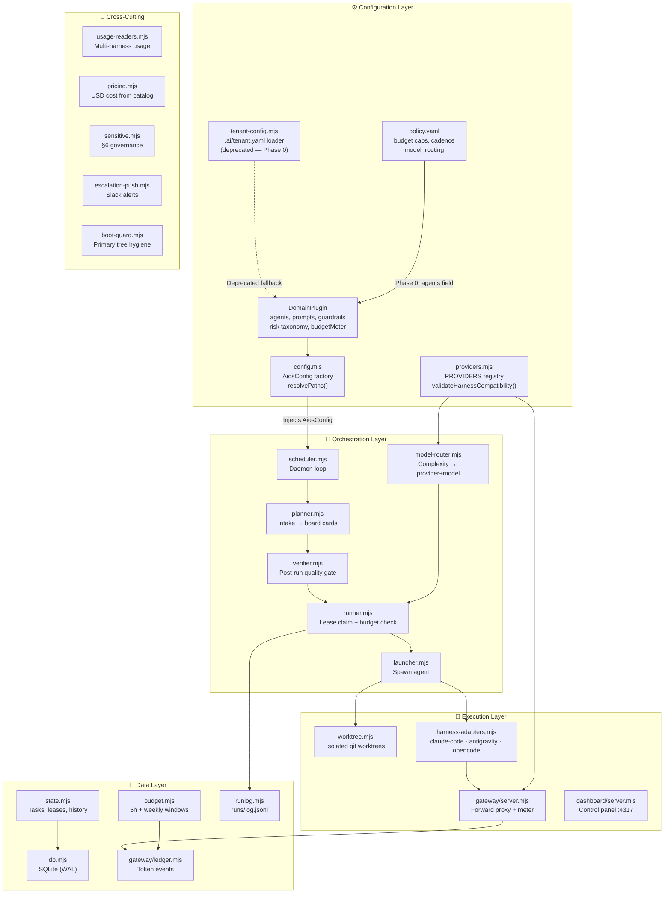

# MeridianOS — Core Component Relationships (C4 Component)

```mermaid
graph TB
    subgraph Config["⚙️ Configuration Layer"]
        ConfigMJS["config.mjs<br/>AiosConfig factory<br/>resolvePaths()"]
        DomainPlugin["DomainPlugin<br/>agents, prompts, guardrails<br/>risk taxonomy, budgetMeter"]
        TenantConfig["tenant-config.mjs<br/>.ai/tenant.yaml loader<br/>(deprecated — Phase 0)"]
        Providers["providers.mjs<br/>PROVIDERS registry<br/>validateHarnessCompatibility()"]
        PolicyYAML["policy.yaml<br/>budget caps, cadence<br/>model_routing"]
    end

    TenantConfig -.->|"Deprecated fallback"| DomainPlugin
    PolicyYAML -->|"Phase 0: agents field"| DomainPlugin
    DomainPlugin --> ConfigMJS

    subgraph Orchestration["🔄 Orchestration Layer"]
        Scheduler["scheduler.mjs<br/>Daemon loop"]
        Planner["planner.mjs<br/>Intake → board cards"]
        Verifier["verifier.mjs<br/>Post-run quality gate"]
        Runner["runner.mjs<br/>Lease claim + budget check"]
        Launcher["launcher.mjs<br/>Spawn agent"]
        Router["model-router.mjs<br/>Complexity → provider+model"]
    end

    Scheduler --> Planner
    Planner --> Verifier
    Verifier --> Runner
    Runner --> Launcher
    Router --> Runner

    subgraph Execution["🚀 Execution Layer"]
        Worktree["worktree.mjs<br/>Isolated git worktrees"]
        Harness["harness-adapters.mjs<br/>claude-code · antigravity · opencode"]
        Gateway["gateway/server.mjs<br/>Forward proxy + meter"]
        Dashboard["dashboard/server.mjs<br/>Control panel :4317"]
    end

    Launcher --> Worktree
    Launcher --> Harness
    Harness --> Gateway

    subgraph Data["💾 Data Layer"]
        DB["db.mjs<br/>SQLite (WAL)"]
        State["state.mjs<br/>Tasks, leases, history"]
        Ledger["gateway/ledger.mjs<br/>Token events"]
        Budget["budget.mjs<br/>5h + weekly windows"]
        RunLog["runlog.mjs<br/>runs/log.jsonl"]
    end

    State --> DB
    Gateway --> Ledger
    Budget --> Ledger
    Runner --> RunLog

    subgraph CrossCutting["🔀 Cross-Cutting"]
        Usage["usage-readers.mjs<br/>Multi-harness usage"]
        Pricing["pricing.mjs<br/>USD cost from catalog"]
        Sensitive["sensitive.mjs<br/>§6 governance"]
        EscPush["escalation-push.mjs<br/>Slack alerts"]
        BootGuard["boot-guard.mjs<br/>Primary tree hygiene"]
    end

    ConfigMJS -->|"Injects AiosConfig"| Scheduler
    Providers --> Router
    Providers --> Gateway
```
