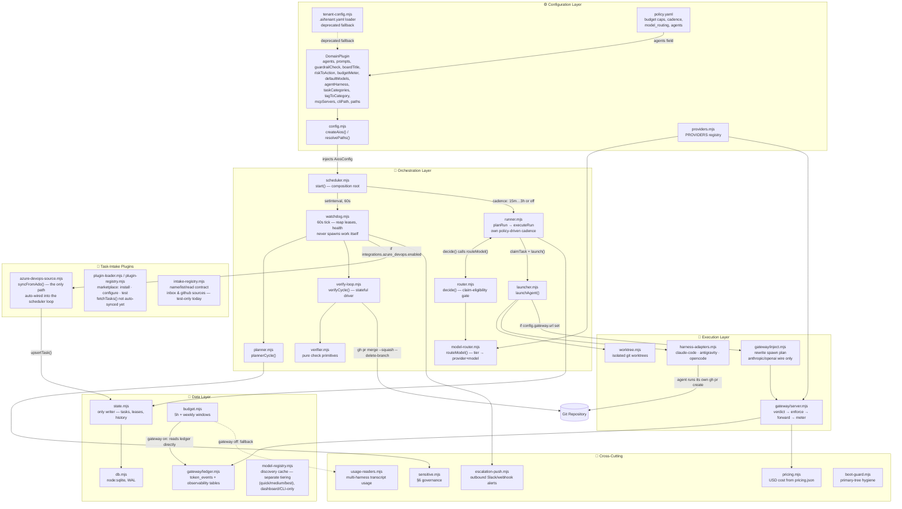

# MeridianOS — Component Relationships (C4 Component)

> Rendered directly from the Mermaid source below — no separate image export is maintained (see
> [docs/README.md](../README.md#diagrams) for the convention).

Two diagrams, one per "container" from [processing-pipeline.md](processing-pipeline.md): the
per-project **orchestration core** (unchanged in spirit since the original extraction, refined
below with what actually calls what), and the **control plane** the multi-tenant platform added on
top of it (new).

## Orchestration core

Corrections from the previous version: `router.mjs` and `model-router.mjs` are not duplicates or
parallel paths — `router.mjs`'s `decide()` is the single claim-eligibility gate and calls
`model-router.mjs`'s `routeModel()` internally to resolve the model once it has picked a task.
Neither imports anything from `gateway/` — model/tier selection is fully independent of the
gateway; the gateway only intercepts the physical wire call later, inside `launcher.mjs`.
`model-registry.mjs` is a third, unrelated thing (an auto-discovery cache with its own
quick/medium/best tiering, used only by dashboard/CLI discovery views). Planner, the verify loop,
and the runner are not a strict pipeline — the watchdog tick drives the first two independently
every 60s, while the runner fires on its own separately-configured cadence. PR creation is the
**agent's own** responsibility (the prompt `launcher.mjs` builds instructs it to run
`gh pr create` itself); core only adopts/merges what the agent already opened.

## Control plane (multi-tenant platform)

```mermaid
graph TB
    subgraph Web["🌐 Dashboard Process — one node:http server, :4317"]
        DashServer["dashboard/server.mjs<br/>~90 legacy routes + static UI"]
        ApiV1["api/v1/router.mjs<br/>/api/v1/* — mk-prefixed key auth<br/>same process, delegated wholesale"]
        RequireAuth["requireAuth() / requireProjectRole()<br/>defined locally in server.mjs<br/>— the real auth gate"]
    end

    DashServer -->|"delegates /api/v1/*"| ApiV1
    DashServer --> RequireAuth

    subgraph AuthLayer["🔐 Auth"]
        JWT["auth/jwt.mjs<br/>HMAC-SHA256, 30min expiry"]
        UserStore["auth/user-store.mjs<br/>scrypt password hashing, roles,<br/>invitations (24h expiry)"]
        ApiTokens["auth/api-tokens.mjs<br/>ApiKey scheme + mk-prefixed key scheme"]
        OAuthProvider["auth/oauth-provider.mjs<br/>github/google/azure<br/>⚠ wired, not functional end-to-end"]
    end

    RequireAuth --> JWT
    RequireAuth --> UserStore
    RequireAuth --> ApiTokens
    DashServer -.->|"authorize/callback — currently broken"| OAuthProvider

    subgraph ControlPlaneLayer["🏢 Project Supervision"]
        ProjectManager["control-plane.mjs<br/>ProjectManager"]
        Templates["TemplateLoader<br/>7 templates/*.yaml"]
        Telemetry["control-plane-telemetry.mjs<br/>opt-in local usage counters"]
        DaemonChild["Spawned project<br/>own Scheduler + Gateway"]
    end

    DashServer -->|"listProjects() / createProject()"| ProjectManager
    ProjectManager --> Templates
    ProjectManager --> Telemetry
    ProjectManager -->|"spawns daemon-entry.mjs as a child process"| DaemonChild

    subgraph BillingLayer["💳 Billing &amp; Compliance"]
        LicenseKey["licensing/license-key.mjs<br/>RSA-2048 — ⚠ keypair regenerated in<br/>memory each restart, not persisted"]
        StripeWebhook["licensing/stripe-webhook.mjs<br/>4 event types"]
        ComplianceReports["compliance/reports/*<br/>SOC2: real data<br/>GDPR / model-usage / cost-allocation:<br/>⚠ mocked or random placeholder figures"]
        AuditLog["compliance/audit-log.mjs<br/>+ activity_log (team feed)"]
    end

    DashServer --> LicenseKey
    DashServer --> StripeWebhook
    DashServer --> ComplianceReports
    AuditLog -->|"real data"| ComplianceReports

    subgraph PluginLayerCP["📦 Marketplace"]
        PluginLoaderCP["plugin-loader.mjs<br/>static analysis + contract check"]
        PluginRegistryCP["plugin-registry.mjs<br/>catalog · ratings · 6 built-ins"]
    end

    DashServer --> PluginLoaderCP
    PluginLoaderCP --> PluginRegistryCP

    subgraph ControlDBs["💾 Control-Plane Storage"]
        ControlPlaneDB[("control-plane.db<br/>projects · users · api_tokens ·<br/>invitations · licenses · activity_log ·<br/>compliance_log")]
    end

    ProjectManager --> ControlPlaneDB
    UserStore --> ControlPlaneDB
    ApiTokens --> ControlPlaneDB
    LicenseKey --> ControlPlaneDB
    AuditLog --> ControlPlaneDB
```

Notes: `auth/auth.mjs` and `auth/error-handler.mjs` are dead code in the live server (both are
Express-style middleware; the actual server is raw `node:http`) — omitted above since they aren't
part of the real request path, even though they still exist in the tree and are exercised by one
test file. `schema/control-plane-schema.sql` is a reconciled reference document, not a migration
runner — the tables above are actually created ad hoc by whichever module's constructor touches
them first. "Spawned project" is the same orchestration-core diagram above, one instance per
project the control plane supervises.
