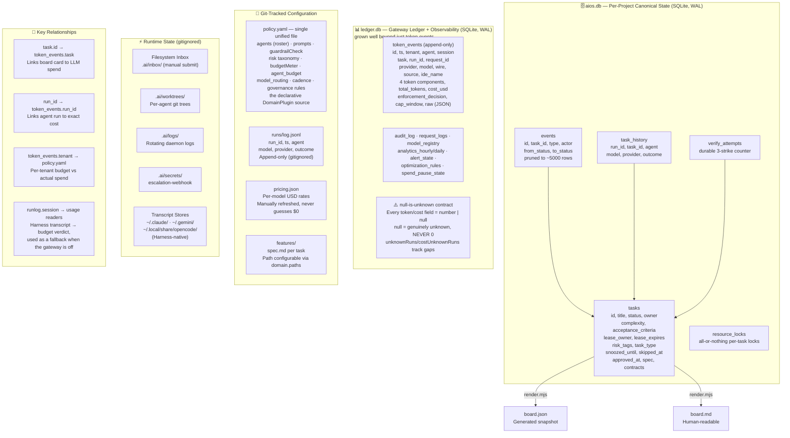
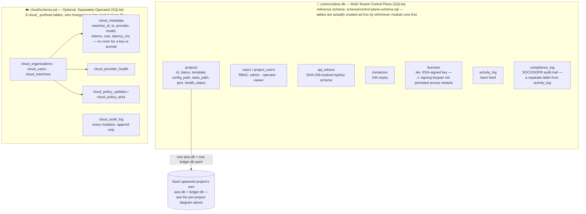

# MeridianOS — Data Model & Storage Architecture

> Rendered directly from the Mermaid source below — no separate image export is maintained (see
> [docs/README.md](../README.md#diagrams) for the convention).

Two diagrams: the per-project state every MeridianOS install has (unchanged in kind since the
original single-tenant core, refined below), and the multi-tenant control-plane + optional cloud
storage the platform layer added (new).

## Per-project state

The previous version carried two separate nodes both effectively labeled "policy.yaml" — a
leftover from before Phase 0 unified `tenant.yaml` into `policy.yaml`. Merged into one node above;
`.ai/tenant.yaml` still exists only as a deprecated fallback (see
[component-relationships.md](component-relationships.md)).

## Control-plane &amp; cloud storage (multi-tenant platform)

`schema/project-schema.sql` (a third, smaller schema — one `task_comments` table per project's own
DB) and the JSON Schemas (`schema/policy.schema.json`, `provider.schema.json`,
`domain-record.schema.json`) validate config shapes rather than describing stored data, so they're
omitted from this diagram.
