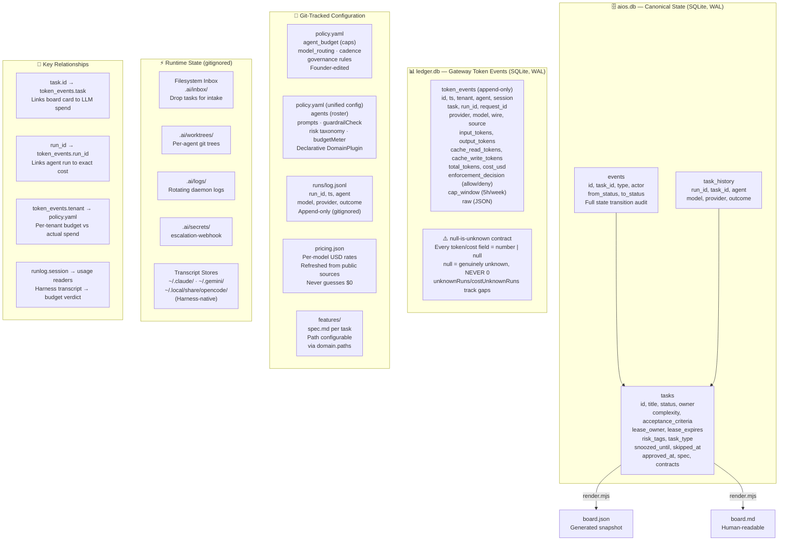

# MeridianOS — Data Model & Storage Architecture

```mermaid
graph TB
    subgraph StateDB["🗄️ aios.db — Canonical State (SQLite, WAL)"]
        Tasks["tasks<br/>id, title, status, owner<br/>complexity, acceptance_criteria<br/>lease_owner, lease_expires<br/>risk_tags, task_type<br/>snoozed_until, skipped_at<br/>approved_at, spec, contracts"]
        Events["events<br/>id, task_id, type, actor<br/>from_status, to_status<br/>Full state transition audit"]
        History["task_history<br/>run_id, task_id, agent<br/>model, provider, outcome"]
    end

    subgraph LedgerDB["📊 ledger.db — Gateway Token Events (SQLite, WAL)"]
        TokenEvents["token_events (append-only)<br/>id, ts, tenant, agent, session<br/>task, run_id, request_id<br/>provider, model, wire, source<br/>input_tokens, output_tokens<br/>cache_read_tokens, cache_write_tokens<br/>total_tokens, cost_usd<br/>enforcement_decision (allow/deny)<br/>cap_window (5h/week)<br/>raw (JSON)"]
        NullContract["⚠️ null-is-unknown contract<br/>Every token/cost field = number | null<br/>null = genuinely unknown, NEVER 0<br/>unknownRuns/costUnknownRuns track gaps"]
    end

    subgraph GitTracked["📁 Git-Tracked Configuration"]
        PolicyYAML["policy.yaml<br/>agent_budget (caps)<br/>model_routing · cadence<br/>governance rules<br/>Founder-edited"]
        TenantYAML["policy.yaml (unified config)<br/>agents (roster)<br/>prompts · guardrailCheck<br/>risk taxonomy · budgetMeter<br/>Declarative DomainPlugin"]
        RunLog["runs/log.jsonl<br/>run_id, ts, agent<br/>model, provider, outcome<br/>Append-only (gitignored)"]
        PricingJSON["pricing.json<br/>Per-model USD rates<br/>Refreshed from public sources<br/>Never guesses $0"]
        FeaturesDir["features/<br/>spec.md per task<br/>Path configurable<br/>via domain.paths"]
    end

    subgraph RuntimeState["⚡ Runtime State (gitignored)"]
        Inbox["Filesystem Inbox<br/>.ai/inbox/<br/>Drop tasks for intake"]
        Worktrees[".ai/worktrees/<br/>Per-agent git trees"]
        Logs[".ai/logs/<br/>Rotating daemon logs"]
        Secrets[".ai/secrets/<br/>escalation-webhook"]
        Transcripts["Transcript Stores<br/>~/.claude/ · ~/.gemini/<br/>~/.local/share/opencode/<br/>(Harness-native)"]
    end

    Tasks -->|"render.mjs"| BoardJSON["board.json<br/>Generated snapshot"]
    Tasks -->|"render.mjs"| BoardMD["board.md<br/>Human-readable"]
    Events --> Tasks
    History --> Tasks

    subgraph Relationships["🔗 Key Relationships"]
        Rel1["task.id → token_events.task<br/>Links board card to LLM spend"]
        Rel2["run_id → token_events.run_id<br/>Links agent run to exact cost"]
        Rel3["token_events.tenant → policy.yaml<br/>Per-tenant budget vs actual spend"]
        Rel4["runlog.session → usage readers<br/>Harness transcript → budget verdict"]
    end
```
