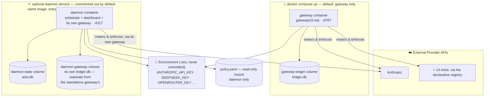
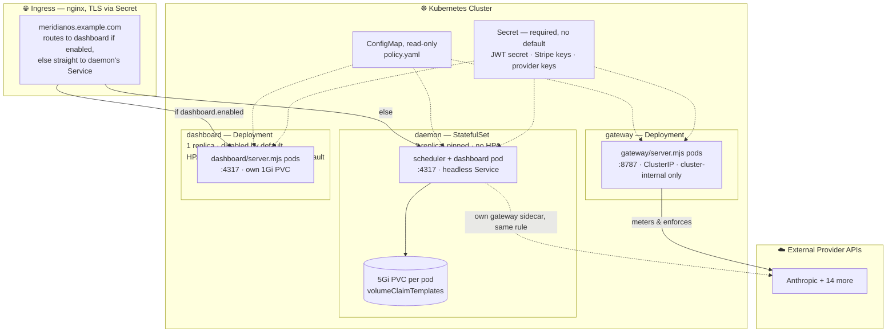
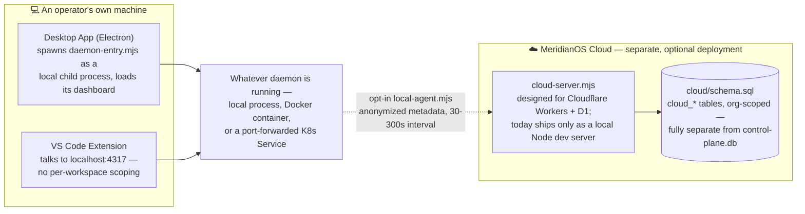

# MeridianOS — Deployment & Infrastructure

> Rendered directly from the Mermaid source below — no separate image export is maintained (see
> [docs/README.md](../README.md#diagrams) for the convention).

Three deployment shapes exist today: a single-machine Docker Compose setup, a production
Kubernetes Helm chart, and local desktop/IDE clients that can point at either — plus an entirely
separate, optional service for operators who want fleet-wide aggregation across machines.

## Docker Compose (local / single machine)

`docker compose up` starts **only the gateway** by default — the daemon service is commented out
in `docker-compose.yml` and must be opted into explicitly (with a mounted `.ai/tenant.yaml`). Both
share one image; only the entrypoint differs.

The previous version of this diagram had the two volumes swapped (gateway pointing at
`daemon-state`, daemon at `gateway-ledger`) — fixed above against the actual `docker-compose.yml`.
It also showed both containers as if they always ran together; by default only the gateway does.

## Kubernetes (production, `deploy/kubernetes/helm/meridianos`)

One container image backs three workloads, differentiated by command/args. The daemon is a
**StatefulSet**, not a Deployment — it needs a stable identity and a dedicated volume, not
horizontal scaling.

Known limitations (documented in the chart itself, carried over here rather than restated as
diagram nodes): the daemon can't horizontally scale — `ProjectManager` supervises spawned project
processes locally via `child_process`, so a second replica wouldn't see the first's work.
Gateway persistence is off by default because its SQLite ledger is single-writer (WAL mode); only
safe pinned to 1 replica if enabled. The standalone `dashboard` Deployment shares no state with
the daemon unless both are pointed at the same `ReadWriteMany` volume, which is why it's disabled
by default. The image runs as root (no `USER` in the Dockerfile), and first boot needs the
container command to `mkdir -p` a couple of `.ai/` subdirectories the app doesn't create itself.

## Local clients & optional cloud aggregation

The desktop app and VS Code extension aren't part of either deployment above — they run on an
individual's own machine and simply point at whatever daemon is reachable. Fleet-wide aggregation
across many operators' machines is a separate, optional service an operator can choose to stand up
and opt into — not something every install talks to.

