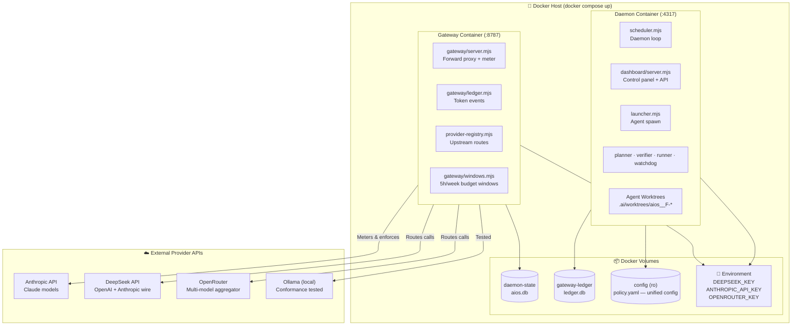

# MeridianOS — Deployment & Infrastructure

```mermaid
graph TB
    subgraph DockerHost["🐳 Docker Host (docker compose up)"]
        subgraph GatewayContainer["Gateway Container (:8787)"]
            GWServer["gateway/server.mjs<br/>Forward proxy + meter"]
            GWLedger["gateway/ledger.mjs<br/>Token events"]
            GWRegistry["provider-registry.mjs<br/>Upstream routes"]
            GWWindows["gateway/windows.mjs<br/>5h/week budget windows"]
        end

        subgraph DaemonContainer["Daemon Container (:4317)"]
            Scheduler["scheduler.mjs<br/>Daemon loop"]
            Dashboard["dashboard/server.mjs<br/>Control panel + API"]
            Launcher["launcher.mjs<br/>Agent spawn"]
            CoreOrch["planner · verifier · runner · watchdog"]
            Worktrees["Agent Worktrees<br/>.ai/worktrees/aios__F-*"]
        end

        subgraph Volumes["📦 Docker Volumes"]
            StateVol[("daemon-state<br/>aios.db")]
            LedgerVol[("gateway-ledger<br/>ledger.db")]
            ConfigVol[("config (ro)<br/>policy.yaml — unified config")]
            EnvVars["🔑 Environment<br/>DEEPSEEK_KEY<br/>ANTHROPIC_API_KEY<br/>OPENROUTER_KEY"]
        end
    end

    GatewayContainer --> StateVol
    DaemonContainer --> LedgerVol
    DaemonContainer --> ConfigVol
    DaemonContainer --> EnvVars
    GatewayContainer --> EnvVars

    subgraph Providers["☁️ External Provider APIs"]
        AnthropicAPI["Anthropic API<br/>Claude models"]
        DeepSeekAPI["DeepSeek API<br/>OpenAI + Anthropic wire"]
        OpenRouterAPI["OpenRouter<br/>Multi-model aggregator"]
        OllamaLocal["Ollama (local)<br/>Conformance tested"]
    end

    GatewayContainer -->|"Meters & enforces"| AnthropicAPI
    GatewayContainer -->|"Routes calls"| DeepSeekAPI
    GatewayContainer -->|"Routes calls"| OpenRouterAPI
    GatewayContainer -->|"Tested"| OllamaLocal
```
