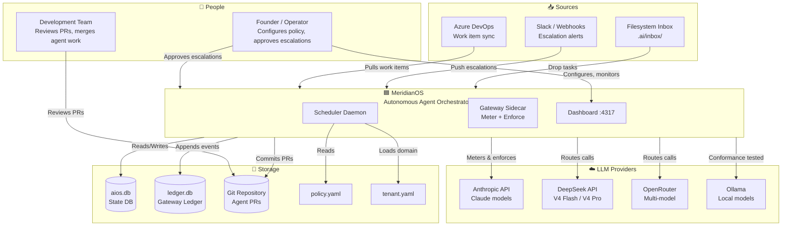

# MeridianOS — High-Level Architecture (C4 Context)

```mermaid
graph TB
    subgraph People["👤 People"]
        Founder["Founder / Operator<br/>Configures policy, approves escalations"]
        DevTeam["Development Team<br/>Reviews PRs, merges agent work"]
    end

    subgraph MeridianOS["🟦 MeridianOS<br/>Autonomous Agent Orchestrator + Cost Governance"]
        direction TB
        Scheduler["Scheduler Daemon"]
        Gateway["Gateway Sidecar<br/>Meter + Enforce"]
        Dashboard["Dashboard :4317"]
    end

    subgraph Sources["📥 Sources"]
        ADO["Azure DevOps<br/>Work item sync"]
        Slack["Slack / Webhooks<br/>Escalation alerts"]
        Inbox["Filesystem Inbox<br/>.ai/inbox/"]
    end

    subgraph Providers["☁️ LLM Providers"]
        Anthropic["Anthropic API<br/>Claude models"]
        DeepSeek["DeepSeek API<br/>V4 Flash / V4 Pro"]
        OpenRouter["OpenRouter<br/>Multi-model"]
        Ollama["Ollama<br/>Local models"]
    end

    subgraph Storage["💾 Storage"]
        StateDB[("aios.db<br/>State DB")]
        LedgerDB[("ledger.db<br/>Gateway Ledger")]
        GitRepo[("Git Repository<br/>Agent PRs")]
        Policy["policy.yaml"]
        TenantYAML["tenant.yaml"]
    end

    Founder -->|"Configures, monitors"| Dashboard
    Founder -->|"Approves escalations"| MeridianOS
    DevTeam -->|"Reviews PRs"| GitRepo
    ADO -->|"Pulls work items"| MeridianOS
    Slack -->|"Push escalations"| MeridianOS
    Inbox -->|"Drop tasks"| MeridianOS
    MeridianOS -->|"Meters & enforces"| Anthropic
    MeridianOS -->|"Routes calls"| DeepSeek
    MeridianOS -->|"Routes calls"| OpenRouter
    MeridianOS -->|"Conformance tested"| Ollama
    MeridianOS -->|"Reads/Writes"| StateDB
    MeridianOS -->|"Appends events"| LedgerDB
    MeridianOS -->|"Commits PRs"| GitRepo
    Scheduler -->|"Reads"| Policy
    Scheduler -->|"Loads domain"| TenantYAML
```
