# MeridianOS — High-Level Architecture (C4 Context)

> Rendered directly from the Mermaid source below — no separate image export is maintained (see
> [docs/README.md](../README.md#diagrams) for the convention).

MeridianOS started as a single-operator autonomous agent orchestrator and has grown a
multi-tenant control plane, a desktop companion app, and a VS Code extension on top of the same
core loop. This diagram shows the system's boundary and everyone/everything it talks to; see
[component-relationships.md](component-relationships.md) and
[processing-pipeline.md](processing-pipeline.md) for what happens inside that boundary.

```mermaid
graph TB
    subgraph People["👤 People"]
        Founder["Founder / Operator<br/>Configures policy, approves escalations, manages billing"]
        TeamMember["Team Member<br/>Signs in via Dashboard (JWT)<br/>role: admin · operator · viewer"]
        DevTeam["Development Team<br/>Reviews PRs, merges agent work"]
    end

    subgraph MeridianOS["🟦 MeridianOS<br/>Autonomous Agent Orchestrator, Cost Governance &amp; Multi-Tenant Control Plane"]
        direction TB
        Scheduler["Scheduler Daemon<br/>Per-project orchestration loop"]
        Gateway["Gateway Sidecar<br/>Meter + Enforce (default-on)"]
        Dashboard["Dashboard &amp; Control Plane<br/>:4317"]
        Desktop["Desktop App<br/>Electron — spawns &amp; wraps the daemon"]
        VSCode["VS Code Extension<br/>sidebar, spend indicator, Copilot routing"]
    end

    subgraph Sources["📥 Task Intake"]
        ADO["Azure DevOps<br/>Work item sync (the only auto-wired source)"]
        Marketplace["Marketplace Connectors<br/>Jira · Linear · Notion · GitHub Issues · Teams · Webhook<br/>installable — not yet auto-syncing"]
        Inbox["Filesystem Inbox<br/>.ai/inbox/ (manual submit)"]
    end

    subgraph Providers["☁️ LLM Providers"]
        Anthropic["Anthropic"]
        OpenAI["OpenAI"]
        MoreProviders["+ 13 more<br/>DeepSeek · OpenRouter · Ollama · Groq ·<br/>Google Gemini · Mistral · Azure · Bedrock · …<br/>declarative registry — no code changes to add one"]
    end

    subgraph ExternalSvc["🔌 External Services"]
        Stripe["Stripe<br/>Billing &amp; subscriptions"]
        OAuthIdP["OAuth Identity Providers<br/>Azure AD · Google · GitHub"]
        CloudCP["MeridianOS Cloud (optional)<br/>Separately-operated fleet aggregator<br/>opt-in, self-hostable"]
    end

    subgraph Storage["💾 Storage"]
        StateDB[("aios.db<br/>Per-project task state")]
        LedgerDB[("ledger.db<br/>Gateway ledger + observability")]
        ControlDB[("control-plane.db<br/>Projects · users · billing · compliance")]
        GitRepo[("Git Repository<br/>Agent PRs")]
        Policy["policy.yaml<br/>Unified config"]
    end

    Founder -->|"Configures policy, monitors, approves escalations"| Dashboard
    MeridianOS -.->|"Escalation alerts (Slack / webhook)"| Founder
    TeamMember -->|"Signs in, manages projects &amp; team"| Dashboard
    DevTeam -->|"Reviews &amp; merges PRs"| GitRepo
    ADO <-->|"Pulls/pushes work items"| MeridianOS
    Marketplace -.->|"Configure, test, manual sync"| Dashboard
    Inbox -->|"Drop tasks"| MeridianOS
    Desktop -->|"Loads"| Dashboard
    VSCode -->|"Task board, spend, Copilot routing"| Dashboard
    MeridianOS -->|"Meters &amp; enforces"| Anthropic
    MeridianOS -->|"Meters &amp; enforces"| OpenAI
    MeridianOS -->|"Meters &amp; enforces"| MoreProviders
    Dashboard -->|"Checkout, plan webhooks"| Stripe
    Dashboard -.->|"SSO login (routes wired, not yet functional end-to-end)"| OAuthIdP
    MeridianOS -.->|"Opt-in usage metadata"| CloudCP
    MeridianOS -->|"Reads/writes"| StateDB
    MeridianOS -->|"Appends events"| LedgerDB
    Dashboard -->|"Reads/writes"| ControlDB
    MeridianOS -->|"Commits, opens PRs"| GitRepo
    Scheduler -->|"Reads"| Policy
```

Notes on what changed since the single-tenant version of this diagram:

- **Task intake is honest about what's automatic.** Azure DevOps (`azure-devops-source.mjs`) is
  the only source actually wired into the scheduler's watchdog loop. The six marketplace
  connectors (`intake-adapters/*.mjs`) can be installed, configured, and test-connected from the
  dashboard's Marketplace panel, but nothing currently calls their `fetchTasks()` automatically —
  see [component-relationships.md](component-relationships.md) for the detail. The filesystem
  inbox exists but is mainly used for agent-to-agent handoff, not external intake.
- **The old "Slack" source was backwards.** Escalations are an *outbound* notification
  (`escalation-push.mjs`), not an inbound task source — fixed to point away from MeridianOS.
- **Dashboard is on port 4317**, not 4320 (a genuine bug in the root README this refresh also
  fixes — 4320 is the first port `ProjectManager` hands out to *spawned project* processes, an
  unrelated number).
- **OAuth SSO is wired but not functional end-to-end today** (mismatched call signatures between
  `dashboard/server.mjs` and `auth/oauth-provider.mjs`, and no session store backing the
  authorize→callback round trip). JWT email/password and API-key auth both work. Flagged here so
  the diagram doesn't overstate what a fresh install can actually do; see
  [KNOWN-ISSUES.md](../KNOWN-ISSUES.md).
- **MeridianOS Cloud** (`cloud/`) is a separate, optional, centrally-operated fleet-aggregation
  service that a `local-agent.mjs` can opt in to phone home to — it is not something every
  MeridianOS install runs, and is currently only demonstrated as a local Node dev server (its own
  header documents Cloudflare Workers as the intended production target, not yet wired up).
