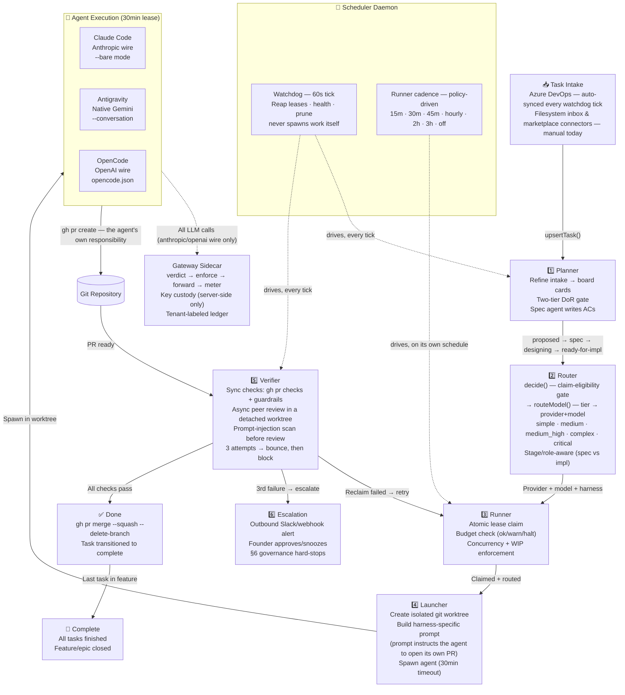

# MeridianOS — Processing Pipeline (C4 Container / Runtime Flow)

> Rendered directly from the Mermaid source below — no separate image export is maintained (see
> [docs/README.md](../README.md#diagrams) for the convention).

This shows one project's task lifecycle end to end. It runs once per project — the multi-tenant
control plane ([component-relationships.md](component-relationships.md#control-plane-multi-tenant-platform))
supervises one or more instances of this exact pipeline, each in its own worktree/state DB.

What changed from the previous version:

- **Intake honesty.** Azure DevOps is the only source the watchdog actually pulls from
  automatically. The filesystem inbox and the six marketplace connectors exist and can be
  configured from the dashboard, but nothing currently syncs their tasks onto the board
  automatically — a real gap, not a diagram simplification. See
  [component-relationships.md](component-relationships.md) for the exact modules involved.
  "Slack" was removed as an intake source entirely — escalation is an *outbound* notification, not
  a way tasks get in.
- **The runner does not share the watchdog's 60-second tick.** It has its own policy-driven
  cadence (`schedule:` in `policy.yaml`, default every 15 minutes, `off` disables it). Only the
  planner and the verify loop are actually driven by the 60s watchdog tick.
- **The gateway sits beside step 4, not between steps 4 and 5.** It meters LLM calls *during*
  agent execution; it has no role in deciding whether a PR is ready to verify. What actually
  triggers verification is the PR/branch existing in the git repo — which the *agent itself*
  creates (the launcher's prompt instructs it to run `gh pr create`), not something core does on
  its behalf. Gateway injection is also scoped to the anthropic/openai wire today — a provider
  routed on `google-ai` or `generic-http` has no daemon-side metering-injection path yet.
- **Merge mechanics spelled out**: the verify loop merges with `gh pr merge --squash
  --delete-branch` once every check passes, in a detached worktree it creates specifically for
  peer review (never the primary tree), after scanning the PR title/body/diff for prompt
  injection.
