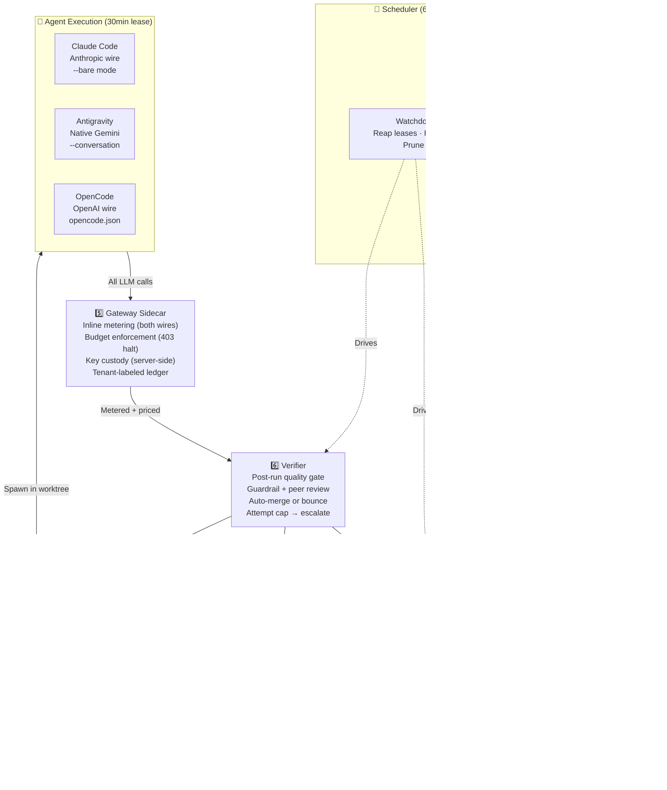

# MeridianOS — Processing Pipeline (C4 Container)

```mermaid
flowchart TD
    Intake["📥 Intake Sources<br/>ADO · Inbox · Slack · Manual"]
    
    subgraph Scheduler["🔄 Scheduler (60s tick)"]
        Watchdog["Watchdog<br/>Reap leases · Health · Prune"]
    end

    Intake -->|"Normalized items"| Planner

    Planner["1️⃣ Planner<br/>Refine intake → board cards<br/>Two-tier DoR gate<br/>Spec agent writes ACs"]
    Planner -->|"proposed → spec → designing → ready-for-impl"| Router

    Router["2️⃣ Model Router<br/>Complexity tier → provider+model<br/>simple · medium · medium_high · complex · critical<br/>Stage/role-aware (spec vs impl)"]
    Router -->|"Provider + model + harness"| Runner

    Runner["3️⃣ Runner<br/>Atomic lease claim<br/>Budget check (ok/warn/halt)<br/>Concurrency + WIP enforcement"]
    Runner -->|"Claimed + routed"| Launcher

    Launcher["4️⃣ Launcher<br/>Create isolated git worktree<br/>Build harness-specific prompt<br/>Spawn agent (30min timeout)"]
    Launcher -->|"Spawn in worktree"| AgentBox

    subgraph AgentBox["🤖 Agent Execution (30min lease)"]
        Claude["Claude Code<br/>Anthropic wire<br/>--bare mode"]
        Antigravity["Antigravity<br/>Native Gemini<br/>--conversation"]
        OpenCode["OpenCode<br/>OpenAI wire<br/>opencode.json"]
    end

    AgentBox -->|"All LLM calls"| Gateway

    Gateway["5️⃣ Gateway Sidecar<br/>Inline metering (both wires)<br/>Budget enforcement (403 halt)<br/>Key custody (server-side)<br/>Tenant-labeled ledger"]
    Gateway -->|"Metered + priced"| Verifier

    Verifier["6️⃣ Verifier<br/>Post-run quality gate<br/>Guardrail + peer review<br/>Auto-merge or bounce<br/>Attempt cap → escalate"]
    Verifier -->|"Reclaim failed → retry"| Runner
    Verifier -->|"Blocked → escalate"| Escalation
    Verifier -->|"All checks pass"| Done

    Escalation["7️⃣ Escalation<br/>Slack/webhook alerts<br/>Founder approves/snoozes<br/>§6 governance hard-stops"]

    Done["✅ Done<br/>PR merged · branch deleted<br/>Task transitioned to complete"]
    Complete["🏁 Complete<br/>All tasks finished<br/>Feature/epic closed"]

    Done -->|"Last task in feature"| Complete

    Watchdog -.->|"Drives"| Planner
    Watchdog -.->|"Drives"| Runner
    Watchdog -.->|"Drives"| Verifier
```
