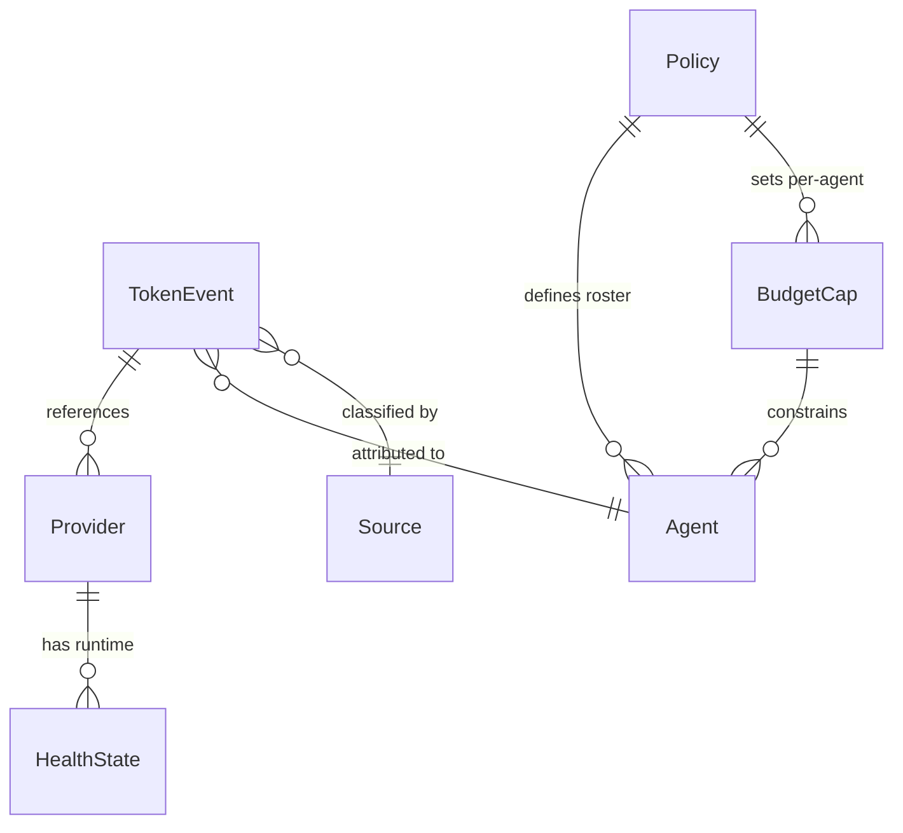

# Data Model: Foundation Hardening

**Created**: 2026-07-27 | **Plan**: [plan.md](./plan.md)

## Overview

Phase 0 does not introduce new entity types — it extends existing entities with new fields and adds one new runtime data structure (provider health state). Below are the affected entities and their changes.

---

## Entity Changes

### 1. Token Event (`token_events` table)

**Location**: `gateway/ledger-schema.sql` | `gateway/token-event.mjs`

**Change**: Add `source` column for traffic origin classification.

```sql
-- Addition to existing schema:
ALTER TABLE token_events ADD COLUMN source TEXT NOT NULL DEFAULT 'agent';
```

**Full schema (post-migration)**:

| Column | Type | Constraints | Description |
|--------|------|-------------|-------------|
| id | TEXT | PRIMARY KEY | UUID v4 |
| ts | TEXT | NOT NULL | ISO-8601 UTC timestamp |
| tenant | TEXT | NOT NULL | Tenant identifier |
| agent | TEXT | NOT NULL | Agent name |
| session | TEXT | | Session identifier |
| task | TEXT | | Task identifier |
| run_id | TEXT | | Run identifier |
| request_id | TEXT | | Request identifier |
| provider | TEXT | NOT NULL | Provider name |
| model | TEXT | NOT NULL | Model name |
| wire | TEXT | NOT NULL | Wire protocol (anthropic/openai/generic-http) |
| **source** | **TEXT** | **NOT NULL, DEFAULT 'agent'** | **Traffic origin: agent/ide/cli/api** |
| upstream_status | INTEGER | | HTTP status from upstream |
| latency_ms | INTEGER | | Request latency in milliseconds |
| input_tokens | INTEGER | | Input token count (null = unknown) |
| output_tokens | INTEGER | | Output token count (null = unknown) |
| cache_read_tokens | INTEGER | | Cache read tokens |
| cache_write_tokens | INTEGER | | Cache write tokens |
| total_tokens | INTEGER | | Total tokens (null = unknown) |
| cost_usd | REAL | | Cost in USD (null = unpriced) |
| enforcement_decision | TEXT | NOT NULL | Verdict: allow/deny |
| cap_window | TEXT | | Budget window that triggered |
| raw | TEXT | NOT NULL | Full JSON event |

**Source values**:
- `agent` — Agent-spawned traffic (current default, only value in Phase 0)
- `ide` — IDE plugin traffic (P4)
- `cli` — CLI ad-hoc traffic (P1)
- `api` — Direct REST API traffic (P6)

**Validation**: `source` must be one of the four allowed values. `makeTokenEvent()` validates this at event creation time.

**Migration**: SQLite `ALTER TABLE ADD COLUMN ... DEFAULT 'agent'` is O(1) — no row rewriting. All existing rows implicitly have `source = 'agent'`.

---

### 2. Provider Health State (in-memory, not persisted)

**Location**: `provider-health.mjs` [NEW]

**Structure**: An in-memory `Map<providerName, HealthState>` updated by the health check loop. Not persisted — health is ephemeral runtime state.

```text
HealthState {
  provider: string,         // Provider name
  status: 'unknown' | 'ok' | 'degraded' | 'down',
  latencyMs: number | null, // Last measured latency
  lastCheck: string,        // ISO-8601 timestamp of last check
  consecutiveFailures: number,
  error: string | null,     // Last error message (if any)
}
```

**State transitions**:
```
unknown ──(first check ok)──→ ok
unknown ──(first check fail)──→ degraded

ok ──(check fail)──→ degraded
ok ──(check ok)──→ ok (update latency)

degraded ──(check ok)──→ ok
degraded ──(check fail)──→ down

down ──(check ok)──→ ok
down ──(check fail)──→ down (stay down)
```

**Exposed via**: `GET /api/providers` in dashboard — each provider object includes `health: { status, latencyMs, lastCheck, error? }`.

---

### 3. Budget Window (no schema change — behavior change only)

**Location**: `budget.mjs` (verdictFor), `gateway/windows.mjs` (agentBudgetVerdict, costVerdictFor)

**Change**: Sentinel value semantics correction.

| Cap Value | Before (Bug) | After (Fix) |
|-----------|-------------|-------------|
| `0` | Treated as "no cap" (unlimited) | Hard block (all requests denied) |
| `null` / `undefined` / absent | Treated as "no cap" (unlimited) | No cap (unlimited) — correct |
| `50000` (positive) | Normal enforcement | Normal enforcement — unchanged |

**Implementation**: Change `if (!r.cap)` to `if (r.cap == null)` in the cap evaluation logic.

---

### 4. Unified Policy Configuration (conceptual merge, not new entity)

**Location**: `config.mjs` (resolveDomain), `tenant-config.mjs` (resolveTenantConfig)

**Change**: `policy.yaml` now accepts `agents:` field directly. Resolution order:

1. Explicit JS `DomainPlugin` passed to `createAios({ domain })` — unchanged
2. `$AIOS_TENANT_CONFIG` env var → YAML file — unchanged
3. `policy.yaml`'s `agents:` field — **NEW**
4. `.ai/tenant.yaml` — **deprecated, fallback only**

No new database entities. The domain plugin structure (`agents`, `prompts`, `guardrailCheck`, etc.) is unchanged — only the source of those values changes.

---

### 5. Policy JSON Schema (new static file)

**Location**: `schema/policy.schema.json` [NEW]

**Structure**: JSON Schema draft-07 document defining the valid shape of `policy.yaml`. Key sections:

```text
{
  "$schema": "http://json-schema.org/draft-07/schema#",
  "type": "object",
  "required": [],
  "properties": {
    "agents": { "type": "array", "items": { "type": "string" } },
    "gateway": {
      "type": "object",
      "properties": {
        "disabled": { "type": "boolean" },
        "port": { "type": "integer", "minimum": 1024, "maximum": 65535 },
        "tenant": { "type": "string" }
      }
    },
    "model_routing": {
      "type": "object",
      "patternProperties": {
        ".*": {
          "type": "object",
          "properties": {
            "provider": { "type": "string" }
          }
        }
      }
    },
    "agent_budget": {
      "type": "object",
      "patternProperties": {
        ".*": {
          "type": "object",
          "properties": {
            "per_5h_tokens": { "type": ["integer", "null"] },
            "per_week_tokens": { "type": ["integer", "null"] },
            "per_5h_cost_usd": { "type": ["number", "null"] },
            "per_week_cost_usd": { "type": ["number", "null"] }
          }
        }
      }
    },
    "providers": { "...": "provider route definitions" }
  }
}
```

**Validation rules**:
- Required fields: none at top level (system boots with empty policy)
- `gateway.port`: must be valid port number (1024–65535)
- `model_routing.*.provider`: must reference a provider defined in `.providers`
- Unknown top-level fields: warning only (forward compat)
- `agent_budget.*.per_5h_tokens`: integer or null (not 0 unless intentional hard block)

---

## Relationships



- **TokenEvent → Provider**: Each event references a provider name (not a foreign key — provider is a string from the registry, not a DB row).
- **TokenEvent → Agent**: Each event is attributed to an agent (from the domain plugin roster).
- **TokenEvent → Source**: The new `source` column classifies the traffic origin.
- **Provider → HealthState**: Ephemeral runtime association — health state is in-memory, not in the ledger.
- **Policy → Agent**: The unified `policy.yaml` defines the agent roster (replaces `tenant.yaml`).
- **Policy → BudgetCap**: Per-agent budget caps live under `agent_budget.<agent>` in policy.
