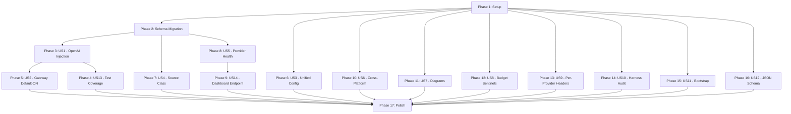

# Tasks: Foundation Hardening

**Input**: Design documents from `/specs/001-foundation-hardening/`

**Prerequisites**: plan.md (required), spec.md (required), research.md, data-model.md, quickstart.md

**Tests**: Test tasks are included per the spec's US13 (Comprehensive Test Coverage) mandate and the constitution's Test-First Discipline principle.

**Organization**: Tasks are grouped by user story to enable independent implementation and testing. The critical path is US1 → US2; all other stories are parallelizable.

## Format: `[ID] [P?] [Story] Description`

- **[P]**: Can run in parallel (different files, no dependencies)
- **[Story]**: Which user story this task belongs to (e.g., US1, US2, US3)
- Include exact file paths in descriptions

---

## Phase 1: Setup (Verification Baseline)

**Purpose**: Confirm clean starting state before any implementation

- [x] T001 Run full test suite to establish baseline: `npm test` — confirm 887 tests pass, 0 failures
- [x] T002 Verify gateway ledger schema current state in `gateway/ledger-schema.sql` — document existing columns
- [x] T003 Verify all 5 diagram source files exist in `docs/diagrams/` — all 5 present (.md and .png)

---

## Phase 2: Foundational — Schema Migration (Blocks US4, US5, US14)

**Purpose**: Database schema change that several stories depend on. Must complete before source-related work.

**⚠️ CRITICAL**: US4, US5, and US14 tasks depend on this phase being complete.

- [x] T004 Add `source TEXT NOT NULL DEFAULT 'agent'` column to `token_events` table in `gateway/ledger-schema.sql` per data-model.md §1
- [x] T005 Update `makeTokenEvent()` to accept and validate `source` parameter in `gateway/token-event.mjs` — valid values: `agent`, `ide`, `cli`, `api`; default `'agent'`
- [x] T006 Update `appendEvent()` to include `source` column in INSERT in `gateway/ledger.mjs`
- [x] T007 Update `listEvents()` to SELECT and return `source` column in query results in `gateway/ledger.mjs` (included via raw JSON)
- [x] T008 Update `queryWindow()` to accept optional `source` filter parameter in `gateway/ledger.mjs`

**Checkpoint**: `source` column exists, all ledger functions handle it, existing tests still pass

---

## Phase 3: User Story 1 — OpenAI Wire Injection for Agent Traffic Metering (Priority: P1) 🎯 MVP

**Goal**: OpenCode agents using OpenAI-compatible wire protocols have their spawn plans automatically rewritten to route all API calls through the MeridianOS gateway for unified metering.

**Independent Test**: Spawn an OpenCode agent with gateway running → query `sqlite3 .ai/gateway/ledger.db "SELECT provider, model, total_tokens FROM token_events WHERE source='agent' ORDER BY ts DESC LIMIT 1"` → shows provider/model with non-null token counts.

### Tests for User Story 1 ⚠️

> **Write these FIRST, ensure they FAIL before implementation**

- [ ] T009 [P] [US1] Create `tests/gateway/inject-openai.test.mjs` — test that `applyGatewayInjection()` correctly rewrites OpenCode spawn plans (file-based `opencode.json` with `baseURL` and `apiKey` replaced) using cassette-mocked provider data
- [ ] T010 [P] [US1] Create `tests/gateway/server-openai.test.mjs` — test that gateway server correctly constructs `Authorization: Bearer` headers and forwards OpenAI-wire requests to upstream, with token-event emission
- [ ] T011 [US1] Extend existing `tests/gateway/inject.test.mjs` with regression assertion: Anthropic-wire injection output must be byte-identical before and after OpenAI changes

### Implementation for User Story 1

- [ ] T012 [US1] Add `wire === 'openai'` branch in `applyGatewayInjection()` in `gateway/inject.mjs` — parse `opencode.json` from plan files, rewrite `baseURL` to gateway URL, rewrite `apiKey` to minted token, return updated files array
- [ ] T013 [US1] Add `case 'openai'` to `buildForwardHeaders()` in `gateway/server.mjs` — construct `Authorization: Bearer ${apiKey}` header (OpenAI clients send auth via Bearer token, not `x-api-key`)
- [ ] T014 [US1] Ensure `openCodeAdapter()` in `harness-adapters.mjs` includes `wire: 'openai'` in spawn plan metadata so injection layer can identify the wire protocol correctly
- [ ] T015 [US1] Run `npm test` — confirm T009, T010, T011 all pass, and all existing inject tests produce byte-identical output (zero Anthropic regression)

**Checkpoint**: OpenCode agents route through gateway, token events recorded with correct provider/model, Anthropic injection unchanged

---

## Phase 4: User Story 13 — Comprehensive Test Coverage for New Functionality (Priority: P1)

**Goal**: All Phase 0 changes have test coverage so future changes don't accidentally break the hardened foundation. All existing 915+ tests continue to pass.

**Independent Test**: `npm test` → 915+ tests pass, 0 failures, zero `.only()` markers.

### Tasks for User Story 13

- [ ] T016 [P] [US13] Extend `tests/cassette.test.mjs` with OpenAI wire cassette fixtures for deterministic test replay
- [ ] T017 [P] [US13] Create `tests/gateway/ledger-source.test.mjs` — test that `source` column migration works, existing rows default to `'agent'`, new events record correct source
- [ ] T018 [P] [US13] Create `tests/gateway/windows-sentinel.test.mjs` — test zero-vs-null budget cap semantics (TBD in US8)
- [ ] T019 [P] [US13] Create `tests/provider-health.test.mjs` — test health check loop with mocked endpoints (TBD in US5)
- [ ] T020 [P] [US13] Create `tests/config-unified.test.mjs` — test policy-only boot, tenant.yaml fallback, deprecation warning (TBD in US3)
- [ ] T021 [P] [US13] Create `tests/bootstrap.test.mjs` — test auto-created directories, `--init` flag, error message format (TBD in US11)
- [ ] T022 [P] [US13] Create `tests/policy-validate-schema.test.mjs` — test JSON Schema validation with valid/invalid configs (TBD in US12)
- [ ] T023 [US13] Run full test suite: `npm test` — verify 915+ tests pass, 0 failures, zero regressions across all modules

**Checkpoint**: Full test coverage for all Phase 0 features, existing test baseline preserved

---

## Phase 5: User Story 2 — Gateway as Default Metering Path (Priority: P1)

**Goal**: Gateway starts automatically with the daemon (opt-out, not opt-in). Budget module reads from gateway ledger as primary authoritative source.

**Independent Test**: Fresh `createAios() + start()` → `config.gateway.url` is set without any `gateway.enabled: true` flag.

### Implementation for User Story 2

- [ ] T024 [US2] Modify `maybeStartGateway()` in `scheduler.mjs` — remove `policy?.gateway?.enabled !== true` gate; always call `assembleGateway()`. Add opt-out check: if `policy.gateway.disabled === true`, skip startup
- [ ] T025 [US2] Modify `buildSpawnPlan()` / launch logic in `launcher.mjs` — replace `gwConfig?.enabled === true` check with `gwConfig?.url` presence check; if gateway URL is available, inject gateway routing
- [ ] T026 [US2] Modify `currentUsage()` in `budget.mjs` — try `ledgerWindowUsage()` (via `gateway/windows.mjs`'s `agentBudgetVerdict`) first as primary source; fall back to `usageReaderUsage()` on error with a logged warning
- [ ] T027 [US2] Update gateway start log message in `scheduler.mjs` to indicate default-ON behavior: `"gateway sidecar auto-started (set gateway.disabled: true to opt out)"`
- [ ] T028 [US2] Audit all existing tests that assumed gateway-off — add `gateway: { disabled: true }` to test fixtures that need it, ensuring zero regressions
- [ ] T029 [US2] Run `npm test` — verify all tests pass with gateway default-ON behavior

**Checkpoint**: Gateway starts automatically, budget reads ledger first, opt-out via `gateway.disabled: true` works

---

## Phase 6: User Story 3 — Unified Configuration Surface (Priority: P1)

**Goal**: All system configuration in single `policy.yaml`. Tenant.yaml becomes deprecated fallback. Boot validation catches misconfigurations with line numbers.

**Independent Test**: Boot MeridianOS with only `policy.yaml` (no `tenant.yaml`) → agent roster loads, board created.

### Implementation for User Story 3

- [ ] T030 [US3] Extend `resolveDomain()` in `config.mjs` to read `agents` from `policy.agents` field before falling back to `tenant.yaml` — maintain existing resolution chain: explicit domain → `$AIOS_TENANT_CONFIG` → policy.agents → tenant.yaml → throw
- [ ] T031 [US3] Add deprecation warning in `resolveTenantConfig()` in `tenant-config.mjs` — when tenant.yaml is loaded, emit `console.warn("[MERIDIANOS] tenant.yaml is deprecated — move agent definitions to policy.yaml under 'agents:' field")`
- [ ] T032 [US3] Extend `policy-validate.mjs` to validate `model_routing` references valid providers defined in `policy.providers` section — error format: `"policy.yaml: model_routing.<agent>.<tier> references unknown provider '<name>' at line <N>"`
- [ ] T033 [US3] Extend `policy-validate.mjs` to validate `keyEnv` environment variables exist at boot time — error format: `"policy.yaml: providers.<name>.keyEnv '<VAR>' is not set in environment"`
- [ ] T034 [US3] Extend `policy-validate.mjs` to validate `wire` values are from allowed set (`anthropic`, `openai`, `generic-http`) — error lists valid options
- [ ] T035 [US3] Create `docs/migration-guide.md` — step-by-step guide for moving from `tenant.yaml` to `policy.yaml` agents field, with before/after examples
- [ ] T036 [US3] Run `npm test` — verify policy-only boot works, tenant.yaml fallback with deprecation warning, validation catches invalid configs

**Checkpoint**: Single `policy.yaml` is sufficient for full system configuration; tenant.yaml users get clear migration path

---

## Phase 7: User Story 4 — Traffic Source Classification (Priority: P2)

**Goal**: Every token event has a `source` column classifying traffic origin as `agent`, `ide`, `cli`, or `api`.

**Independent Test**: `sqlite3 .ai/gateway/ledger.db "SELECT source, COUNT(*) FROM token_events GROUP BY source"` — shows breakdown by source.

### Implementation for User Story 4

- [ ] T037 [US4] Determine traffic source at request time in `gateway/server.mjs` — inspect request context/headers to classify as `agent` (current default), with stubs for `ide`/`cli`/`api` (populated in P1/P4/P6)
- [ ] T038 [US4] Pass `source` through `makeTokenEvent()` call chain in `gateway/server.mjs` — ensure every token event emitted carries the correct source classification
- [ ] T039 [US4] Update `queryWindow()` in `gateway/ledger.mjs` to return source-grouped aggregates — add `GROUP BY source` option for dashboard consumption
- [ ] T040 [US4] Run `npm test` — verify source column exists, all existing rows = `'agent'`, new events carry correct source, query window supports source filtering

**Checkpoint**: All traffic is classified by source; dashboard can display cost breakdown by origin

---

## Phase 8: User Story 5 — Provider Health Monitoring (Priority: P2)

**Goal**: Background health check loop probes every configured provider every 60 seconds. Dashboard shows real-time availability.

**Independent Test**: `GET /api/providers` → each provider has `health: { status, latencyMs, lastCheck }`.

### Implementation for User Story 5

- [ ] T041 [P] [US5] Create `provider-health.mjs` [NEW] — export `startHealthLoop({ registry, intervalMs, onHealthChange })` function. Implement `checkProviderHealth(provider)` → lightweight GET to provider base URL with 5s timeout, returns `{ ok, latencyMs, error? }`
- [ ] T042 [P] [US5] Implement health state machine in `provider-health.mjs`: `unknown → ok` (first success), `unknown → degraded` (first failure), `ok → degraded` (failure), `degraded → ok` (success), `degraded → down` (2nd consecutive failure), `down → ok` (success)
- [ ] T043 [US5] Integrate health loop into `assembleGateway()` in `gateway/index.mjs` — start loop after gateway server is listening; store health states in module-level `Map<providerName, HealthState>`
- [ ] T044 [US5] Add health-aware routing in `model-router.mjs` / gateway server — before forwarding a request, check provider health; skip providers in `down` state when selecting candidates
- [ ] T045 [US5] Run `npm test` — verify tests/provider-health.test.mjs passes, health states transition correctly, dead providers excluded from routing

**Checkpoint**: Provider health visible in dashboard, dead providers excluded from agent task dispatch

---

## Phase 9: User Story 14 — Dashboard Provider Endpoint (Priority: P2)

**Goal**: Dashboard exposes `GET /api/providers` with health status for each configured provider.

**Independent Test**: `Invoke-RestMethod -Uri "http://localhost:4317/api/providers"` → response includes each provider with `health: { status, latencyMs }`.

### Implementation for User Story 14

- [ ] T046 [US14] Add `GET /api/providers` route in `dashboard/server.mjs` — read provider list from registry, attach current health state from `provider-health.mjs`'s in-memory Map, return JSON array
- [ ] T047 [US14] Format provider response shape: `{ name, wire, baseUrl, models: [...], health: { status: 'ok'|'degraded'|'down'|'unknown', latencyMs, lastCheck, error? } }`
- [ ] T048 [US14] Run `npm test` — verify dashboard endpoint returns provider health data correctly

**Checkpoint**: Dashboard displays real-time provider health status

---

## Phase 10: User Story 6 — Cross-Platform Operational Scripts (Priority: P2)

**Goal**: Publish and conductor registration scripts work on Windows, macOS, and Linux using Node.js built-ins.

**Independent Test**: Run `node scripts/publish.mjs --dry-run` and `node scripts/register-conductor.mjs --dry-run` on each platform → success.

### Implementation for User Story 6

- [ ] T049 [P] [US6] Create `scripts/publish.mjs` [NEW] — use `node:crypto` (`randomUUID`, `randomBytes`) instead of Windows DPAPI; read npm token from `~/.npmrc`; support `--dry-run` flag that prints what would happen without publishing
- [ ] T050 [P] [US6] Create `scripts/register-conductor.mjs` [NEW] — detect OS via `process.platform`; Windows: `schtasks /create` via `child_process.execSync`; macOS: write `.plist` to `~/Library/LaunchAgents/` and `launchctl load`; Linux: write `.service` to `~/.config/systemd/user/` and `systemctl --user enable`; support `--dry-run` flag
- [ ] T051 [US6] Replace PowerShell-specific restart logic in `dashboard/server.mjs` `/api/restart` endpoint with platform-agnostic `process.spawn` — detect OS and use appropriate restart mechanism
- [ ] T052 [US6] Add deprecation comment to `scripts/publish.ps1` and `scripts/register-conductor.ps1` pointing to new `.mjs` equivalents

**Checkpoint**: All operational scripts work cross-platform without PowerShell dependency

---

## Phase 11: User Story 7 — Architecture Diagram Corrections (Priority: P3)

**Goal**: All 5 architecture diagrams render correctly with zero visual artifacts and accurately represent the system.

**Independent Test**: Open all 5 diagram PNGs in `docs/diagrams/` → visual inspection confirms no artifacts, all elements present.

### Implementation for User Story 7

- [ ] T053 [P] [US7] Fix high-level-architecture diagram — correct floating text elements, ensure all major system components (Gateway, Scheduler, Dashboard, Worktree Manager) are visually present and correctly positioned
- [ ] T054 [P] [US7] Fix processing-pipeline diagram — correct garbled "propoAReclaim" label to proper state name; add missing terminal states (Done, Complete)
- [ ] T055 [P] [US7] Fix data-model diagram — restore missing Filesystem Inbox node; correct leases box to match actual SQL schema attributes; verify entity attributes match `schema.sql` and `gateway/ledger-schema.sql`
- [ ] T056 [P] [US7] Fix gateway-architecture diagram — ensure all gateway components (server, inject, ledger, provider-registry, windows) are represented with correct relationships
- [ ] T057 [P] [US7] Fix deployment diagram — add missing IDE external system boundary; ensure all external interfaces (VS Code, GitHub, Provider APIs) are shown
- [ ] T058 [US7] Re-export all 5 diagrams as PNG (and SVG if source format supports it) — verify no rendering artifacts in exported files

**Checkpoint**: All 5 diagrams accurate and artifact-free; re-exported PNGs committed

---

## Phase 12: User Story 8 — Zero-vs-Null Budget Sentinel Semantics (Priority: P2)

**Goal**: Budget cap of `0` blocks all requests; absent/null cap allows unlimited. No ambiguity.

**Independent Test**: `per_5h_tokens: 0` → 403 denied. Omit `per_5h_tokens` → allowed. `per_5h_tokens: 50000` → normal enforcement.

### Implementation for User Story 8

- [ ] T059 [US8] Fix `verdictFor()` in `budget.mjs` — change `if (!r.cap)` to `if (r.cap == null)` so `0` is treated as a real cap (always halts), not falsy "no cap"
- [ ] T060 [US8] Fix `costVerdictFor()` in `gateway/windows.mjs` — same `!r.cap` → `r.cap == null` fix for USD cost caps
- [ ] T061 [US8] Add explicit documentation comment above the cap check: `// cap === 0 means "block everything" (hard block); cap === null/undefined means "no limit"`
- [ ] T062 [US8] Run existing budget tests + new sentinel tests from T018 — verify `0` blocks, `null` allows, positive enforces normally

**Checkpoint**: Budget sentinel semantics are unambiguous; operators cannot accidentally block all traffic

---

## Phase 13: User Story 9 — Per-Provider HTTP Header Configuration (Priority: P3)

**Goal**: Provider-specific headers configured per-provider, not hardcoded. Non-Anthropic providers don't receive `anthropic-version`.

**Independent Test**: Route DeepSeek request through gateway → verify no `anthropic-version` header. Route Anthropic → verify it IS present.

### Implementation for User Story 9

- [ ] T063 [US9] Remove `const DEFAULT_ANTHROPIC_VERSION = '2023-06-01'` from `gateway/server.mjs` — delete the hardcoded constant
- [ ] T064 [US9] Add `providerHeaders` lookup in gateway request forwarding: read `route.providerHeaders || {}` from resolved provider route; apply each key-value pair as HTTP header on upstream request
- [ ] T065 [US9] Add `providerHeaders: { "anthropic-version": "2023-06-01" }` to Anthropic provider route definition in provider registry configuration (ensure backward compatibility)
- [ ] T066 [US9] Run `npm test` — verify Anthropic requests include `anthropic-version`, DeepSeek requests do NOT, Google AI gets `x-goog-api-version` if configured

**Checkpoint**: No hardcoded headers; each provider gets only its configured headers

---

## Phase 14: User Story 10 — Harness Adapter OAuth Security Audit (Priority: P2)

**Goal**: Every harness adapter correctly routes through gateway; unmetered traffic detected and alerted.

**Independent Test**: Run each harness adapter through gateway → compare ledger vs usage-reader totals → discrepancy <5%.

### Implementation for User Story 10

- [ ] T067 [US10] Audit `claudeCodeAdapter()` in `harness-adapters.mjs` — verify `--bare` flag is applied for non-native providers, `ANTHROPIC_DEFAULT_*_MODEL` env vars correctly override tier models, `ANTHROPIC_BASE_URL` is set to gateway URL when injected
- [ ] T068 [US10] Audit `openCodeAdapter()` in `harness-adapters.mjs` — verify `baseURL` in generated `opencode.json` is correctly overridden to gateway URL when injected; verify `apiKey` is the gateway token
- [ ] T069 [US10] Audit `antigravityAdapter()` in `harness-adapters.mjs` — verify `AGY_BASE_URL` env var is set correctly for gateway routing
- [ ] T070 [US10] Add periodic ledger-vs-reader discrepancy check in gateway event loop — every 5 minutes, compare `queryWindow()` totals against `usageReaderWindowUsage()` totals; if discrepancy >10%, log warning with agent name and percentage difference
- [ ] T071 [US10] Create `docs/KNOWN-ISSUES.md` — document Claude Code OAuth fallback limitation: even with `--bare`, certain Claude Code configurations may fall back to stored OAuth; document mitigation (ensure `ANTHROPIC_API_KEY` is set, monitor ledger-vs-reader discrepancy)
- [ ] T072 [US10] Run `npm test` — verify harness adapter tests pass, discrepancy detection triggers at >10% threshold

**Checkpoint**: All harness adapters audited; unmetered traffic detection active; known limitations documented

---

## Phase 15: User Story 11 — Self-Healing Bootstrap (Priority: P2)

**Goal**: First run auto-creates required directories. Errors are human-readable with remediation steps. No stack traces on fresh install.

**Independent Test**: Delete `.ai/` directory → run daemon → `.ai/` auto-created, no crash, clear messages.

### Implementation for User Story 11

- [ ] T073 [US11] Add pre-flight directory creation in `boot-guard.mjs` — before any boot logic, call `fs.mkdirSync(dir, { recursive: true })` for `.ai/`, `.ai/gateway/`, `.ai/state/`, `.ai/logs/`, `.ai/runs/`; idempotent (safe when dirs exist)
- [ ] T074 [US11] Add `--init` flag support in `daemon-entry.mjs` — when `--init` is passed, call `init.mjs` scaffold logic to create default `policy.yaml` with inline documentation comments, then exit with getting-started message
- [ ] T075 [US11] Standardize all bootstrap error messages to format: `"[MERIDIANOS] ${checkName}: ${problem}. Fix: ${action}."` — audit `boot-guard.mjs`, `config.mjs`, `db.mjs`, `init.mjs` and replace raw `throw`/stack traces with formatted messages
- [ ] T076 [US11] Replace missing-env-var crashes with actionable messages — e.g., `"[MERIDIANOS] api-key: ANTHROPIC_API_KEY is not set. Fix: Set it in .env file or your shell environment."`
- [ ] T077 [US11] Run `npm test` — verify bootstrap tests pass, fresh directory scenario works, `--init` flag produces valid default config

**Checkpoint**: First-run experience is smooth; all errors are human-readable with fix instructions

---

## Phase 16: User Story 12 — Configuration JSON Schema Validation (Priority: P2)

**Goal**: Boot-time validation of `policy.yaml` with field-level error messages. Invalid config caught before runtime.

**Independent Test**: Boot with invalid `wire` value → error lists valid options. Boot with broken model reference → error names the reference and line.

### Implementation for User Story 12

- [ ] T078 [P] [US12] Create `schema/policy.schema.json` [NEW] — JSON Schema draft-07 document defining valid `policy.yaml` shape: `agents` (array of strings), `gateway` (disabled, port, tenant), `model_routing` (per-agent tier → provider/model), `agent_budget` (per-agent caps), `providers` (per-provider route configs); required fields: none (bootable with empty policy)
- [ ] T079 [US12] Build lightweight schema validator in `policy-validate.mjs` — validate `policy.yaml` against `schema/policy.schema.json` at boot using pure Node.js (no `ajv` dependency): type checking, required field checking, enum validation, cross-reference validation (model_routing.*.provider must reference a defined provider)
- [ ] T080 [US12] Implement forward-compatibility: unknown top-level fields in `policy.yaml` produce warnings (not errors) — `console.warn("[MERIDIANOS] policy.yaml: unknown field '<field>' — this may be for a future version")`
- [ ] T081 [US12] Error message formatting — each validation error includes: file path (`policy.yaml`), field path (`model_routing.builder.simple.provider`), problem description, and valid options where applicable
- [ ] T082 [US12] Run `npm test` — verify schema validation catches invalid configs with specific messages, valid configs pass silently, unknown fields warn only

**Checkpoint**: All configuration validated at boot with actionable error messages; zero misconfigurations reach runtime

---

## Phase 17: Polish & Final Verification

**Purpose**: Cross-cutting validation, documentation, and final regression check

- [ ] T083 [P] Run full test suite: `npm test` — verify 915+ tests pass, 0 failures, zero `.only()` markers, zero regressions
- [ ] T084 [P] Verify quickstart.md validation scenarios 1–13 — execute each scenario's command and confirm expected results
- [ ] T085 [P] Update `AGENTS.md` and `.github/copilot-instructions.md` — run `powershell -ExecutionPolicy Bypass -File ".specify/extensions/agent-context/scripts/powershell/update-agent-context.ps1"` to refresh managed spec section
- [ ] T086 Verify gateway log output on daemon start — confirm default-ON message, provider health check results, no unexpected errors
- [ ] T087 Verify dashboard at `http://localhost:4317` — confirm provider health indicators visible, source filter options present in cost views
- [ ] T088 Run `git status` — confirm all new files are tracked, no leftover artifacts

**Checkpoint**: Phase 0 complete — all 14 user stories verified, test suite green, ready for P1

---

## Dependencies & Execution Order

### Phase Dependencies



### Critical Path

```
Phase 1 → Phase 2 → Phase 3 (US1) → Phase 5 (US2) → Phase 17 (Polish)
                                           ↘ Phase 4 (US13)
```

**Critical path duration**: ~5 working days (matches master plan P0 estimate).

### Parallel Execution Groups

| Group | Phases | Stories | Can Start After |
|-------|--------|---------|-----------------|
| **G1** | P3 → P5 | US1, US2 | Phase 2 complete |
| **G2** | P4 | US13 | Phase 3 complete |
| **G3** | P6 | US3 | Phase 1 complete |
| **G4** | P7 | US4 | Phase 2 complete |
| **G5** | P8 → P9 | US5, US14 | Phase 2 complete |
| **G6** | P10 | US6 | Phase 1 complete |
| **G7** | P11 | US7 | Phase 1 complete |
| **G8** | P12 | US8 | Phase 1 complete |
| **G9** | P13 | US9 | Phase 1 complete |
| **G10** | P14 | US10 | Phase 1 complete |
| **G11** | P15 | US11 | Phase 1 complete |
| **G12** | P16 | US12 | Phase 1 complete |

G3 through G12 are all independent — 10 stories can proceed in parallel after Phase 1 setup. G1 (US1→US2) is the only critical path.

### Within Each User Story

- Tests (if included) MUST be written and FAIL before implementation
- Core implementation before integration
- Story complete before moving to next priority (within critical path)
- Parallel stories can proceed independently

### Parallel Opportunities

- **Phase 2 (Schema)**: T004–T008 are sequential within the phase (each builds on prior)
- **Phase 3 (US1 tests)**: T009, T010, T011 can run in parallel (different files)
- **Phase 4 (US13 tests)**: T016–T022 can ALL run in parallel (different test files)
- **Phases 6–16**: All non-critical-path phases can run in parallel with each other
- **Phase 11 (US7 diagrams)**: T053–T057 can run in parallel (different diagram files)
- **Phase 12 (US8)**: T059 + T060 can run in parallel (different files, same fix pattern)
- **Phase 17 (Polish)**: T083, T084, T085 can run in parallel

---

## Parallel Example: Maximum Parallelism (Day 1–2)

```text
Developer A: Phase 3 (US1) → Phase 5 (US2) — Critical Path
Developer B: Phase 4 (US13) — Test Coverage (after US1 done)
Developer C: Phase 6 (US3) + Phase 16 (US12) — Config unification + schema
Developer D: Phase 8 (US5) + Phase 9 (US14) — Provider health + dashboard
Developer E: Phase 7 (US4) + Phase 12 (US8) + Phase 13 (US9) — Source + sentinels + headers
Developer F: Phase 10 (US6) + Phase 11 (US7) — Scripts + diagrams
Developer G: Phase 14 (US10) + Phase 15 (US11) — Harness audit + bootstrap
```

---

## Implementation Strategy

### MVP Scope (User Story 1 + 2 + 3)

**Delivers**: OpenAI agents metered through gateway, gateway starts by default, single config file.

1. Phase 1 → Phase 2 (schema migration) — **Day 0.5**
2. Phase 3 (US1 — OpenAI injection) — **Day 1–2**
3. Phase 5 (US2 — Gateway default-ON) — **Day 3–4**
4. Phase 6 (US3 — Unified config) — **Day 4–5 (parallel)**

**MVP complete in 5 working days** — operators get default metering, OpenAI coverage, and unified config.

### Incremental Delivery

1. **Sprint 1 (Day 1–3)**: US1 + US13 — OpenAI wire injection with tests
2. **Sprint 2 (Day 3–5)**: US2 + US3 — Gateway default-ON + unified config
3. **Sprint 3 (Day 1–5 parallel)**: US4–US12, US14 — All remaining hardening stories
4. **Sprint 4 (Day 5)**: Phase 17 — Polish, final verification, merge

### Rollback Strategy

Each feature is independently revertible:
- US1: Pure code change — `git revert`
- US2: Set `gateway.disabled: true` in policy → instant rollback
- US3: Restore `tenant.yaml` → system reads from it (backward compat)
- US4: `ALTER TABLE` is additive only; no rollback needed for new column
- US5: Health loop stops on gateway close; no persistent state
- US8: Revert `== null` → `!cap` (one line)
- All others: Standard `git revert`
