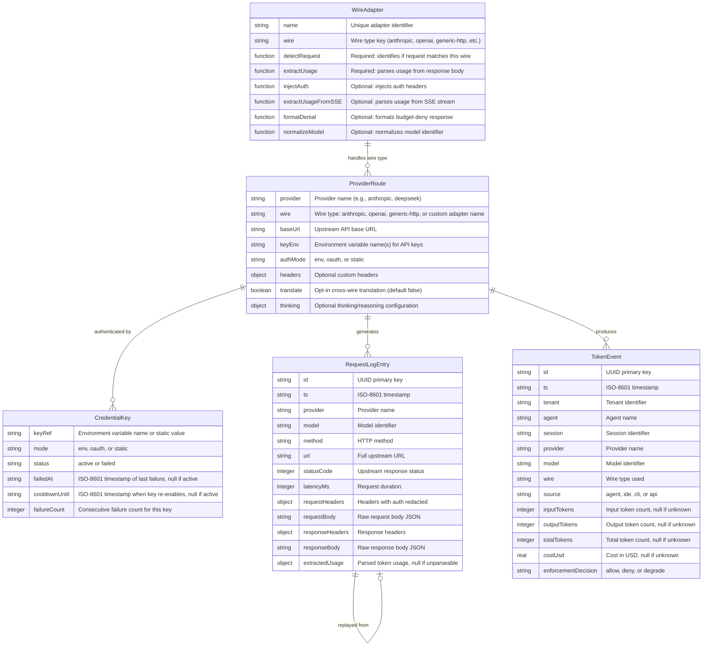

# Data Model: Universal Gateway

**Feature**: Universal Gateway (002) | **Date**: 2026-07-28

## Entity Overview



## Entity Details

### 1. WireAdapter

The core extensibility primitive. Each WireAdapter is a module in `gateway/wire-adapters/` exporting an object.

**Required fields**:
- `detectRequest(req: IncomingMessage) → { wire, model, provider } | null`
- `extractUsage(parsedBody: object) → { inputTokens, outputTokens, cacheReadTokens, cacheWriteTokens } | null`

**Optional fields** (default to no-op if absent):
- `injectAuth(headers: object, resolveKey: function) → void`
- `extractUsageFromSSE(event: object) → partial usage object | null`
- `formatDenial(capWindow: string) → { status: number, body: object }`
- `normalizeModel(model: string) → string`

**Validation rules**:
- Must export an object (not a function, class, or primitive)
- Must have `detectRequest` and `extractUsage` as functions
- `detectRequest` must return either an object with `wire`/`model`/`provider` or `null`
- Optional methods, if present, must be functions
- Adapters missing required methods are skipped with a logged error

**States**: Registered (loaded and valid), Skipped (validation failed)

**Relationships**: One WireAdapter handles one wire type. Multiple ProviderRoutes can reference the same wire type.

### 2. ProviderRoute

Represents a configured upstream LLM provider accessible through the gateway.

**Fields**:
- `provider`: unique provider identifier string
- `wire`: references a WireAdapter by its `wire` type key. Special value `generic-http` uses the built-in passthrough adapter
- `baseUrl`: full upstream API base URL (e.g., `https://api.anthropic.com`)
- `keyEnv`: comma-separated environment variable names for API keys (e.g., `ANTHROPIC_KEY_1,ANTHROPIC_KEY_2`)
- `auth.mode`: one of `env` (read from process env), `oauth` (token with refresh), `static` (literal key in config)
- `headers`: optional static headers to include in upstream requests (provider defaults, overridable by client)
- `translate`: boolean, default `false`. When `true`, enables cross-wire translation for this route
- `thinking`: optional thinking/reasoning injection config

**Validation rules**:
- `provider` must be a non-empty string
- `wire` must match a registered WireAdapter or be `generic-http`
- `baseUrl` must be a valid absolute URL
- `keyEnv` must match `^[A-Z][A-Z0-9_]*(,[A-Z][A-Z0-9_]*)*$` when mode is `env`
- `translate` can only be `true` when wire is `anthropic` or `openai` (the two translatable formats)

**Relationships**: Resolved by `resolveRoute(registry, provider)` during request handling. References one WireAdapter. Has zero or more CredentialKeys.

### 3. CredentialKey

Represents a single API key used for provider authentication. Managed by the multi-key rotation system.

**Fields**:
- `keyRef`: the environment variable name (for `env` mode) or the literal key value (for `static` mode)
- `mode`: `env`, `oauth`, or `static`
- `status`: `active` or `failed`
- `failedAt`: ISO-8601 timestamp of most recent 401 failure
- `cooldownUntil`: ISO-8601 timestamp when key re-enables automatically
- `failureCount`: consecutive 401 failures (reset on successful use)

**State transitions**:
```
active → failed (on 401 response)
failed → active (after cooldown expires, default 60s)
failed → active (on manual reset)
```

**Validation rules**:
- `keyRef` must be non-empty
- `mode` must be one of `env`, `oauth`, `static`
- `status` must be `active` or `failed`
- Cooldown is only meaningful when `status` is `failed`

**Relationships**: Belongs to one ProviderRoute. Managed by the credential resolver (`resolveApiKey` → array, `selectKey` round-robin, `markKeyFailed` → cooldown).

### 4. RequestLogEntry

Append-only store of request-response pairs for debugging. Stored in a new `request_logs` table in the gateway ledger database.

**Fields**:
- `id`: UUID primary key
- `ts`: ISO-8601 creation timestamp
- `provider`: provider name from route
- `model`: model identifier
- `method`: HTTP method (GET, POST, etc.)
- `url`: full upstream URL
- `statusCode`: upstream HTTP response status
- `latencyMs`: request round-trip time in milliseconds
- `requestHeaders`: JSON object, with `authorization`, `x-api-key`, `api-key` values replaced with `[REDACTED]`
- `requestBody`: raw request body as string
- `responseHeaders`: JSON object of response headers
- `responseBody`: raw response body as string
- `extractedUsage`: parsed token usage or null (same shape as WireAdapter.extractUsage return)

**Validation rules**:
- All string fields are stored as-is (no schema validation on bodies)
- Redaction is applied BEFORE storage — never stored in plaintext
- Append-only: rows are never updated, only inserted and (optionally) pruned

**Lifecycle**:
1. Created on each proxied request when `gateway.logging.enabled` is `true`
2. Pruned when older than `gateway.logging.retention_days` (default 7 days)
3. Replayed via `POST /api/gateway/replay/:id` — reads stored request, resubmits to current provider config

**Relationships**: Each entry corresponds to one proxied request. No FK to token_events (decoupled — logging is optional and independent of metering).

### 5. TokenEvent (Existing — Extended)

The existing `token_events` table in the gateway ledger. Extended with:

- `wire` field: adds `generic-http` as valid value (currently only `anthropic` and `openai`)
- `source` field: adds `ide` and `cli` sources (currently `agent` is default)
- Translated requests still emit a single token event with the upstream provider's wire type and real usage

**No schema migration needed**: The `wire` and `source` columns are `TEXT NOT NULL` — they accept any value. Only validation in `token-event.mjs` needs updating to expand `VALID_WIRES` and `VALID_SOURCES`.

## Storage Schema

### New Table: `request_logs`

```sql
CREATE TABLE IF NOT EXISTS request_logs (
  id              TEXT PRIMARY KEY,
  ts              TEXT NOT NULL,
  provider        TEXT NOT NULL,
  model           TEXT NOT NULL,
  method          TEXT NOT NULL,
  url             TEXT NOT NULL,
  status_code     INTEGER,
  latency_ms      INTEGER,
  request_headers TEXT NOT NULL,  -- JSON, redacted
  request_body    TEXT,           -- raw JSON string
  response_headers TEXT,          -- JSON
  response_body   TEXT,           -- raw JSON string
  extracted_usage TEXT            -- JSON or null
);

CREATE INDEX IF NOT EXISTS idx_request_logs_ts ON request_logs(ts);
CREATE INDEX IF NOT EXISTS idx_request_logs_provider ON request_logs(provider);
```

### Existing Table: `token_events` (unchanged schema, validation relaxed)

The existing `token_events` table schema is NOT modified. Only the in-memory validation in `token-event.mjs` is extended:

- `VALID_WIRES`: add `'generic-http'` (and any future adapter wire types)
- `VALID_SOURCES`: already `['agent', 'ide', 'cli', 'api']` — no change needed

## Key Design Decisions

1. **No FK between `request_logs` and `token_events`**: Logging is optional and independent. A logged request may not have a corresponding token event (if metering is disabled), and vice versa. Decoupling avoids cascading failures.

2. **Wire type as open enum**: Rather than a closed `VALID_WIRES` list in `token-event.mjs`, the validation is relaxed to accept any non-empty string. The WireAdapter registry is the authoritative source of valid wire types — duplicating the list in token-event validation creates a maintenance burden. However, to minimize change surface in Phase 1, we simply add `'generic-http'` to the existing array and defer the full open-enum change to Phase 2.

3. **Redaction at storage time, not query time**: Auth header values are replaced with `[REDACTED]` before the INSERT. This means even direct SQLite access never exposes plaintext keys. The original values exist only in-memory during request processing.

4. **Translation is transparent to the data model**: Translated requests produce the same token event shape as direct requests — the `wire` field reflects the UPSTREAM provider's wire type (what was actually sent), not the client's original format. This preserves accurate cost attribution.
