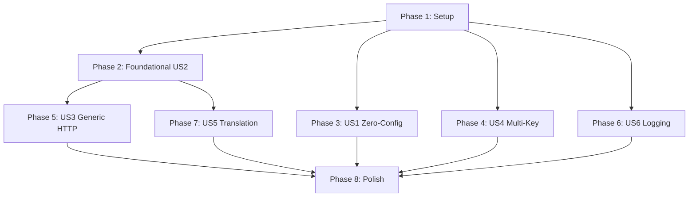

# Tasks: Universal Gateway

**Input**: Design documents from `specs/002-universal-gateway/`

**Prerequisites**: plan.md (required), spec.md (required), research.md, data-model.md, contracts/

**Tests**: Test tasks are included per the project's Test-First Discipline (Constitution Principle IV) and the test files identified in plan.md. Existing cassette system (`test/cassette.mjs`) reused for deterministic LLM response mocking.

**Organization**: Tasks are grouped by user story to enable independent implementation and testing of each story.

## Format: `[ID] [P?] [Story] Description`

- **[P]**: Can run in parallel (different files, no dependencies)
- **[Story]**: Which user story this task belongs to (e.g., US1, US2, US3)
- Include exact file paths in descriptions

---

## Phase 1: Setup (Shared Infrastructure)

**Purpose**: Create new directories, schema migrations, and wire the WireAdapter registry into the gateway assembly — shared prerequisites for all stories.

- [x] T001 Create `gateway/wire-adapters/` directory and add a `.gitkeep` placeholder
- [x] T002 [P] Add `request_logs` table to `gateway/ledger-schema.sql` per data-model.md schema (columns: id, ts, provider, model, method, url, status_code, latency_ms, request_headers, request_body, response_headers, response_body, extracted_usage; indexes on ts and provider)
- [x] T003 [P] Expand `VALID_WIRES` in `gateway/token-event.mjs` to accept `'generic-http'` (and prepare for future dynamic wire types from adapter registry)

---

## Phase 2: Foundational — WireAdapter Registry & Built-in Adapters [US2]

**Purpose**: Define the WireAdapter interface contract, build the auto-discovery registry, and extract existing Anthropic/OpenAI wire logic from `gateway/server.mjs` into conforming adapter modules. This phase IS User Story 2 and is the architectural foundation for US3 and US5.

**⚠️ CRITICAL**: US3 (Generic HTTP) and US5 (Cross-Wire Translation) depend on this phase. US1, US4, and US6 can proceed in parallel.

**Independent Test**: Drop a minimal `.mjs` adapter with only `detectRequest` + `extractUsage` into `gateway/wire-adapters/`, restart gateway, verify it appears in `GET /api/wire-adapters`. Existing Anthropic/OpenAI tests pass unchanged.

### Tests for US2

> **Write these tests FIRST — ensure they FAIL before implementation**

- [x] T004 [P] [US2] Create adapter registry unit tests in `gateway/tests/wire-adapter-registry.test.mjs` — test auto-discovery of valid adapters, rejection of modules missing required methods, graceful skip of throwing modules, no-op defaults for omitted optional methods
- [x] T005 [P] [US2] Create adapter extraction regression tests in `gateway/tests/server.test.mjs` (extend existing) — verify existing Anthropic routing, OpenAI routing, usage extraction, deny formatting, and SSE usage tracking all produce identical output after extraction

### Implementation for US2

- [x] T006 [US2] Define WireAdapter interface contract as JSDoc typedef in `gateway/wire-adapter-registry.mjs` — document required methods (`detectRequest`, `extractUsage`) and optional methods (`injectAuth`, `extractUsageFromSSE`, `formatDenial`, `normalizeModel`) with their type signatures and null-is-unknown contract
- [x] T007 [US2] Implement `loadAdapter(dir, filename)` in `gateway/wire-adapter-registry.mjs` — dynamic `import()` the module, validate it exports an object with `detectRequest` and `extractUsage` as functions, wrap optional methods with no-op defaults, return validated adapter object or null with logged error
- [x] T008 [US2] Implement `discoverAdapters(adaptersDir)` in `gateway/wire-adapter-registry.mjs` — scan `gateway/wire-adapters/` for `*.mjs` files, call `loadAdapter` on each, return `Map<wireKey, adapter>` of successfully loaded adapters, log and skip invalid ones
- [x] T009 [US2] Implement `dispatchAdapter(adapters, req)` in `gateway/wire-adapter-registry.mjs` — iterate registered adapters calling `detectRequest(req)` on each, return `{ adapter, result }` for the first match, or null if no adapter claims the request (for fallthrough to generic-http)
- [x] T010 [US2] Extract Anthropic wire logic from `gateway/server.mjs` into `gateway/wire-adapters/anthropic.mjs` — `detectRequest` (check for `x-api-key` header or Anthropic-format body), `extractUsage` (parse `usage.input_tokens`, `output_tokens`, `cache_read_input_tokens`, `cache_creation_input_tokens`), `injectAuth` (set `x-api-key` header), `extractUsageFromSSE` (parse `message_start.usage` and `message_delta.usage.output_tokens`), `formatDenial` (Anthropic error shape)
- [x] T011 [US2] Extract OpenAI wire logic from `gateway/server.mjs` into `gateway/wire-adapters/openai.mjs` — `detectRequest` (check for `authorization: Bearer` header or OpenAI-format body), `extractUsage` (parse `usage.prompt_tokens`, `completion_tokens`, `prompt_tokens_details.cached_tokens`), `injectAuth` (set `authorization: Bearer` header), `extractUsageFromSSE` (parse SSE `usage` field), `formatDenial` (OpenAI error shape)
- [x] T012 [US2] Refactor `gateway/server.mjs` `handleRequest()` to delegate wire-specific logic to adapter registry — replace inline `buildForwardHeaders` with `adapter.injectAuth(headers, resolveKey)`, inline `extractUsage` with `adapter.extractUsage(parsedBody)`, inline SSE tracker with `adapter.extractUsageFromSSE(event)`, inline `sendDeny` with `adapter.formatDenial(capWindow)`
- [x] T013 [US2] Refactor `gateway/server.mjs` `startGateway()` to accept and initialize adapter registry — call `discoverAdapters()` at gateway start, pass adapters map into request handler closure, handle the case where no adapters load (gateway still starts but logs warning)
- [x] T014 [US2] Wire adapter registry into `gateway/index.mjs` `assembleGateway()` — initialize adapters at assembly time, pass through to `startGateway()`, ensure existing callers (tests, daemon) work without changes
- [x] T015 [US2] Add `GET /api/wire-adapters` management endpoint in `gateway/server.mjs` — return JSON array of registered adapters with `name`, `wire`, and boolean flags for which optional methods each adapter implements (`hasInjectAuth`, `hasSSEExtraction`, `hasFormatDenial`, `hasNormalizeModel`)
- [x] T016 [US2] Verify all existing gateway tests pass after extraction — run `npm test -- tests/gateway/` and confirm zero regressions; fix any extraction bugs revealed by test failures

**Checkpoint**: WireAdapter interface is functional. Existing Anthropic/OpenAI behavior preserved. Adapter auto-discovery works. US3 and US5 can now begin.

---

## Phase 3: User Story 1 — Zero-Configuration Gateway Bootstrap (Priority: P1) 🎯 MVP

**Goal**: A developer runs a single command with zero arguments, and the gateway auto-detects API keys from environment variables, configures matching provider routes, and prints clear getting-started instructions with the dashboard URL.

**Independent Test**: Set `ANTHROPIC_API_KEY` in env, run `node gateway/cli.mjs` with zero arguments, verify gateway boots and prints auto-detected provider count and dashboard URL. Set `AWS_ACCESS_KEY_ID` (non-AI key), verify it is NOT detected.

### Tests for US1

- [ ] T017 [P] [US1] Create zero-config bootstrap tests in `gateway/tests/cli.test.mjs` — test auto-detection with known keys (Anthropic, OpenAI, DeepSeek, Groq), test non-detection of non-AI keys, test zero-keys-detected interactive prompt, test `--init` flag generation, test startup message format including version/port/providers/dashboard URL

### Implementation for US1

- [x] T018 [US1] Implement `KEY_PATTERNS` whitelist map in `gateway/cli.mjs` — map of recognized env var names to their provider metadata: `ANTHROPIC_API_KEY` → `{ provider: 'anthropic', wire: 'anthropic' }`, `OPENAI_API_KEY` → `{ provider: 'openai', wire: 'openai' }`, `DEEPSEEK_KEY` → `{ provider: 'deepseek', wire: 'anthropic' }`, `GROQ_API_KEY` → `{ provider: 'groq', wire: 'openai' }`, `GOOGLE_API_KEY` → `{ provider: 'google', wire: 'generic-http' }`, `MISTRAL_API_KEY` → `{ provider: 'mistral', wire: 'openai' }`, `COHERE_API_KEY` → `{ provider: 'cohere', wire: 'generic-http' }`, `TOGETHER_API_KEY` → `{ provider: 'together', wire: 'openai' }`
- [x] T019 [US1] Implement `autoDetectProviders()` in `gateway/cli.mjs` — scan `process.env` for keys in the `KEY_PATTERNS` whitelist, return array of `{ provider, wire, keyEnv }` for each detected key; strict whitelist only, no wildcard matching
- [x] T020 [US1] Implement `printStartupMessage({ version, port, detectedProviders, dashboardUrl })` in `gateway/cli.mjs` — format and print the startup banner: `"MeridianOS Gateway vX.Y.Z | Listening on http://127.0.0.1:<port> | N provider(s) auto-detected: <list> | Dashboard: <url>"`; when zero providers detected, print alternative message suggesting `--init`
- [x] T021 [US1] Implement `--init` flag handler in `gateway/cli.mjs` — generate a default `policy.yaml` (or `.ai/providers.yaml`) with auto-detected providers pre-populated, each with `provider`, `wire`, `baseUrl` (from defaults), and `keyEnv` fields; print file path created
- [x] T022 [US1] Integrate `autoDetectProviders()` into gateway bootstrap in `gateway/cli.mjs` — call auto-detection before `assembleGateway()`, pass detected providers as pre-configured routes into the registry, print startup message after server starts listening
- [x] T023 [US1] Handle zero-providers-detected scenario in `gateway/cli.mjs` — if `autoDetectProviders()` returns empty and no existing config exists, print interactive prompt: "No API keys detected. Set provider API keys in your environment or run with --init to generate a starter config." Gateway still boots and listens.

**Checkpoint**: Gateway boots with zero config. Auto-detection works. MVP deliverable — users can start metering traffic immediately.

---

## Phase 4: User Story 4 — Multi-Key Credential Management (Priority: P2)

**Goal**: Support multiple comma-separated API key env var names per provider with round-robin distribution and automatic 60-second cooldown on 401 auth failures.

**Independent Test**: Configure a provider with 3 comma-separated key env vars, send requests, verify round-robin distribution. Simulate 401 on key 1, verify key 2 used. After 60s, key 1 re-enabled.

### Tests for US4

- [ ] T024 [P] [US4] Create multi-key credential tests in `gateway/tests/multi-key.test.mjs` — test comma-separated key resolution, round-robin distribution across 3 keys, 401 failover to next key, 60-second cooldown and re-enable, all-keys-exhausted error response, env/oauth/static auth modes

### Implementation for US4

- [ ] T025 [US4] Implement `parseKeyEnv(keyEnv)` in `gateway/provider-registry.mjs` — split comma-separated env var name string into array, validate each against `KEY_ENV_NAME_RE`, return string array or throw on invalid format
- [ ] T026 [US4] Implement `resolveApiKey(keyEnv, mode)` in `gateway/provider-registry.mjs` — for `env` mode: read `process.env[name]` for each name in comma-separated list, filter out undefined/missing, return array of resolved key strings; for `static` mode: return the literal key value as single-element array; for `oauth` mode: call OAuth token endpoint and return refreshed token
- [ ] T027 [US4] Implement key rotation state tracker as a closure in `gateway/provider-registry.mjs` — maintain per-provider map of `{ keyIndex, keys: [{ value, status, failedAt, cooldownUntil, failureCount }] }`; expose `selectKey(provider)`, `markKeyFailed(provider, keyIndex)`, `markKeySuccess(provider, keyIndex)` functions
- [ ] T028 [US4] Implement `selectKey(provider)` round-robin logic in `gateway/provider-registry.mjs` — skip keys with `status: 'failed'` where `cooldownUntil > Date.now()`; if a failed key's cooldown has expired, re-enable it (status → active, clear timestamps); return first active key's value; if all keys failed, return null
- [ ] T029 [US4] Implement `markKeyFailed(provider, keyIndex)` in `gateway/provider-registry.mjs` — set status to `failed`, set `failedAt` to current time, set `cooldownUntil` to current time + 60s (configurable), increment `failureCount`
- [ ] T030 [US4] Implement `markKeySuccess(provider, keyIndex)` in `gateway/provider-registry.mjs` — reset `failureCount` to 0; if status was `failed`, set to `active` and clear timestamps
- [ ] T031 [US4] Integrate key rotation into `gateway/server.mjs` `buildForwardHeaders()` — replace single `resolveKey(route.keyEnv)` call with `selectKey(ctx.provider)`; on 401 response from upstream, call `markKeyFailed()` before sending response to client; on non-401 success, call `markKeySuccess()`
- [ ] T032 [US4] Handle all-keys-exhausted scenario in `gateway/server.mjs` — if `selectKey()` returns null (all keys failed), return 502 with clear error message: `"gateway: all API keys exhausted for provider '<name>'. Retry after <shortestCooldown>s."`
- [ ] T033 [US4] Wire cooldown duration from config in `gateway/provider-registry.mjs` — read `gateway.key_cooldown_seconds` from policy.yaml, default to 60; support per-provider override via route config

**Checkpoint**: Multi-key rotation with automatic failover works. Production-ready key management.

---

## Phase 5: User Story 3 — Generic HTTP Provider Support (Priority: P2)

**Goal**: Register and meter any HTTP-based LLM provider without writing a custom WireAdapter. The `generic-http` wire type forwards requests as-is and performs best-effort usage extraction.

**Independent Test**: Register a generic HTTP route, send a request, verify it's forwarded as-is. Send a request to an endpoint returning Anthropic-format response, verify usage extracted. Send a request to an unknown-format endpoint, verify `null` usage recorded.

### Tests for US3

- [ ] T034 [P] [US3] Create generic HTTP adapter tests in `gateway/tests/generic-http.test.mjs` — test request passthrough (headers/body preserved), Anthropic-format usage extraction, OpenAI-format usage extraction, unknown-format null usage, custom header forwarding, error response passthrough (non-200)

### Implementation for US3

- [ ] T035 [US3] Implement `gateway/wire-adapters/generic-http.mjs` — `detectRequest`: always returns null (never claims requests directly; activated by route config, not request content); `extractUsage`: try parsing as Anthropic `usage` shape first (`input_tokens`/`output_tokens`), then OpenAI shape (`prompt_tokens`/`completion_tokens`), return null for unrecognized; `injectAuth`: set `authorization: Bearer <key>` header
- [ ] T036 [US3] Add `'generic-http'` route handling in `gateway/server.mjs` `handleRequest()` — when route wire is `generic-http`, skip adapter dispatch (no `detectRequest` needed), forward request as-is using generic-http adapter's `injectAuth`, parse response with generic-http adapter's `extractUsage`
- [ ] T037 [US3] Update `gateway/provider-registry.mjs` `resolveRoute()` to accept `'generic-http'` as valid wire type — no specific adapter required; generic-http is always available as fallback
- [ ] T038 [US3] Add custom header support to generic HTTP forwarding in `gateway/server.mjs` `buildForwardHeaders()` — merge `route.headers` (static config headers) into forwarded request, with client-sent headers taking priority (provider headers are defaults only)
- [ ] T039 [US3] Add graceful handling for generic HTTP upstream errors in `gateway/server.mjs` — when generic-http upstream returns non-200, still emit token event with `null` usage (or extracted usage if error body contains usage data), record `upstreamStatus` accurately

**Checkpoint**: Any REST endpoint can be registered and metered. Provider coverage is now universal.

---

## Phase 6: User Story 6 — Request Logging with Replay (Priority: P3)

**Goal**: Optional append-only request/response logging with automatic auth header redaction, configurable retention, and replay capability for debugging failed provider calls.

**Independent Test**: Enable logging, send a request, verify stored with `[REDACTED]` auth headers. Replay the request, verify new response returned. Set retention to 0 days, verify logs pruned.

### Tests for US6

- [ ] T040 [P] [US6] Create request logging tests in `gateway/tests/logging.test.mjs` — test disabled-by-default (no writes), enabled logging stores request-response pair, auth header redaction (`authorization`, `x-api-key`, `api-key` → `[REDACTED]`), replay returns new response, retention pruning removes old entries, privacy warning at startup when enabled, append-only (no updates to existing entries)

### Implementation for US6

- [ ] T041 [US6] Implement `gateway/logging.mjs` — `logRequestResponse(db, entry)` inserts into `request_logs` table with redacted headers; `pruneOldLogs(db, retentionDays)` deletes rows where `ts < now - retentionDays`; `getLogById(db, id)` returns single entry; `listLogs(db, { limit, offset, provider, since })` returns paginated results
- [ ] T042 [US6] Implement header redaction in `gateway/logging.mjs` `redactHeaders(headers)` — deep-clone headers object, replace values of `authorization`, `x-api-key`, `api-key` (case-insensitive key match) with literal string `[REDACTED]`; preserve all other headers unchanged; never throw — malformed headers fall through unredacted with warning
- [ ] T043 [US6] Implement `replayRequest(db, id, { registry, resolveKey, now })` in `gateway/logging.mjs` — read stored request from `request_logs`, construct new upstream HTTP request to current provider config (NOT the original — re-resolve route), return new response; original log entry is never modified (append-only)
- [ ] T044 [US6] Integrate logging into `gateway/server.mjs` `handleRequest()` — after upstream response completes (but before emitting token event), call `logRequestResponse()` if `gateway.logging.enabled` is true; pass redacted entry to logging module; logging failure must NEVER block the response or crash the gateway (catch and log warning)
- [ ] T045 [US6] Add management endpoints in `gateway/server.mjs` — `GET /api/gateway/logs` (paginated list with query params `limit`, `offset`, `provider`, `since`), `GET /api/gateway/logs/:id` (single entry with full bodies), `POST /api/gateway/replay/:requestId` (replay endpoint)
- [ ] T046 [US6] Implement log pruning on schedule in `gateway/logging.mjs` — call `pruneOldLogs()` on gateway startup and every 6 hours thereafter via `setInterval`; respect `gateway.logging.retention_days` config (default 7); if pruning fails, log warning and retry next cycle
- [ ] T047 [US6] Implement disk-space guard in `gateway/logging.mjs` — before each `logRequestResponse()`, check available disk space on the volume containing ledger.db; if below 100MB threshold, suspend logging with alert message, auto-resume when space recovers above threshold
- [ ] T048 [US6] Add privacy warning to startup message in `gateway/cli.mjs` — when `gateway.logging.enabled` is true, print: "⚠ Logging is ENABLED. Request/response data will be stored for debugging. Authorization headers are automatically redacted, but request bodies may contain sensitive information."

**Checkpoint**: Request logging with redaction and replay is functional. Privacy-first defaults (disabled, warnings).

---

## Phase 7: User Story 5 — Non-Streaming Cross-Wire Translation (Priority: P3)

**Goal**: Bidirectional Anthropic↔OpenAI request/response translation so agents built for one wire format can use providers on the other format. Non-streaming only. Opt-in per route.

**Independent Test**: Configure OpenAI route with `translate: true`, send Anthropic-format request, verify translated to OpenAI, response translated back to Anthropic. Disable translation, verify passthrough.

### Tests for US5

- [ ] T049 [P] [US5] Create translation unit tests in `gateway/tests/translate.test.mjs` — test `anthropicToOpenai()` message mapping (roles, system→top-level system message, tool definitions), `openaiToAnthropic()` message mapping (system message→top-level system, tool calls→tool_use blocks), `openaiResponseToAnthropic()` (finish_reason mapping, usage field mapping), `anthropicResponseToOpenai()` (stop_reason mapping, usage field mapping), thinking block silent drop, computer_use tool silent drop, streaming request rejection, malformed JSON error passthrough, round-trip fidelity (A→O→A and O→A→O)

### Implementation for US5

- [x] T050 [US5] Implement `gateway/translate.mjs` `anthropicToOpenai(body)` — extract `model`, `messages` (flatten system prompt from top-level to first message with `role: system`), `tools` (map `input_schema` → `parameters`), `max_tokens` → `max_completion_tokens`; drop `thinking` block and `computer_*` tools silently; return OpenAI-format request body
- [x] T051 [US5] Implement `gateway/translate.mjs` `openaiToAnthropic(body)` — extract `model`, `messages` (promote first `role: system` message to top-level `system` field), `tools` (map `parameters` → `input_schema`), `max_completion_tokens` → `max_tokens`; drop `stream: true` with logged warning; return Anthropic-format request body
- [x] T052 [US5] Implement `gateway/translate.mjs` `openaiResponseToAnthropic(body)` — map `choices[0].message` → `content` array with `text` blocks; map `choices[0].message.tool_calls` → `tool_use` content blocks; map `finish_reason: stop` → `stop_reason: end_turn`, `finish_reason: tool_calls` → `stop_reason: tool_use`; map `usage.prompt_tokens` → `usage.input_tokens`, `usage.completion_tokens` → `usage.output_tokens`; preserve `id` and `model`
- [x] T053 [US5] Implement `gateway/translate.mjs` `anthropicResponseToOpenai(body)` — map `content` blocks (`text` → message content, `tool_use` → `tool_calls`); map `stop_reason: end_turn` → `finish_reason: stop`, `stop_reason: tool_use` → `finish_reason: tool_calls`; map `usage.input_tokens` → `usage.prompt_tokens`, `usage.output_tokens` → `usage.completion_tokens`; generate OpenAI-format `id` if missing
- [ ] T054 [US5] Implement route-level translation toggle in `gateway/server.mjs` `handleRequest()` — read `route.translate` config flag (default `false`); when `true` AND route wire differs from detected request wire, apply translation before forwarding; after receiving upstream response, apply reverse translation before returning to client; when `false`, pass through untranslated
- [ ] T055 [US5] Integrate translation into request pipeline in `gateway/server.mjs` — detect client wire format from adapter's `detectRequest` result; if client wire ≠ route wire and `route.translate` is true, apply appropriate `*To*()` function before forwarding; apply reverse `*ResponseTo*()` function to upstream response before returning
- [ ] T056 [US5] Handle unsupported features gracefully in `gateway/translate.mjs` — if request contains `stream: true`, log warning "streaming not supported for cross-wire translation" and pass through untranslated (or reject with clear error); if request contains `thinking` or `computer_*` tools, drop silently with debug-level log
- [ ] T057 [US5] Ensure accurate usage extraction through translation in `gateway/server.mjs` — after translation, extract usage from UPSTREAM (translated) response using the upstream wire's adapter, NOT from the translated-back response; this ensures cost attribution matches the actual provider's reported usage
- [ ] T058 [US5] Wire translation into route configuration in `gateway/provider-registry.mjs` — add `translate` boolean field to route schema (default `false`); only allow `translate: true` when route wire is `anthropic` or `openai` (the two translatable formats); validate on route registration

**Checkpoint**: Cross-wire translation works bidirectionally. Agents use any backend regardless of native wire format.

---

## Phase 8: Polish & Cross-Cutting Concerns

**Purpose**: Full regression validation, edge case hardening, documentation, and final integration checks.

- [ ] T059 [P] Run full test suite `npm test` and fix any regressions — all 915+ existing tests must pass; all new test files must pass; zero failures
- [ ] T060 [P] Add graceful handling for concurrent adapter directory scans in `gateway/wire-adapter-registry.mjs` — ensure `discoverAdapters()` is idempotent (called once at boot, cached); protect against TOCTOU if adapters directory changes during request handling (adapter map is frozen after boot)
- [ ] T061 [P] Add startup-time adapter validation summary in `gateway/cli.mjs` — after `discoverAdapters()`, print count of loaded adapters and list any skipped (with reason); e.g., "3 wire adapters loaded (anthropic, openai, generic-http). 1 skipped: test-wire.mjs (missing detectRequest)"
- [ ] T062 Verify all validation scenarios from quickstart.md pass end-to-end — VS-1 through VS-7; document any gaps found
- [ ] T063 Run existing gateway integration tests (`tests/gateway/index.test.mjs`, `tests/gateway/server.test.mjs`, `tests/gateway/inject.test.mjs`) and verify all pass — ensure no breakage in run registry, token injection, or budget enforcement paths
- [ ] T064 [P] Update `gateway/README.md` with WireAdapter interface documentation — link to `contracts/wire-adapter-interface.md`, provide minimal adapter example, document auto-discovery behavior
- [ ] T065 Verify zero-config bootstrap with real API keys (manual dogfood MD-1 from quickstart.md) — set real `ANTHROPIC_API_KEY`, start gateway, send request, verify token event in ledger
- [ ] T066 Verify cross-wire translation with real providers (manual dogfood MD-2 from quickstart.md) — Claude Code → OpenAI via gateway with `translate: true`; OpenCode → Anthropic via gateway with `translate: true`

---

## Dependencies

### Story Completion Order



### Story Dependency Matrix

| Story | Depends On | Blocks | Can Parallel With |
|-------|-----------|--------|-------------------|
| US1 (Zero-Config) | Setup only | Nothing | US2, US4, US6 |
| US2 (WireAdapter) | Setup only | US3, US5 | US1, US4, US6 |
| US3 (Generic HTTP) | US2 (WireAdapter) | Nothing | US1, US4, US6 |
| US4 (Multi-Key) | Setup only | Nothing | US1, US2, US6 |
| US5 (Translation) | US2 (WireAdapter) | Nothing | US1, US4, US6 (after US2 done) |
| US6 (Logging) | Setup only | Nothing | US1, US2, US4 |

### Critical Path

**Phase 2 (US2: WireAdapter, 5 days) → Phase 5 or 7 (US3/US5, 5 days) = 10 working days**

Non-critical-path stories (US1, US4, US6) complete within 4 days and can run in parallel with Phase 2.

---

## Parallel Execution Examples

### Parallel Group 1 (Day 1-4, alongside US2)

```text
Developer A: Phase 3 US1 — Zero-Config Bootstrap (T017–T023)
Developer B: Phase 4 US4 — Multi-Key Credentials (T024–T033)
Developer C: Phase 6 US6 — Request Logging (T040–T048)
```

All three modify different files:
- US1: `gateway/cli.mjs` (new logic), `gateway/tests/cli.test.mjs` (new)
- US4: `gateway/provider-registry.mjs` (extend), `gateway/server.mjs` (integrate), `gateway/tests/multi-key.test.mjs` (new)
- US6: `gateway/logging.mjs` (new), `gateway/server.mjs` (integrate), `gateway/ledger-schema.sql` (already done in Setup), `gateway/tests/logging.test.mjs` (new)

### Parallel Group 2 (After US2 complete, Day 5-9)

```text
Developer A: Phase 5 US3 — Generic HTTP (T034–T039)
Developer B: Phase 7 US5 — Cross-Wire Translation (T049–T058)
```

Both depend on US2 (WireAdapter registry) but are independent of each other:
- US3: `gateway/wire-adapters/generic-http.mjs` (new), `gateway/tests/generic-http.test.mjs` (new)
- US5: `gateway/translate.mjs` (new), `gateway/server.mjs` (integrate), `gateway/tests/translate.test.mjs` (new)

---

## Implementation Strategy

### MVP First (User Story 1 Only)

1. Complete Phase 1: Setup (T001–T003)
2. Complete Phase 2: WireAdapter Registry (T004–T016) — required for gateway to function at all
3. Complete Phase 3: US1 Zero-Config Bootstrap (T017–T023)
4. **STOP and VALIDATE**: Gateway boots with zero config, auto-detects keys, meters traffic
5. Deploy/demo if ready

### Incremental Delivery

| Increment | Stories | What Users Get |
|-----------|---------|---------------|
| **MVP** | US1 + US2 | Gateway starts with zero config; Anthropic/OpenAI metering works; WireAdapter interface exists |
| **+Reliability** | +US4 | Multi-key rotation with automatic failover for production use |
| **+Coverage** | +US3 | ANY HTTP-based LLM provider can be metered — 100% provider coverage |
| **+Debugging** | +US6 | Request logging with redaction and replay for debugging failed calls |
| **+Agnosticism** | +US5 | Cross-wire translation — Anthropic agents use OpenAI backends and vice versa |

### Recommended Execution Order

1. **Phase 1** (Setup) — all devs: create directories, schema, validation updates
2. **Phase 2** (US2: WireAdapter) — critical path: interface + extraction + registry
3. **Parallel sprint**: US1, US4, US6 all start simultaneously after Phase 1
4. **After US2 complete**: US3 and US5 start in parallel
5. **Phase 8** (Polish): all devs — regression testing, edge cases, documentation

---

## Summary

| Metric | Value |
|--------|-------|
| **Total Tasks** | 66 |
| **Setup Tasks** | 3 (T001–T003) |
| **US2 (WireAdapter) Tasks** | 13 (T004–T016) |
| **US1 (Zero-Config) Tasks** | 7 (T017–T023) |
| **US4 (Multi-Key) Tasks** | 10 (T024–T033) |
| **US3 (Generic HTTP) Tasks** | 6 (T034–T039) |
| **US6 (Logging) Tasks** | 9 (T040–T048) |
| **US5 (Translation) Tasks** | 10 (T049–T058) |
| **Polish Tasks** | 8 (T059–T066) |
| **Parallel Opportunities** | 30 tasks marked [P] (45%) |
| **Critical Path Duration** | 10 working days (US2 → US5) |
| **MVP Scope** | US1 + US2 (20 tasks, ~5 days) |
