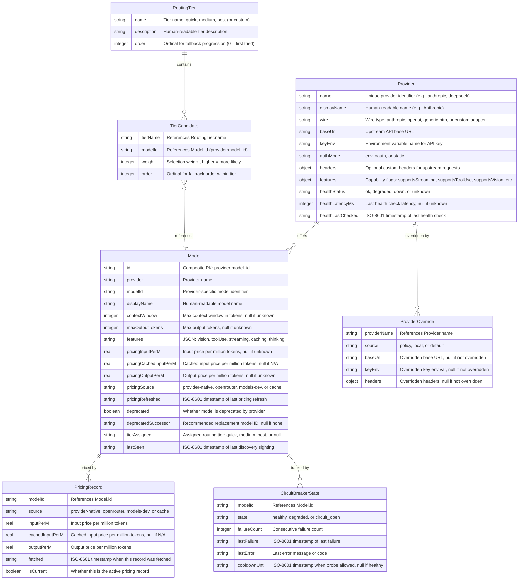

# Data Model: Provider &amp; Model Agnosticism

**Feature**: Provider &amp; Model Agnosticism (003) | **Date**: 2026-07-28

## Entity Overview



## Entity Details

### Provider

Represents an LLM service endpoint. The canonical definition comes from the three-source merge (policy.yaml > .ai/providers.yaml > built-in defaults). At runtime, `resolveAllProviders()` returns a flat map of resolved provider objects.

**Sources** (in merge priority):
1. **policy.yaml** — user overrides under `providers:` key. Highest priority.
2. **.ai/providers.yaml** — local state written by wizard. Intermediate priority.
3. **providers.defaults.yaml** — built-in defaults shipped with the project. Lowest priority.

**Merge rules**:
- Top-level fields are merged shallowly: a field defined in a higher-priority source replaces the lower-priority value.
- `headers` and `features` objects are merged deeply: individual keys are overridden, not the entire object.
- A provider defined only in a lower-priority source still appears in the resolved list.
- Removing a provider from a higher source "hides" it from the resolved list (null override).

**Validation rules** (from `schema/provider.schema.json`):
- `name`: Required. Must match `^[a-z][a-z0-9-]*$`. Must be unique across all sources.
- `wire`: Required. Must match a registered WireAdapter name.
- `baseUrl`: Required. Must be a valid HTTPS URL.
- `keyEnv`: Required if `auth.mode` is `env`. Must be a valid environment variable name.
- `auth.mode`: Must be one of `env`, `oauth`, `static`.

**Health status**: Populated at runtime by the provider health check loop (P0-F5), not stored in config. States: `unknown` (not yet checked), `ok` (responsive), `degraded` (1 failure), `down` (2+ consecutive failures).

### Model

Represents a specific AI model offered by a provider. Discovered automatically by `model-discovery.mjs` and persisted in the `model_registry` SQLite table. The composite primary key `provider:model_id` ensures model identity is scoped to provider.

**Lifecycle**:
1. **Discovered**: Model appears in provider's discovery API response → upserted with `last_seen = now()`.
2. **Active**: Model is regularly seen in discovery responses. Available for routing.
3. **Deprecated**: Model no longer appears in discovery responses → `deprecated = 1`. Retained for historical cost attribution.
4. **Stale**: Model hasn't been seen in 30+ days → eligible for dashboard hiding (not deletion).

**Tier assignment**: The `tier_assigned` field is populated by `autoAssignTiers()` heuristic based on context window and pricing:
- `quick`: context_window < 32000 OR pricing_output_per_m < $1.00
- `medium`: 32000 ≤ context_window < 128000
- `best`: context_window ≥ 128000 OR explicitly configured as best
- Operators can override via dashboard or policy.yaml routing configuration.

**Pricing nullability**: All pricing fields are nullable. NULL means "unknown" — the system will still route to this model but won't show cost estimates. This is distinct from zero pricing (free model).

### RoutingTier

A logical grouping of models by capability/cost. Used by `model-router.mjs` to select models for agent tasks. Tiers are ordered — if all candidates in one tier fail, the router falls back to the next tier.

**Built-in tiers**:
- `quick` (order 0): Fast, cheap models for simple tasks.
- `medium` (order 1): Balanced capability/cost for typical tasks.
- `best` (order 2): Most capable models for complex tasks.

**Custom tiers**: Operators can define additional tiers in policy.yaml (e.g., `vision` for vision-capable models). Custom tiers are inserted into the ordered list based on their `order` field.

### TierCandidate

Associates a model with a routing tier, specifying its selection weight and fallback priority within the tier.

**Weight semantics**: Weights are relative — a model with weight 90 and another with weight 10 in the same tier means the first is selected ~90% of the time. Weights are normalized to probabilities at selection time.

**Order semantics**: Within a tier, candidates are tried in ascending `order`. Order 0 is the primary; order 1 is the first fallback; etc.

### CircuitBreakerState

Ephemeral in-memory state tracking per-model health for intelligent routing. Not persisted — reset on daemon restart.

**State transitions**:
```
healthy ──(2+ failures)──→ degraded ──(3+ more failures, total 5)──→ circuit_open
degraded ──(success)──→ healthy
circuit_open ──(5-min cooldown + probe success)──→ healthy
circuit_open ──(5-min cooldown + probe failure)──→ circuit_open (reset cooldown)
```

**Error classification for breaker**:
- **Immediate open**: 401, 403 (authentication errors — not retryable)
- **Counted failures**: timeout, 5xx, connection refused, DNS resolution failure
- **Not counted**: 400, 404 (client errors — model issue, not infrastructure)

### PricingRecord

Historical pricing data for audit trail. Each refresh creates a new record; `isCurrent = 1` marks the active price. Historical records enable cost recalculation for past time periods and price change detection.

**Price change detection**: When a new pricing record is created, compare with the previous `isCurrent` record. If the difference exceeds thresholds:
- >10%: Dashboard notification
- >50%: Alert (possible error or major pricing change)

## Database Schema Additions

### New Table: `model_registry`

```sql
CREATE TABLE IF NOT EXISTS model_registry (
    id              TEXT PRIMARY KEY,          -- "provider:model_id"
    provider        TEXT NOT NULL,             -- Provider name
    model_id        TEXT NOT NULL,             -- Provider-specific model ID
    display_name    TEXT,                      -- Human-readable name
    context_window  INTEGER,                   -- Max context tokens, NULL if unknown
    max_output_tokens INTEGER,                -- Max output tokens, NULL if unknown
    features        TEXT DEFAULT '{}',         -- JSON: capability flags
    pricing_input_per_m         REAL,          -- USD per million input tokens
    pricing_cached_input_per_m  REAL,          -- USD per million cached input tokens
    pricing_output_per_m        REAL,          -- USD per million output tokens
    pricing_source              TEXT,          -- provider-native, openrouter, models-dev, cache
    pricing_refreshed           TEXT,          -- ISO-8601 timestamp
    deprecated      INTEGER DEFAULT 0,         -- 0 = active, 1 = deprecated
    deprecated_successor TEXT,                 -- Recommended replacement model_id
    tier_assigned   TEXT,                      -- quick, medium, best, or custom
    last_seen       TEXT NOT NULL,             -- ISO-8601 timestamp
    created_at      TEXT NOT NULL DEFAULT (datetime('now')),
    updated_at      TEXT NOT NULL DEFAULT (datetime('now'))
);

CREATE INDEX IF NOT EXISTS idx_model_registry_provider ON model_registry(provider);
CREATE INDEX IF NOT EXISTS idx_model_registry_tier ON model_registry(tier_assigned);
CREATE INDEX IF NOT EXISTS idx_model_registry_deprecated ON model_registry(deprecated);
```

### Migration Strategy

The `model_registry` table is new — no migration needed for existing data. `ledger-schema.sql` is appended with the CREATE TABLE statement. The existing `token_events` table is not modified.

## Configuration File Structure

### `policy.yaml` Additions

```yaml
# New top-level key: providers
providers:
  deepseek:
    baseUrl: "https://api.deepseek.com"  # Override built-in default
    headers:
      Custom-Header: "value"

  groq:
    name: groq
    wire: openai
    baseUrl: "https://api.groq.com/openai/v1"
    keyEnv: GROQ_API_KEY
    displayName: "Groq"

# Modified: model_routing tiers now support candidate lists
model_routing:
  builder:
    quick:
      candidates:
        - model: "deepseek:deepseek-chat"
          weight: 90
        - model: "groq:llama-3.3-70b-versatile"
          weight: 10
    medium:
      candidates:
        - model: "anthropic:claude-sonnet-4-20250514"
          weight: 100
    best:
      candidates:
        - model: "openrouter:anthropic/claude-opus-4"
          weight: 100
```

### `.ai/providers.yaml` (generated, gitignored)

```yaml
# Auto-generated by provider wizard. Edit via `node gateway/cli.mjs provider` or dashboard.
anthropic:
  name: anthropic
  wire: anthropic
  baseUrl: "https://api.anthropic.com"
  keyEnv: ANTHROPIC_API_KEY
  displayName: "Anthropic"

deepseek:
  name: deepseek
  wire: openai
  baseUrl: "https://api.deepseek.com"
  keyEnv: DEEPSEEK_API_KEY
  displayName: "DeepSeek"
```

### `gateway/known-providers.json` (static, committed)

JSON array of 15 provider objects. Example entry:
```json
{
  "name": "groq",
  "displayName": "Groq",
  "wire": "openai",
  "baseUrl": "https://api.groq.com/openai/v1",
  "keyEnv": "GROQ_API_KEY",
  "docsUrl": "https://console.groq.com/docs/api-reference",
  "features": {
    "supportsStreaming": true,
    "supportsToolUse": true,
    "supportsVision": false,
    "supportsCaching": false,
    "supportsThinking": false
  }
}
```
