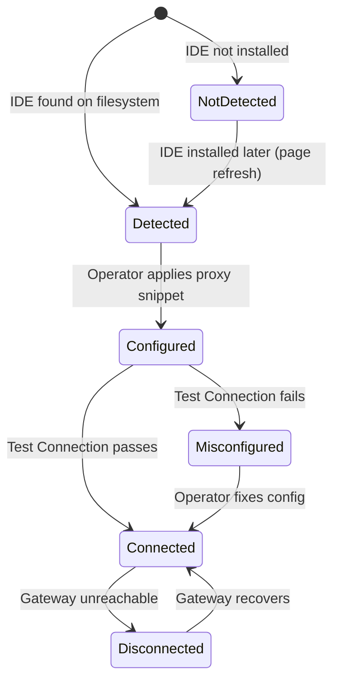
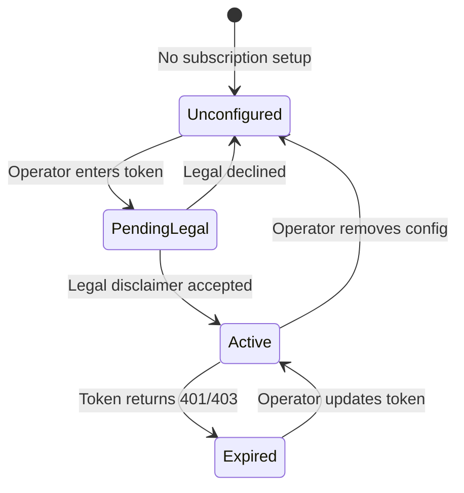

# Data Model: IDE & Platform Traffic Integration

**Feature**: IDE & Platform Traffic Integration (004) | **Date**: 2026-07-30

## Entity Overview

```mermaid
erDiagram
    IdeDetectionRecord ||--o{ IdeProxyConfig : "generates"
    IdeProxyConfig ||--o| ConnectivityTestResult : "tested by"
    TokenEvent ||--o| IdeAttribution : "classified by"
    TokenEvent ||--o| BillingType : "classified by"
    ProviderConfig ||--o| SubscriptionAuth : "extended with"
    McpToolDefinition ||--o{ McpToolParameter : "parameterized by"

    IdeDetectionRecord {
        string ideName "Unique IDE identifier: vscode, cursor, windsurf, claude-code, jetbrains"
        string displayName "Human-readable: Visual Studio Code, Cursor, Windsurf, Claude Code, JetBrains"
        boolean installed "Whether detected on this machine"
        string installPath "Filesystem path, null if not installed"
        string version "Detected version string, null if undetectable"
        string detectionMethod "How it was found: standard-path, custom-path, env-var, which-command"
    }

    IdeProxyConfig {
        string ideName "References IdeDetectionRecord.ideName"
        string snippetType "settings-json, env-export, or generic-proxy"
        string content "The actual config text to copy-paste"
        string instructions "Human-readable setup instructions"
        string gatewayUrl "The gateway proxy URL used in the snippet"
    }

    ConnectivityTestResult {
        string ideName "Which IDE was tested"
        boolean ok "Whether the probe succeeded"
        integer latencyMs "Round-trip latency, null if failed"
        string errorCode "AUTH_FAILED, CONNECTION_FAILED, TIMEOUT, null if ok"
        string errorMessage "Human-readable error, null if ok"
        string testedAt "ISO-8601 timestamp"
    }

    IdeAttribution {
        string source "Always 'ide' for IDE traffic"
        string ideName "vscode-copilot, claude-code, cursor, windsurf, or unknown-ide"
        string ideRequestId "Original request ID from the IDE, null if not available"
    }

    BillingType {
        string type "subscription or api_key"
        string subscriptionPlan "Claude Pro, GitHub Copilot, Anti-Gravity, or null"
        real monthlyCost "Flat monthly cost in USD, null for api_key"
    }

    SubscriptionAuth {
        string providerName "References ProviderConfig.name"
        string mode "Always 'subscription'"
        string keyEnv "Environment variable holding the session token"
        string planName "Claude Pro, GitHub Copilot, Anti-Gravity"
        real monthlyCostUsd "Known monthly subscription cost"
        string lastVerified "ISO-8601 date of last successful token verification"
        string docsUrl "Link to token extraction documentation"
        boolean legalAccepted "Whether operator accepted legal disclaimer"
    }

    McpToolDefinition {
        string name "Unique tool name: meridian_list_tasks, meridian_create_task, etc."
        string description "Human-readable tool description for Claude"
        string jsonSchema "JSON Schema for tool parameters"
        string apiEndpoint "Dashboard API endpoint the tool wraps"
    }

    McpToolParameter {
        string toolName "References McpToolDefinition.name"
        string paramName "Parameter name"
        string type "string, number, boolean, array, object"
        boolean required "Whether the parameter is required"
        string description "Human-readable parameter description"
        string defaultValue "Default value if omitted, null if required"
    }
```



## Entity Details

### IdeDetectionRecord

Represents the result of scanning the local machine for an AI-enabled IDE. Generated on-demand when the dashboard's IDE Connect page loads.

**Detection Methods** (in priority order):
1. **standard-path** — Check known install paths for the current OS
2. **which-command** — Run `which`/`where` command (for CLI tools like Claude Code)
3. **custom-path** — Check paths from `policy.yaml` `ide_detection.paths` override
4. **env-var** — Check environment variables that indicate IDE presence

**Supported IDEs and their standard paths**:

| IDE | Windows | macOS | Linux |
|-----|---------|-------|-------|
| VS Code | `%LOCALAPPDATA%\Programs\Microsoft VS Code` | `/Applications/Visual Studio Code.app` | `/usr/share/code` |
| Cursor | `%LOCALAPPDATA%\Programs\Cursor` | `/Applications/Cursor.app` | `/usr/share/cursor` |
| Windsurf | `%LOCALAPPDATA%\Programs\Windsurf` | `/Applications/Windsurf.app` | `/usr/share/windsurf` |
| Claude Code | `%LOCALAPPDATA%\claude` + `which claude` | `which claude` | `which claude` |
| JetBrains | `%APPDATA%\JetBrains` | `~/Library/Application Support/JetBrains` | `~/.local/share/JetBrains` |

**Lifecycle**: Detection records are ephemeral — regenerated on each page load. Not persisted to disk. This ensures detection reflects the current machine state (IDEs may be installed/uninstalled between MeridianOS sessions).

---

### IdeProxyConfig

A generated configuration snippet for routing an IDE's HTTP traffic through the MeridianOS gateway.

**Snippet Types**:

| Type | Format | Example Content |
|------|--------|----------------|
| `settings-json` | JSON fragment for VS Code `settings.json` | `"http.proxy": "http://127.0.0.1:8787"` |
| `env-export` | Shell export commands | `export ANTHROPIC_BASE_URL=http://127.0.0.1:8787` |
| `generic-proxy` | Environment variable assignments | `HTTP_PROXY=http://127.0.0.1:8787` |

**Gateway URL Resolution**:
- Read `config.gateway.port` from the running gateway
- Default port: 8787
- URL format: `http://127.0.0.1:{port}`
- If gateway is on a non-localhost bind address, use that address

---

### TokenEvent Extensions (IdeAttribution + BillingType)

Existing `token_events` table in `ledger.db` extended with two new columns:

**New Columns**:

| Column | Type | Default | Description |
|--------|------|---------|-------------|
| `ide_name` | TEXT | NULL | Which IDE generated the traffic (vscode-copilot, claude-code, cursor, windsurf). NULL for non-IDE traffic (agent, CLI, API). |
| `billing_type` | TEXT | `'api_key'` | How the traffic is billed: `'api_key'` (per-token) or `'subscription'` (flat monthly). |

**Migration**: `ALTER TABLE token_events ADD COLUMN ide_name TEXT` and `ALTER TABLE token_events ADD COLUMN billing_type TEXT NOT NULL DEFAULT 'api_key'`. Both are O(1) operations in SQLite (no row rewriting for ADD COLUMN with defaults in recent SQLite versions; for older versions, the default is applied on read).

**Source Classification Matrix** (existing `source` column + new `ide_name`):

| source | ide_name | Meaning |
|--------|----------|---------|
| `agent` | NULL | Agent-spawned traffic (existing behavior) |
| `ide` | `vscode-copilot` | GitHub Copilot traffic routed through gateway |
| `ide` | `claude-code` | Claude Code traffic routed through gateway |
| `ide` | `cursor` | Cursor IDE traffic |
| `ide` | `windsurf` | Windsurf IDE traffic |
| `ide` | `unknown-ide` | IDE traffic from an unrecognized source |
| `cli` | NULL | CLI-ad-hoc traffic (existing) |
| `api` | NULL | Direct API calls (existing) |

---

### SubscriptionAuth

Extends the provider configuration with subscription plan authentication. Stored as part of the provider definition in `policy.yaml` under `providers.{name}.auth`.

**Configuration Example** (in policy.yaml):
```yaml
providers:
  anthropic-claude-pro:
    name: anthropic-claude-pro
    displayName: Anthropic (Claude Pro)
    wire: anthropic
    baseUrl: https://api.anthropic.com
    auth:
      mode: subscription
      keyEnv: CLAUDE_PRO_SESSION_TOKEN
      planName: Claude Pro
      monthlyCostUsd: 20
    features:
      supportsStreaming: true
      supportsToolUse: true
```

**Legal Acceptance Flow**:
1. Operator navigates to Dashboard → Subscription Setup
2. Selects plan type (Claude Pro, Copilot, Anti-Gravity)
3. Dashboard displays legal disclaimer with checkbox
4. Operator checks "I confirm my subscription terms allow this usage"
5. Operator provides the session token (pasted into a field, saved to env var)
6. Dashboard POSTs to `/api/subscriptions` with `legal_accepted: true`
7. System saves the provider config to policy.yaml
8. Gateway uses the token for proxied requests with `billing_type='subscription'`

---

### McpToolDefinition

Defines a tool exposed by the MeridianOS MCP server to Claude Code/Cowork. Each tool wraps a dashboard API endpoint with parameter validation and response transformation.

**Tools Defined**:

| Tool Name | API Endpoint | Method | Purpose |
|-----------|-------------|--------|---------|
| `meridian_list_tasks` | `/api/state` | GET | List board tasks with filters |
| `meridian_create_task` | `/api/tasks` | POST | Create a new task on the board |
| `meridian_get_spend` | `/api/spend/overview` | GET | Query current spend |
| `meridian_get_budget` | `/api/budget/status` | GET | Check budget status |
| `meridian_get_board_summary` | `/api/state` | GET | Get board statistics |

**Parameter Schemas** (see contracts/mcp-tools.md for full JSON Schema definitions):

- `meridian_list_tasks`: `{ status?, agent?, category?, limit? }`
- `meridian_create_task`: `{ title (required), category, priority?, body? }`
- `meridian_get_spend`: `{ period?: 'session'|'day'|'week'|'month' }`
- `meridian_get_budget`: `{}` (no parameters)
- `meridian_get_board_summary`: `{}` (no parameters)

---

## State Transitions

### IDE Connection State



### Subscription Plan State


