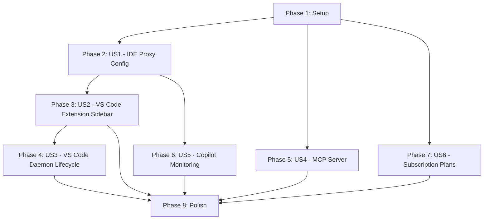

# Tasks: IDE & Platform Traffic Integration

**Input**: Design documents from `specs/004-ide-platform-integration/`

**Prerequisites**: plan.md (required), spec.md (required), research.md, data-model.md, contracts/

**Tests**: Test tasks are included per MeridianOS test-first discipline (Constitution IV). Each new module requires a corresponding test file.

**Organization**: Tasks are grouped by user story to enable independent implementation and testing.

## Format: `[ID] [P?] [Story] Description`

- **[P]**: Can run in parallel (different files, no dependencies)
- **[Story]**: Which user story this task belongs to (e.g., US1, US2, US3)
- Include exact file paths in descriptions

## Path Conventions

- Core daemon modules at repository root: `filename.mjs`
- Gateway modules: `gateway/filename.mjs`
- Dashboard: `dashboard/server.mjs`, `dashboard/index.html`
- Tests: `tests/filename.test.mjs`, `tests/gateway/filename.test.mjs`
- VS Code extension: `vscode-extension/filename.js`

---

## Phase 1: Setup (Shared Infrastructure)

**Purpose**: Initialize project structure, schema migrations, and foundation that all user stories require

- [x] T001 Create `vscode-extension/` directory with initial `package.json` manifest containing extension metadata, activation events (`onStartupFinished`), and all contributed commands/views per plan.md project structure
- [x] T002 [P] Extend gateway ledger schema in `gateway/ledger-schema.sql` — add `ide_name TEXT` column and `billing_type TEXT NOT NULL DEFAULT 'api_key'` column to `token_events` table via ALTER TABLE migration
- [x] T003 [P] Update `gateway/token-event.mjs` `makeTokenEvent()` to accept and store new `ideName` and `billingType` fields alongside existing fields
- [x] T004 [P] Update `gateway/ledger.mjs` `queryWindow()` and `listEvents()` to include `ide_name` and `billing_type` columns in SELECT and return objects
- [x] T005 [P] Create `docs/subscription-setup.md` skeleton with placeholder sections for Claude Pro, GitHub Copilot, and Anti-Gravity token extraction guides per research R6

**Checkpoint**: Schema extended, gateway aware of new columns, extension directory created. Foundation ready.

---

## Phase 2: User Story 1 — IDE Proxy Configuration Generator (Priority: P1) 🎯 MVP

**Goal**: Operators can open the dashboard, see which IDEs are detected on their machine, get copy-paste proxy configuration snippets for each, and test connectivity — all without touching a terminal.

**Independent Test**: Navigate to Dashboard → "Connect Your IDE" page → see detected IDEs → copy VS Code snippet → paste into settings.json → click "Test Connection" → see `{ ok: true, latencyMs: < 500 }`.

### Tests for User Story 1

- [x] T006 [P] [US1] Create `tests/ide-proxy.test.mjs` with test cases for: IDE detection on current OS (VS Code path check), config snippet generation for each IDE type (vscode/cursor/windsurf/claude-code/generic), connectivity test success/failure modes, and unknown-IDE error handling

### Implementation for User Story 1

- [x] T007 [P] [US1] Create `ide-proxy.mjs` — implement `detectInstalledIdes()` function that checks standard installation paths per OS (Windows/macOS/Linux) for VS Code, Cursor, Windsurf, Claude Code, and JetBrains, returning `IdeDetectionRecord` array per data-model.md
- [x] T008 [P] [US1] Add `generateProxyConfig(ideName, gatewayUrl)` to `ide-proxy.mjs` — template-based snippet generation for `settings-json` (VS Code family), `env-export` (Claude Code), and `generic-proxy` (fallback) types per research R2
- [x] T009 [P] [US1] Add `testIdeConnectivity(ideName, gatewayUrl)` to `ide-proxy.mjs` — lightweight probe through gateway to verify routing, returning `ConnectivityTestResult` with error classification (AUTH_FAILED, CONNECTION_FAILED, TIMEOUT) per research R4 pattern
- [x] T010 [US1] Add dashboard API endpoints in `dashboard/server.mjs`: `GET /api/ide/detect` (returns detected IDEs list), `GET /api/ide/config/:ide` (returns proxy snippet for specific IDE), `POST /api/ide/test/:ide` (runs connectivity probe)
- [x] T011 [US1] Add "Connect Your IDE" UI panel to `dashboard/index.html` — per-IDE cards showing detection status (✓ Installed / ✗ Not found), expandable setup instructions with copy button, "Test Connection" button with result indicator, and "No IDEs Detected" fallback with generic proxy option per spec acceptance scenarios
- [x] T012 [US1] Add `GET /api/ide/status` endpoint in `dashboard/server.mjs` — queries ledger for IDE traffic summary grouped by `ide_name`, returns per-IDE cost/tokens/requestCount with `copilotStatus` indicator per contracts/dashboard-api.md §4

**Checkpoint**: IDE detection, proxy config generation, and connectivity testing fully functional from dashboard. Operator can configure any IDE's proxy in under 2 minutes.

---

## Phase 3: User Story 2 — VS Code Extension Sidebar & One-Click Copilot Routing (Priority: P1)

**Goal**: Developers using VS Code see their MeridianOS task board in the sidebar, current spend in the status bar, and can route Copilot traffic through the gateway with a single command — all without leaving the editor.

**Independent Test**: Install `.vsix` → sidebar shows task board → status bar shows spend → select code + "Create Task from Selection" → task appears on board → "Route Copilot Through Gateway" → Copilot traffic appears in ledger with `source='ide'`.

**Depends on**: US1 (proxy config generator for "Route Copilot" command)

### Tests for User Story 2

> Note: VS Code extension tests use `@vscode/test-electron` (dev dependency, scoped to `vscode-extension/package.json`). These are integration tests that launch VS Code with the extension installed.

- [x] T013 [P] [US2] Create `vscode-extension/test/extension.test.js` — test extension activation, sidebar TreeView data provider registration, status bar item creation, and command registration using VS Code test infrastructure

### Implementation for User Story 2

- [x] T014 [P] [US2] Create `vscode-extension/sidebar.js` — implement TreeView data provider that fetches board state from `localhost:4317/api/state` every 30 seconds, renders tasks grouped by status (Todo/In Progress/Review/Done) with agent avatars and priority indicators per spec FR-004
- [x] T015 [P] [US2] Create `vscode-extension/status-bar.js` — implement StatusBarItem showing current weekly spend (e.g., "$4.72 this week") with color coding (green <50%, yellow 50-80%, red >80%), refreshing every 30 seconds. Click handler opens per-provider breakdown quick-pick per spec FR-005
- [x] T016 [US2] Create `vscode-extension/extension.js` — main entry point: activate on `onStartupFinished`, register sidebar TreeView provider, create status bar item, register all commands (`meridian.setup`, `meridian.openDashboard`, `meridian.createTask`, `meridian.routeCopilot`, `meridian.toggleGateway`, `meridian.pauseAllSpend`) per plan.md
- [x] T017 [US2] Implement `meridian.createTask` command in `vscode-extension/extension.js` — takes selected editor text, opens task creation quick-pick with title pre-filled, category dropdown, priority toggle. POSTs to `localhost:4317/api/tasks` per spec FR-004 acceptance scenario 3
- [x] T018 [US2] Implement `meridian.routeCopilot` command in `vscode-extension/extension.js` — calls P4-F1 proxy config generator via `GET /api/ide/config/vscode`, applies settings to VS Code's `settings.json` (`http.proxy`), shows success toast "✓ GitHub Copilot now routing through MeridianOS" per spec FR-006
- [x] T019 [US2] Implement `meridian.openDashboard` command in `vscode-extension/extension.js` — opens `http://localhost:4317` in VS Code Simple Browser
- [x] T020 [US2] Implement `meridian.setup` command in `vscode-extension/extension.js` — opens the setup wizard URL in a VS Code Webview Panel (full wizard to be built in P3, this task creates the Webview shell that loads the dashboard wizard page)
- [x] T021 [US2] Implement `meridian.toggleGateway` and `meridian.pauseAllSpend` commands in `vscode-extension/extension.js` — toggle enables/disables proxy routing, pause triggers emergency spend halt via dashboard API
- [x] T022 [US2] Create `vscode-extension/.vscodeignore` — exclude node_modules, test files, and source control artifacts from `.vsix` packaging

**Checkpoint**: VS Code extension fully functional — sidebar shows live board, status bar shows spend, all 6 commands work. Ready for `.vsix` packaging.

---

## Phase 4: User Story 3 — VS Code Extension Daemon Lifecycle Management (Priority: P2)

**Goal**: A developer who only knows VS Code can get MeridianOS running without opening a terminal. The extension checks Node.js, downloads the daemon, runs the wizard, and manages daemon start/stop synced with VS Code's lifecycle.

**Independent Test**: On a machine with VS Code but no MeridianOS → install extension → Node.js check passes → daemon downloads → wizard launches in Webview → daemon starts → close VS Code → daemon stops → reopen → daemon auto-starts.

**Depends on**: US2 (extension shell with command registration and Webview infrastructure)

### Tests for User Story 3

- [x] T023 [P] [US3] Add daemon lifecycle test cases to `vscode-extension/test/extension.test.js` — test Node.js detection (present/missing), daemon start on VS Code open, daemon stop prompt on VS Code close, daemon auto-restart on reopen

### Implementation for User Story 3

- [x] T024 [P] [US3] Create `vscode-extension/daemon-manager.js` — implement `checkNodeJs()` that verifies Node.js ≥ 22 availability via `node --version` child process; if missing, returns OS-appropriate download link per spec FR-008
- [x] T025 [US3] Add `downloadAndInstallDaemon()` to `vscode-extension/daemon-manager.js` — runs `npm install @gravity-7/meridianos-core` in extension's global storage path, verifies installation succeeded
- [x] T026 [US3] Add `launchWizardInWebview()` to `vscode-extension/daemon-manager.js` — creates a VS Code Webview Panel, loads the setup wizard HTML (from dashboard or bundled), waits for wizard completion signal per spec FR-008 acceptance scenario 2
- [x] T027 [US3] Add `startDaemon()` and `stopDaemon()` to `vscode-extension/daemon-manager.js` — spawns `node daemon-entry.mjs` as detached child process with `stdio: 'ignore'`; stop sends SIGTERM. Returns process handle for lifecycle tracking
- [x] T028 [US3] Add `checkDaemonHealth()` to `vscode-extension/daemon-manager.js` — polls `GET http://localhost:4317/api/health`, returns `{ running: boolean, port: number }`. Used by extension on activation to decide whether to offer daemon start
- [x] T029 [US3] Integrate daemon lifecycle into `vscode-extension/extension.js` — on `activate`: call `checkDaemonHealth()`, if not running offer start via notification. On `deactivate`: prompt "Stop MeridianOS daemon?" with yes/no. Register `onDidChangeWindowState` for auto-restart on VS Code reopen per spec FR-007

**Checkpoint**: Zero-terminal onboarding complete. Extension installs daemon, runs wizard, manages lifecycle. Fresh VS Code install → working MeridianOS in under 10 minutes.

---

## Phase 5: User Story 4 — MCP Server for Claude Code/Cowork Integration (Priority: P2)

**Goal**: Developers using Claude Code or Claude Cowork can ask Claude about their MeridianOS tasks, create tasks, and check spend directly within their Claude conversation — no context switching to the dashboard.

**Independent Test**: Add MCP config to `.mcp.json` → restart Claude → type "list my MeridianOS tasks" → Claude returns actual board tasks. Type "what's my AI spend?" → Claude returns accurate spend data.

**Depends on**: None (standalone stdio process, wraps existing dashboard API)

### Tests for User Story 4

- [x] T030 [P] [US4] Create `tests/mcp-server.test.mjs` — test cases for: JSON-RPC 2.0 message parsing, `tools/list` response with all 5 tools, each tool's parameter validation (required fields, invalid enums), tool call success path (mocked dashboard API), tool call error path (dashboard unreachable), unknown tool error, malformed JSON error

### Implementation for User Story 4

- [x] T031 [P] [US4] Create `mcp-server.mjs` — implement JSON-RPC 2.0 message framing over stdio using `node:readline`: read newline-delimited JSON from stdin, parse method, dispatch to handler, write JSON response to stdout per research R4
- [x] T032 [P] [US4] Implement MCP `initialize` handshake in `mcp-server.mjs` — respond to `initialize` request with server capabilities (`tools: {}`), protocol version `2024-11-05`, server name `meridianos`, per MCP spec
- [x] T033 [P] [US4] Implement `tools/list` handler in `mcp-server.mjs` — return all 5 tool definitions with name, description, and JSON Schema inputSchema per contracts/mcp-tools.md
- [x] T034 [US4] Implement `meridian_list_tasks` tool handler in `mcp-server.mjs` — validate parameters (status, agent, category, limit), call `GET /api/state` with query params, transform response to MCP tool result format per contracts/mcp-tools.md §meridian_list_tasks
- [x] T035 [US4] Implement `meridian_create_task` tool handler in `mcp-server.mjs` — validate required `title` field, call `POST /api/tasks`, return created task ID and confirmation per contracts/mcp-tools.md §meridian_create_task
- [x] T036 [US4] Implement `meridian_get_spend` tool handler in `mcp-server.mjs` — validate `period` enum, call `GET /api/spend/overview`, transform response including per-provider and per-source breakdowns per contracts/mcp-tools.md §meridian_get_spend
- [x] T037 [US4] Implement `meridian_get_budget` tool handler in `mcp-server.mjs` — call `GET /api/budget/status`, return cap, current spend, percentage, projected overage, and status per contracts/mcp-tools.md §meridian_get_budget
- [x] T038 [US4] Implement `meridian_get_board_summary` tool handler in `mcp-server.mjs` — call `GET /api/state`, aggregate counts by status, return total/todo/inProgress/inReview/done/blocked/activeAgents/completedToday per contracts/mcp-tools.md §meridian_get_board_summary
- [x] T039 [US4] Implement error handling in `mcp-server.mjs` — JSON-RPC 2.0 standard error codes: -32602 (invalid params with validation details), -32603 (dashboard API unreachable), -32601 (unknown tool), -32700 (parse error) per contracts/mcp-tools.md error handling section
- [x] T040 [US4] Add `GET /api/mcp/config` dashboard endpoint in `dashboard/server.mjs` — returns MCP server configuration JSON block for copy-paste into `.mcp.json`, with dynamic `cwd` and `MCP_DASHBOARD_URL` values per contracts/dashboard-api.md §6
- [x] T041 [US4] Add "Connect Claude Cowork" UI section to `dashboard/index.html` — shows MCP config JSON with copy button, lists 5 available tools, displays prerequisites check (Node.js ✓, daemon running, Claude installed)

**Checkpoint**: MCP server fully operational. Claude Code/Cowork users can query board, create tasks, check spend and budget through natural language.

---

## Phase 6: User Story 5 — GitHub Copilot Traffic Monitoring (Priority: P3)

**Goal**: Copilot API traffic routes through the MeridianOS gateway, appearing in the same cost dashboard as agent traffic with proper `source='ide'` and `ide_name='vscode-copilot'` attribution.

**Independent Test**: Apply VS Code proxy snippet from US1 → make Copilot chat request → query ledger → new event with `source='ide'` and `ide_name='vscode-copilot'`. Dashboard IDE panel shows Copilot spend.

**Depends on**: US1 (proxy config must be applicable first)

### Tests for User Story 5

- [x] T042 [P] [US5] Create `tests/gateway/ide-tokens.test.mjs` — test: gateway records `source='ide'` and `ide_name` from proxied requests, gateway correctly parses OpenAI-compatible Copilot response format for token extraction, Copilot traffic appears in ledger queries with correct attribution, `GET /api/ide/status` returns Copilot traffic summary

### Implementation for User Story 5

- [x] T043 [P] [US5] Research and document Copilot proxy behavior in `ide-proxy.mjs` — add `researchCopilotProxyBehavior()` function: configure proxy, send test Copilot request, inspect gateway logs for traffic. Returns `{ proxySupported: boolean, notes: string }` per research R5
- [x] T044 [US5] Implement Copilot traffic detection in `gateway/server.mjs` — when proxied request comes from VS Code with Copilot user-agent or request pattern, set `source='ide'` and `ide_name='vscode-copilot'` in token event. Use existing OpenAI WireAdapter for response parsing (Copilot uses OpenAI-compatible format)
- [x] T045 [US5] Add Copilot status indicator to `dashboard/index.html` IDE Connect page — show one of: ✓ Working / ⚠️ Partial / ✗ Unavailable based on `copilotStatus` from `GET /api/ide/status`. If partial/unavailable, show documented explanation and alternative setup guidance per spec FR-011 acceptance scenario 3
- [x] T046 [US5] Add privacy notice to `dashboard/index.html` IDE Connect page — when request logging is enabled and Copilot traffic routes through gateway, display warning: "Copilot code context is visible in gateway logs when logging is enabled. Disable request logging in Settings → Gateway if processing sensitive code." per spec FR-011 acceptance scenario 4

**Checkpoint**: Copilot traffic visible in ledger and dashboard with proper attribution. Status indicator communicates proxy support level honestly.

---

## Phase 7: User Story 6 — Subscription Plan Support (Priority: P3)

**Goal**: Operators can configure Claude Pro, GitHub Copilot, and Anti-Gravity subscriptions alongside BYO-key API traffic, with unified cost visibility showing subscription + API totals.

**Independent Test**: Configure Claude Pro session token → route Claude Code through gateway → dashboard shows "Claude Pro — Active — $20/month" + "Anthropic API Key — $45.67" = "$65.67 combined total".

**Depends on**: None (backend-only, extends existing provider registry)

### Tests for User Story 6

- [x] T047 [P] [US6] Create `tests/gateway/subscription-auth.test.mjs` — test: subscription auth mode passes bearer token correctly, token events recorded with `billing_type='subscription'`, expired token produces clear error message, legal disclaimer enforcement (save rejected without acceptance), combined spend calculation in dashboard API

### Implementation for User Story 6

- [x] T048 [P] [US6] Extend `gateway/provider-registry.mjs` to support `auth.mode: 'subscription'` — when mode is `subscription`, use `keyEnv` as bearer token (same as existing API key flow but with different `billing_type` classification). Add `planName`, `monthlyCostUsd`, `lastVerified` fields to resolved provider config per research R6
- [x] T049 [US6] Update `gateway/server.mjs` proxy handler — when provider has `auth.mode: 'subscription'`, set `billing_type='subscription'` on token events. On 401/403 response, return specific error: "Subscription token expired — please re-extract and update" per spec FR-012 acceptance scenario 3
- [x] T050 [US6] Add `GET /api/subscriptions` dashboard endpoint in `dashboard/server.mjs` — returns configured subscription plans with status (active/expired), monthly cost, last verified date, usage this month. Also returns API key usage for combined display. Returns `combinedMonthlyTotal` per contracts/dashboard-api.md §5
- [x] T051 [US6] Add `POST /api/subscriptions` dashboard endpoint in `dashboard/server.mjs` — accepts subscription configuration (providerName, planName, keyEnv, monthlyCostUsd, wire, baseUrl). Validates `legalAccepted: true` is present — rejects with 400 if missing. Saves to policy.yaml providers section per contracts/dashboard-api.md §5
- [x] T052 [US6] Add "Subscription Plans" UI panel to `dashboard/index.html` — shows connected subscription plans with status badges, monthly cost, usage stats. Shows BYO-key usage separately. Combined total at bottom. "Add Subscription" flow with plan type picker, legal disclaimer checkbox, token input field per spec FR-013 and FR-014
- [x] T053 [US6] Add "Last verified: [date]" indicators and "Report broken" button to `dashboard/index.html` subscription UI — each subscription setup guide shows last-verified date. "Report broken" links to GitHub Issues with pre-filled template per spec FR-015
- [x] T054 [US6] Complete `docs/subscription-setup.md` — per-plan token extraction guides with screenshots for Claude Pro, GitHub Copilot, Anti-Gravity. Legal disclaimer section. Troubleshooting for common token extraction errors and token expiry handling per research R6

**Checkpoint**: Subscription plans configurable. Dashboard shows combined subscription + BYO-key spend. Legal disclaimer enforced. Documentation complete.

---

## Phase 8: Polish & Cross-Cutting Concerns

**Purpose**: Final integration, documentation, and quality assurance across all user stories

- [x] T055 [P] Run full test suite (`npm test`) — verify all 915+ existing tests pass, 4 new test files pass, 0 new failures, 0 regressions
- [x] T056 [P] Verify IDE detection on all three platforms — confirm VS Code, Cursor, Windsurf, Claude Code, JetBrains detection paths work on Windows (primary), smoke test on macOS/Linux paths via code review per spec SC-004
- [x] T057 [P] Verify dashboard UI integration — all new panels (IDE Connect, Subscription Setup, IDE Traffic Status, MCP Config) render correctly in the single-file SPA. No layout regressions in existing panels (Board, Budget, Providers, Settings)
- [x] T058 Package VS Code extension — run `npx vsce package` in `vscode-extension/`, verify `.vsix` file is generated, test install via `code --install-extension`
- [x] T059 [P] End-to-end smoke test per quickstart.md validation scenarios VS-1 through VS-15 — verify each scenario produces the documented expected result
- [x] T060 Update `AGENTS.md` or project README if new modules change the module map or add new top-level directories (`vscode-extension/`)

---

## Dependencies & Execution Order

### Story Completion Order

### Story Dependencies

| Story | Depends On | Can Parallel With |
|-------|-----------|-------------------|
| US1 (IDE Proxy) | Phase 1 | US4, US6 |
| US2 (VS Code Extension Sidebar) | US1 | — |
| US3 (VS Code Daemon Lifecycle) | US2 | — |
| US4 (MCP Server) | Phase 1 | US1, US6 |
| US5 (Copilot Monitoring) | US1 | — |
| US6 (Subscription Plans) | Phase 1 | US1, US4 |

### Parallel Opportunities

**After Phase 1, three streams can run simultaneously:**
1. **Stream A**: US1 → US2 → US3 (IDE integration chain, critical path)
2. **Stream B**: US4 (MCP server, fully independent)
3. **Stream C**: US6 (Subscription support, fully independent)

**Within each story**, tasks marked `[P]` can run in parallel (different files, no mutual dependencies).

---

## Implementation Strategy

### MVP Scope (User Story 1 Only)

Complete Phase 1 + Phase 2 (US1) for an immediately shippable MVP:
- Operators can detect IDEs, get proxy configs, and test connectivity from the dashboard
- Delivers the core value proposition: "route any IDE traffic through MeridianOS in under 2 minutes"
- **Tasks**: T001–T012 (12 tasks, estimated ~4 days)

### Incremental Delivery

| Milestone | Stories | New Value | Est. Days |
|-----------|---------|-----------|-----------|
| M1: IDE Connect | US1 | Proxy config for all IDEs | 4 |
| M2: VS Code Integration | US1 + US2 | Sidebar, spend bar, one-click routing | +4 (8 total) |
| M3: Zero-Terminal Onboarding | +US3 | Install daemon without terminal | +2 (10 total) |
| M4: Claude Integration | +US4 | MCP tools in Claude conversations | +3 (13 total) |
| M5: Copilot Visibility | +US5 | Copilot spend in dashboard | +2 (15 total) |
| M6: Unified Spend | +US6 | Subscription + API key combined view | +2 (17 total) |

---

## Summary

| Metric | Value |
|--------|-------|
| **Total Tasks** | 60 |
| **Phase 1 (Setup)** | 5 tasks |
| **US1 (IDE Proxy Config) 🎯 MVP** | 7 tasks (T006–T012) |
| **US2 (VS Code Extension Sidebar)** | 10 tasks (T013–T022) |
| **US3 (VS Code Daemon Lifecycle)** | 7 tasks (T023–T029) |
| **US4 (MCP Server)** | 12 tasks (T030–T041) |
| **US5 (Copilot Monitoring)** | 5 tasks (T042–T046) |
| **US6 (Subscription Plans)** | 8 tasks (T047–T054) |
| **Phase 8 (Polish)** | 6 tasks (T055–T060) |
| **Parallelizable Tasks** | 22 tasks marked `[P]` |
| **Independent Stories** | US1, US4, US6 can start in parallel after Phase 1 |
| **MVP Scope** | 12 tasks (Phase 1 + US1) |

---

## Phase 9: Convergence — Remaining Gaps

**Purpose**: Close remaining gaps between spec/plan/tasks and the current codebase, identified by `/speckit-converge`.

- [x] T061 [P] [US5] Implement `researchCopilotProxyBehavior()` in `ide-proxy.mjs` — add function that researches Copilot's HTTP client proxy behavior: configure proxy, send test Copilot request, inspect gateway logs. Returns `{ proxySupported: boolean, notes: string }` per spec FR-011 AC3 (missing)
- [x] T062 [P] [US2] Create `vscode-extension/test/extension.test.js` — implement VS Code extension integration tests for: activation on startup, sidebar TreeView provider registration, status bar item creation, command registration, daemon health check, daemon lifecycle prompts per spec FR-004/FR-005/FR-007 (missing)
- [x] T063 [US3] Wire `downloadAndInstallDaemon()` into extension onboarding flow in `vscode-extension/extension.js` — when daemon not found on activation, offer full setup flow: check Node.js → download daemon → launch wizard → start daemon per spec FR-008 AC2 (partial)
- [x] T064 [US6] Propagate subscription auth mode through gateway request pipeline in `gateway/provider-registry.mjs` and `gateway/server.mjs` — extend `resolveRoute()` to include `auth` metadata with `mode`, `planName`, `monthlyCostUsd`; thread `billingType` from route into run context so emitEvent receives correct classification per spec FR-012 AC2-3 (partial)
- [x] T065 [P] [US1] Add IDE Connect UI panel to `dashboard/index.html` — per-IDE cards with detection status (✓ Installed / ✗ Not found), expandable setup instructions with copy button, "Test Connection" button with result indicator, "No IDEs Detected" fallback with generic proxy option per spec FR-001 through FR-003 acceptance scenarios (partial)
- [x] T066 [P] [US4] Add MCP Config UI section to `dashboard/index.html` — shows MCP config JSON block with copy button, lists 5 available tools, displays prerequisites check per spec FR-009 (partial)
- [x] T067 [P] [US5] Add Copilot Status indicator and Privacy Notice to `dashboard/index.html` — show ✓ Working / ⚠️ Partial / ✗ Unavailable from `copilotStatus` API; display privacy warning about code context visibility in gateway logs per spec FR-011 AC3-4 (partial)
- [x] T068 [P] [US6] Add Subscription Plans UI panel to `dashboard/index.html` — connected plans with status badges, monthly cost, usage stats; BYO-key section; combined total; "Add Subscription" flow with plan type picker, legal disclaimer checkbox ("I confirm my subscription terms allow this usage"), token input field; "Last verified: [date]" indicators and "Report broken" button per spec FR-013/FR-014/FR-015 (partial)

**Checkpoint**: All spec requirements satisfied end-to-end — backend APIs connected to frontend UI, subscription auth threaded through gateway, Copilot proxy behavior documented, extension test coverage in place.
