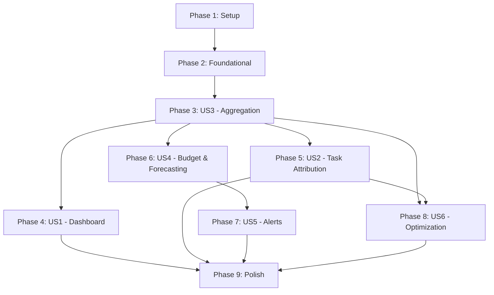

# Tasks: AI Spend Observability

**Input**: Design documents from `specs/005-ai-spend-observability/`

**Prerequisites**: plan.md (required), spec.md (required), research.md, data-model.md, contracts/analytics-api.md, quickstart.md

**Tests**: Test tasks are included per the constitution's Test-First Discipline principle (Principle IV). Each module gets corresponding test files.

**Organization**: Tasks are grouped by user story to enable independent implementation and testing. Critical path: US3 → US1 + US2 → US4 → US5; US6 is parallelizable after US2 + US3.

## Format: `[ID] [P?] [Story] Description`

- **[P]**: Can run in parallel (different files, no dependencies)
- **[Story]**: Which user story this task belongs to (e.g., US1, US2, US3)
- Include exact file paths in descriptions

---

## Phase 1: Setup (Verification Baseline)

**Purpose**: Confirm clean starting state and review existing code that will be modified

- [X] T001 Run full test suite to establish baseline: `npm test` — confirm 915+ tests pass, 0 failures
- [X] T002 Review existing `gateway/ledger.mjs` migration pattern — document the ALTER TABLE approach used for `ide_name`/`billing_type` columns as the pattern to follow for new analytics tables
- [X] T003 [P] Review `gateway/server.mjs` `handleRequest()` function — identify exact point where spend-pause check will be inserted (before provider dispatch, after auth parsing)
- [X] T004 [P] Review `escalation-push.mjs` existing Slack/Discord formatting — document the webhook dispatch pattern to extend with email and generic webhook channels
- [X] T005 [P] Review `dashboard/server.mjs` existing API endpoint patterns — document the route registration style and auth check pattern to follow for new analytics endpoints

**Checkpoint**: Baseline confirmed. Existing patterns documented. Ready for foundational work.

---

## Phase 2: Foundational — Schema Migration & Analytics Core (Blocks US1, US2, US3, US4, US6)

**Purpose**: Add all new SQLite tables to the gateway ledger and create the shared analytics query module. All user stories depend on this.

**⚠️ CRITICAL**: No user story work can begin until schema migration is complete.

- [X] T006 Add `analytics_hourly`, `analytics_daily`, `alert_state`, `optimization_rules`, and `spend_pause_state` table definitions to `gateway/ledger-schema.sql` per data-model.md — all use `CREATE TABLE IF NOT EXISTS`
- [X] T007 Add schema migration logic to `gateway/ledger.mjs` — detect missing tables at boot and run `CREATE TABLE IF NOT EXISTS` statements. Insert default `spend_pause_state` row `(is_paused = 0)` on first creation
- [X] T008 [P] Create `analytics.mjs` — analytics query module exporting functions: `queryOverview(db, from, to)` → KPI aggregates, `queryTimeseries(db, from, to, groupBy)` → time-series data, `queryBreakdown(db, dimension, from, to, limit)` → ranked breakdown, `queryTaskCost(db, taskId, includeRuns)` → per-task cost. All functions read from `analytics_hourly`/`analytics_daily` with fallback to raw `token_events` for pre-aggregation windows
- [X] T009 [P] Add `analytics:` config section parsing to `config.mjs` — parse `policy.yaml` keys: `analytics.aggregation.intervalMinutes` (default 60), `analytics.alerts.channels[]`, `analytics.alerts.rules[]`, `analytics.budget.monthlyLimit`, `analytics.optimization.minDataDays` (default 7)
- [X] T010 [P] Add analytics config validation to `policy-validate.mjs` — validate alert channel types (slack/email/webhook), validate URLs, validate budget values > 0, validate severity levels

**Checkpoint**: Schema tables exist. Analytics query module functional. Config parsing in place. Aggregation engine (US3) can now be built.

---

## Phase 3: User Story 3 — Cost Aggregation & Historical Trends (Priority: P2) 🏗️ Foundational

**Goal**: Build the hourly/daily aggregation engine that materializes raw token events into summary tables. This is P2 in priority but serves as the data foundation for US1 (dashboard), US2 (task attribution), US4 (budget forecasting), and US6 (optimization).

**Independent Test**: Generate token events for multiple hours, trigger aggregation, and verify hourly/daily summary tables contain correct rollups matching raw event totals. Query a 90-day trend and confirm it returns in under 1 second.

### Tests for User Story 3 ⚠️

> **Write these FIRST, ensure they FAIL before implementation**

- [X] T011 [P] [US3] Create `tests/aggregation.test.mjs` — test idempotent hourly aggregation (INSERT OR REPLACE), daily rollup from hourly, late-arriving data re-aggregation, resume-after-interrupt, 0.1% precision tolerance, empty ledger edge case, corrupted event skipping, 90-day trend query performance < 1s

### Implementation for User Story 3

- [X] T012 [US3] Create `aggregation.mjs` — export `aggregateHour(db, hourTs)` that runs `INSERT OR REPLACE INTO analytics_hourly` grouping raw `token_events` by (provider, model, agent, task) for the given hour window. Compute window_key as `{hourTs}:{provider}:{model}:{agent}:{task}`. Skip corrupted events (NULL cost, negative tokens) with warning log
- [X] T013 [US3] Add `aggregateDay(db, dayTs)` to `aggregation.mjs` — roll up `analytics_hourly` rows for the given day into `analytics_daily` using same INSERT OR REPLACE pattern
- [X] T014 [US3] Add `getLastAggregatedHour(db)` and `getLastAggregatedDay(db)` to `aggregation.mjs` — query max `hour_ts`/`day_ts` from summary tables to determine next window to aggregate (handles resume-after-interrupt)
- [X] T015 [US3] Add `aggregatePendingWindows(db)` to `aggregation.mjs` — find all unaggregated hours since last run, aggregate each sequentially, then check if any full days are now complete and aggregate those. Log progress per window
- [X] T016 [US3] Wire aggregation timer into `scheduler.mjs` — add a `setInterval` (default 60 min per config `analytics.aggregation.intervalMinutes`) that calls `aggregatePendingWindows()`. Run once at daemon boot to catch up on any missed windows. Log "Aggregation: completed N hourly, M daily windows"
- [X] T017 [US3] Run `npm test` — confirm T011 passes, all existing tests pass with zero regressions

**Checkpoint**: Aggregation engine running automatically. Hourly and daily summaries populated. Dashboard and budget features can now read from fast summary tables.

---

## Phase 4: User Story 1 — Spend Analytics Dashboard (Priority: P1) 🎯 MVP

**Goal**: Build the Analytics tab in the dashboard with KPI cards, time-series charts, breakdown visualizations, and CSV export. This is the primary visible deliverable.

**Independent Test**: Open the dashboard, navigate to the Analytics tab, and verify that KPI cards show total spend, provider breakdown, and model breakdown matching raw ledger queries. Change the date range filter and confirm charts update. Export a CSV and verify data matches on-screen values.

### Tests for User Story 1 ⚠️

- [X] T018 [P] [US1] Create `tests/analytics.test.mjs` — test `GET /api/analytics/overview` KPI accuracy, `GET /api/analytics/timeseries` resolution auto-selection (24h→hourly, 7d→4h, 30d→daily, 90d→weekly), `GET /api/analytics/breakdown` dimension filtering, `GET /api/analytics/export` CSV format and completeness, empty ledger graceful responses, date range validation

### Implementation for User Story 1

- [X] T019 [US1] Add `GET /api/analytics/overview` endpoint to `dashboard/server.mjs` — calls `queryOverview()` from `analytics.mjs`, returns JSON with `totalSpend`, `spendChangePct`, `totalTokens`, `totalApiCalls`, `topProvider`, `topModel`, `topAgent`. Supports `from`/`to` query params. Returns empty state when no data
- [X] T020 [US1] Add `GET /api/analytics/timeseries` endpoint to `dashboard/server.mjs` — calls `queryTimeseries()` with auto-resolution selection per research.md R10. Supports `from`/`to`/`groupBy` query params. Returns `{ resolution, series[], period }`
- [X] T021 [US1] Add `GET /api/analytics/breakdown` endpoint to `dashboard/server.mjs` — calls `queryBreakdown()` for provider/model/agent/task dimensions. Supports `dimension`/`from`/`to`/`limit` query params
- [X] T022 [US1] Add `GET /api/analytics/export` endpoint to `dashboard/server.mjs` — streams CSV with proper escaping (quotes, commas, newlines), sets `Content-Type: text/csv` and `Content-Disposition: attachment`. Uses `node:stream` `Readable.from()` for memory-efficient streaming
- [X] T023 [US1] Add `GET /api/analytics/aggregation/status` endpoint to `dashboard/server.mjs` — returns last run timestamps, pending windows, completed counts. For debugging/monitoring
- [X] T024 [US1] Add Canvas chart components to `dashboard/index.html` — build three reusable ES module classes per research.md R2: `LineChart` (time-series, supports multiple series with legend), `BarChart` (ranked breakdowns, horizontal bars with value labels), `DonutChart` (proportional breakdowns with hover tooltips). All use HTML5 Canvas 2D API. ~5KB total code
- [X] T025 [US1] Add Analytics tab UI to `dashboard/index.html` — KPI cards row (Total Spend, % Change, Top Provider, Top Model), date range selector (Today/7d/30d/Custom), time-series chart (spend over time, filterable by provider), breakdown panels (Provider/Model/Agent with bar or donut charts), Export CSV button
- [X] T026 [US1] Wire Analytics tab JS in `dashboard/index.html` — fetch from `/api/analytics/overview`, `/api/analytics/timeseries`, `/api/analytics/breakdown` on tab activation and date range change. Update KPIs and charts. Handle loading state (spinner), empty state ("Connect a provider and run your first task"), and error state
- [X] T027 [US1] Run `npm test` — confirm T018 passes, all existing tests pass with zero regressions

**Checkpoint**: Analytics dashboard functional. Operators can view spend KPIs, trends, breakdowns, and export CSV — all in under 2 seconds.

---

## Phase 5: User Story 2 — Per-Task Cost Attribution (Priority: P1)

**Goal**: Attribute every LLM API call to its originating task, display per-task cost summaries in the dashboard, and support cost aggregation by project/feature label.

**Independent Test**: Trigger an agent run against a known task. After completion, query the task's cost via dashboard API. Verify the returned cost matches the sum of all token events attributed to that task in the gateway ledger.

### Tests for User Story 2 ⚠️

- [X] T028 [P] [US2] Create `tests/task-cost-attribution.test.mjs` — test `GET /api/analytics/task-cost` with includeRuns, multiple runs per task, unattributed traffic (NULL task), `GET /api/analytics/project-costs` with task ranking, aggregation by custom label/tag, cross-verify totals against raw ledger SUM

### Implementation for User Story 2

- [X] T029 [US2] Verify `gateway/token-event.mjs` task field population — ensure the `task` field on emitted token events is always populated from request metadata when available. Audit call sites in `gateway/server.mjs` to confirm task context is passed through
- [X] T030 [US2] Add `GET /api/analytics/task-cost` endpoint to `dashboard/server.mjs` — calls `queryTaskCost()` from `analytics.mjs`. Supports `taskId` (required) and `includeRuns` (optional boolean). Returns `{ taskId, totalCost, totalTokens, apiCalls, models[], runs[] }` per contracts/analytics-api.md §4
- [X] T031 [US2] Add `GET /api/analytics/project-costs` endpoint to `dashboard/server.mjs` — aggregates task costs for a project. Supports `project` (required), `orderBy` (cost/tokens/calls), `limit`. Returns ranked task list with cost breakdowns
- [X] T032 [US2] Add task cost summary widget to `dashboard/index.html` Analytics tab — displays per-task cost on drill-down from agent/model breakdown. Shows "This task cost $X.XX across N runs" with run-level detail
- [X] T033 [US2] Add cost label/tag support — when task metadata includes a `costLabel` or `tag`, aggregate costs by that label in `analytics.mjs`. Update `queryBreakdown()` to support `dimension=label` grouping
- [X] T034 [US2] Run `npm test` — confirm T028 passes, cross-verify task costs match raw ledger queries

**Checkpoint**: Every LLM call attributed to a task. Operators can see per-task cost, per-project cost ranking, and aggregate by custom labels.

---

## Phase 6: User Story 4 — Budget Intelligence & Forecasting (Priority: P2)

**Goal**: Implement budget forecasting (linear projection), spending anomaly detection (z-score), and the "Pause All AI Spend" emergency gateway control.

**Independent Test**: Set a monthly budget of $100. Simulate spend at a rate that would reach $150 by month-end. Verify the forecast shows "Projected: $150 — $50 over budget" with a warning. Trigger a spending anomaly (3x normal hourly rate) and verify an alert is raised. Activate "Pause All AI Spend" and verify all subsequent LLM requests are blocked.

### Tests for User Story 4 ⚠️

- [X] T035 [P] [US4] Create `tests/budget-forecast.test.mjs` — test linear projection accuracy with known daily rates, status thresholds (on-track < 90%, at-risk 90-100%, over-budget > 100%), zero-data edge case, budget config validation
- [X] T036 [P] [US4] Create `tests/gateway/spend-pause.test.mjs` — test pause activation blocks requests (HTTP 503), resume restores normal flow, pause survives daemon restart (DB persistence), already-paused/paused-idempotent toggle, pause reason included in block response

### Implementation for User Story 4

- [X] T037 [US4] Add `computeBudgetForecast(db, budgetConfig)` to `analytics.mjs` — implement linear projection per research.md R5: `dailyBurnRate = SUM(cost) over last 7 days / 7`, `projectedTotal = spendToDate + (dailyBurnRate * daysRemaining)`. Return `{ spendToDate, projectedTotal, dailyBurnRate, daysRemaining, status }` with status thresholds
- [X] T038 [US4] Add `detectAnomalies(db)` to `analytics.mjs` — implement z-score detection per research.md R6: for each completed hour, compute `(hourlySpend - trailing7DayMean) / trailing7DayStdDev`. Flag hours with z-score > 3.0. Return array of `{ hourTs, provider, cost, zScore, normalRange }`
- [X] T039 [US4] Add `GET /api/analytics/budget` endpoint to `dashboard/server.mjs` — returns budget config, current spend-to-date/pct, forecast (projected total, burn rate, status), and recent anomalies per contracts/analytics-api.md §5
- [X] T040 [US4] Implement spend pause check in `gateway/server.mjs` — at the top of `handleRequest()`, read `spend_pause_state.is_paused` from the ledger. If paused, return HTTP 503 with `{ "error": "Spend is paused", "pausedAt": "...", "reason": "..." }` and log the blocked request. Check must be < 1ms overhead
- [X] T041 [US4] Add `GET /api/analytics/spend-pause` and `POST /api/analytics/spend-pause` endpoints to `dashboard/server.mjs` per contracts/analytics-api.md §6. POST requires `X-AIOS-Token` auth. Handles `pause`/`resume` actions. Returns 409 if already in requested state
- [X] T042 [US4] Add Budget tab UI to `dashboard/index.html` — budget gauge (spend-to-date vs limit with status color), forecast projection (projected total with on-track/at-risk/over-budget badge), anomaly list (recent spikes with hour, provider, z-score), "Pause All AI Spend" emergency button (red, with confirmation dialog), threshold configuration
- [X] T043 [US4] Run `npm test` — confirm T035, T036 pass, all existing tests pass with zero regressions

**Checkpoint**: Budget forecasting active. Anomalies detected. Emergency spend pause functional from dashboard and persists across restarts.

---

## Phase 7: User Story 5 — Multi-Channel Alerts (Priority: P2)

**Goal**: Deliver budget threshold, anomaly, and optimization alerts via Slack, email (SMTP), and generic webhook. Enforce cooldown to prevent spam. Support per-channel severity filtering.

**Independent Test**: Configure a Slack webhook. Set a budget threshold at 50%. Generate spend that crosses the threshold. Verify a Slack message is delivered with current spend, percentage, and projected total. Verify cooldown prevents duplicate alerts within the configured window.

### Tests for User Story 5 ⚠️

- [X] T044 [P] [US5] Create `tests/alerts.test.mjs` — test alert trigger conditions (budget threshold, anomaly, optimization available), cooldown enforcement (no duplicate within window, fires after cooldown), severity-based channel filtering, test-alert end-to-end, misconfigured channel graceful degradation
- [X] T045 [P] [US5] Create `tests/smtp-mailer.test.mjs` — test SMTP connection (cassette-mocked TLS socket), AUTH LOGIN handshake, email formatting (MIME multipart), connection timeout, auth failure handling

### Implementation for User Story 5

- [X] T046 [US5] Create `smtp-mailer.mjs` — SMTP client using `node:tls` per research.md R3. Export `sendEmail({ host, port, user, pass, from, to, subject, textBody, htmlBody })`. Implement EHLO, AUTH LOGIN (base64 credentials), MAIL FROM, RCPT TO, DATA with MIME multipart boundaries. 5-second connection timeout. Return `{ ok, error? }`
- [X] T047 [US5] Create `alerts.mjs` — alert evaluation engine. Export `evaluateAlerts(db, config)` that checks all configured alert rules against current state: budget thresholds (spendToDate/monthlyLimit >= thresholdPct), anomalies (zScore > threshold), optimization available (new active recommendations). Export `dispatchAlert(alert, channels)` that formats per-channel (Slack/Discord via existing `escalation-push.mjs` patterns, email via `smtp-mailer.mjs`, generic webhook via `fetch`/`node:https`). Export `checkCooldown(db, ruleId, cooldownSecs)` that reads `alert_state` table
- [X] T048 [US5] Extend `escalation-push.mjs` with generic webhook and email alert formatting — add `formatAlertSlack(alert)` reusing existing Slack block structure, `formatAlertEmail(alert)` returning MIME text+HTML, `formatAlertWebhook(alert)` returning JSON payload per contracts/analytics-api.md §8
- [X] T049 [US5] Add `GET /api/analytics/alerts/config` endpoint to `dashboard/server.mjs` — returns current alert channels and rules from parsed config per contracts/analytics-api.md §8
- [X] T050 [US5] Add `POST /api/analytics/alerts/test` endpoint to `dashboard/server.mjs` — sends a test alert to all enabled channels (respecting severity filters). Returns per-channel `{ ok, error? }` results. Requires `X-AIOS-Token` auth
- [X] T051 [US5] Wire alert evaluation into `scheduler.mjs` — after each aggregation run completes, call `evaluateAlerts()`. For each triggered alert, check cooldown, dispatch to channels, update `alert_state` table. Log "Alert: {ruleId} dispatched to N channels"
- [X] T052 [US5] Add Alerts tab UI to `dashboard/index.html` — channel configuration form (add/remove Slack URL, email address, webhook URL), per-channel severity checkboxes (info/warning/critical), rule configuration (threshold percentages, cooldown seconds), test-alert button per channel, alert history list (last 50 firings from `alert_state`)
- [X] T053 [US5] Run `npm test` — confirm T044, T045 pass, all existing tests pass with zero regressions

**Checkpoint**: Multi-channel alerting functional. Operators receive Slack/email/webhook notifications for budgets, anomalies, and optimization opportunities with cooldown protection.

---

## Phase 8: User Story 6 — Model Cost Optimization Recommendations (Priority: P3)

**Goal**: Analyze per-task usage patterns, identify cheaper equivalent-model alternatives, present ranked recommendations with savings estimates, and support one-click apply and dismiss.

**Independent Test**: Simulate 2 weeks of usage where 80% of code review tasks use an expensive model. Run the optimization analysis. Verify it recommends switching to a cheaper equivalent model with a specific dollar savings estimate. Apply the recommendation and verify the model router now uses the recommended model for matching tasks.

### Tests for User Story 6 ⚠️

- [X] T054 [P] [US6] Create `tests/optimization.test.mjs` — test recommendation generation (cost comparison by task type), capability filtering (vision/tools/streaming superset check), confidence scoring (sample size + pricing freshness), apply updates model routing, dismiss hides for 30 days, actual vs projected savings tracking, insufficient data edge case (< 7 days)

### Implementation for User Story 6

- [X] T055 [US6] Create `optimization.mjs` — export `generateRecommendations(db)` that per research.md R7: groups costs by task label/type, computes average cost per task for each model used, queries `model_registry` for models with matching capabilities and lower per-token pricing, estimates `(currentCostPerTask - candidateCostPerTask) × tasksPerWeek`, filters by confidence > 0.5. Inserts results into `optimization_rules` table. Export `applyRecommendation(db, id)` that updates model routing config for the task type. Export `dismissRecommendation(db, id, reason)` that sets `status=dismissed, dismissed_at=now`
- [X] T056 [US6] Add `GET /api/analytics/optimization/recommendations` endpoint to `dashboard/server.mjs` — queries `optimization_rules` filtered by `status`. Returns ranked list per contracts/analytics-api.md §9
- [X] T057 [US6] Add `POST /api/analytics/optimization/apply` endpoint to `dashboard/server.mjs` — calls `applyRecommendation()`, returns updated status. Requires `X-AIOS-Token` auth
- [X] T058 [US6] Add `POST /api/analytics/optimization/dismiss` endpoint to `dashboard/server.mjs` — calls `dismissRecommendation()`, requires `{ id, reason }` body and `X-AIOS-Token` auth
- [X] T059 [US6] Wire optimization analysis into `scheduler.mjs` — run `generateRecommendations()` once daily (after daily aggregation completes). Only if at least `analytics.optimization.minDataDays` (default 7) of data exists. Log recommendation count
- [X] T060 [US6] Add Optimization tab UI to `dashboard/index.html` — recommendations list ranked by estimated weekly savings, each showing current→recommended model, task type, savings estimate, confidence bar, capability check results, Apply and Dismiss buttons. Savings tracker section for applied recommendations showing actual vs projected. Dismissed recommendations section (collapsed by default)
- [X] T061 [US6] Add `trackActualSavings(db)` to `optimization.mjs` — for applied recommendations, compare task costs before and after the switch date. Update `actual_savings_usd` and `updated_at` in `optimization_rules`. Run weekly
- [X] T062 [US6] Run `npm test` — confirm T054 passes, all existing tests pass with zero regressions

**Checkpoint**: Optimization engine generating data-driven recommendations. Operators can review, apply, and dismiss model-switch suggestions. Savings tracked post-apply.

---

## Phase 9: Polish & Cross-Cutting Concerns

**Purpose**: Documentation, final integration testing, and edge-case hardening

- [X] T063 [P] Update `docs/MASTER-PLAN-CLOSE-GAPS.md` — mark P5 features as complete with actual story counts and dates
- [X] T064 [P] Run full test suite `npm test` — confirm 915+ base tests pass PLUS all new analytics tests (T011, T018, T028, T035, T036, T044, T045, T054) — zero failures
- [X] T065 Run quickstart validation scenarios from `quickstart.md` — verify VS1 (aggregation), VS2 (dashboard KPIs), VS3 (spend pause), VS4 (task attribution), VS5 (alerts), VS6 (optimization), VS7 (CSV export), VS8 (budget forecasting), VS9 (regression gate)
- [X] T066 [P] Performance validation — verify SC-001 (< 2s dashboard load), SC-002 (< 1s 90-day trend), SC-006 (< 1s spend pause block). If any threshold exceeded, profile and optimize
- [X] T067 [P] Edge case hardening — verify all 7 edge cases from spec.md: empty ledger state, corrupted event handling, negative budget validation, misconfigured channel degradation, large export streaming, conflicting optimization apply, pricing change flagging

---

## Dependencies

### User Story Dependency Graph



### Critical Path

```
Setup → Foundational → US3 (Aggregation) → US4 (Budget) → US5 (Alerts) → Polish
                                          ↘ US1 (Dashboard) → Polish
                                          ↘ US2 (Attribution) → US6 (Optimization) → Polish
```

**Longest path**: Setup → Foundational → US3 → US4 → US5 → Polish (6 phases)
**Parallel opportunities**: US1, US2, US4 can run in parallel after US3 completes. US6 can start after US2 + US3.

### Within Each User Story

- Tests MUST be written first (red), then implementation (green)
- [P] tasks within a story can run in parallel (different files, no shared state)
- Non-[P] tasks depend on prior tasks in the same story

---

## Parallel Execution Examples

### After Phase 3 (US3) completes — Three stories can run simultaneously:

```text
Agent A: Phase 4 (US1 - Dashboard)
  T018 → T019 → T020 → T021 → T022 → T023 → T024 → T025 → T026 → T027

Agent B: Phase 5 (US2 - Task Attribution)
  T028 → T029 → T030 → T031 → T032 → T033 → T034

Agent C: Phase 6 (US4 - Budget & Forecasting)
  T035 → T036 → T037 → T038 → T039 → T040 → T041 → T042 → T043
```

### After Phase 5 + Phase 6 complete — Two more can run:

```text
Agent D: Phase 7 (US5 - Alerts)
  T044 → T045 → T046 → T047 → T048 → T049 → T050 → T051 → T052 → T053

Agent E: Phase 8 (US6 - Optimization)  [can start after US2 + US3]
  T054 → T055 → T056 → T057 → T058 → T059 → T060 → T061 → T062
```

---

## Implementation Strategy

### MVP Scope (User Stories 1 + 3 only)

Deliver the Analytics Dashboard with aggregation backend:
1. Phase 1: Setup (T001–T005)
2. Phase 2: Foundational (T006–T010)
3. Phase 3: US3 — Aggregation (T011–T017)
4. Phase 4: US1 — Dashboard (T018–T027)

**MVP delivers**: Operators can see their AI spend in a dashboard with KPIs and charts. Aggregation ensures fast loading. CSV export for offline analysis.

**Estimated**: ~27 tasks, deliverable as a single increment.

### Incremental Delivery

| Increment | Stories | New Value |
|-----------|---------|-----------|
| **Inc 1 (MVP)** | US3 + US1 | Dashboard with spend visibility |
| **Inc 2** | US2 | Per-task cost attribution |
| **Inc 3** | US4 | Budget forecasting + spend pause |
| **Inc 4** | US5 | Multi-channel alerts |
| **Inc 5** | US6 | Cost optimization recommendations |

Each increment is independently testable and deployable.

### Suggested PR Structure

Each user story → one PR per the PR discipline rule (PR title: `[P5]-[F{N}]: description`):
- `[P5]-[F6]: Cost aggregation engine and schema migration` (US3 + Foundational)
- `[P5]-[F1]: Spend analytics dashboard with KPIs and charts` (US1)
- `[P5]-[F5]: Per-task cost attribution and project cost ranking` (US2)
- `[P5]-[F2]: Budget intelligence, forecasting, and spend pause` (US4)
- `[P5]-[F4]: Multi-channel alerts — Slack, email, webhook` (US5)
- `[P5]-[F3]: Model cost optimization recommendations` (US6)
- `[P5]-[Polish]: Documentation, edge-case hardening, performance validation`

---

## Summary

| Metric | Count |
|--------|-------|
| **Total tasks** | 67 |
| **Setup tasks** | 5 |
| **Foundational tasks** | 5 |
| **US3 (Aggregation)** | 7 (1 test + 6 impl) |
| **US1 (Dashboard)** | 10 (1 test + 9 impl) |
| **US2 (Task Attribution)** | 7 (1 test + 6 impl) |
| **US4 (Budget/Forecasting)** | 9 (2 tests + 7 impl) |
| **US5 (Alerts)** | 10 (2 tests + 8 impl) |
| **US6 (Optimization)** | 9 (1 test + 8 impl) |
| **Polish** | 5 |
| **[P] parallel opportunities** | 22 tasks marked [P] |
| **New files to create** | 10 (5 source + 5 test) |
| **Files to modify** | 10 existing files |
